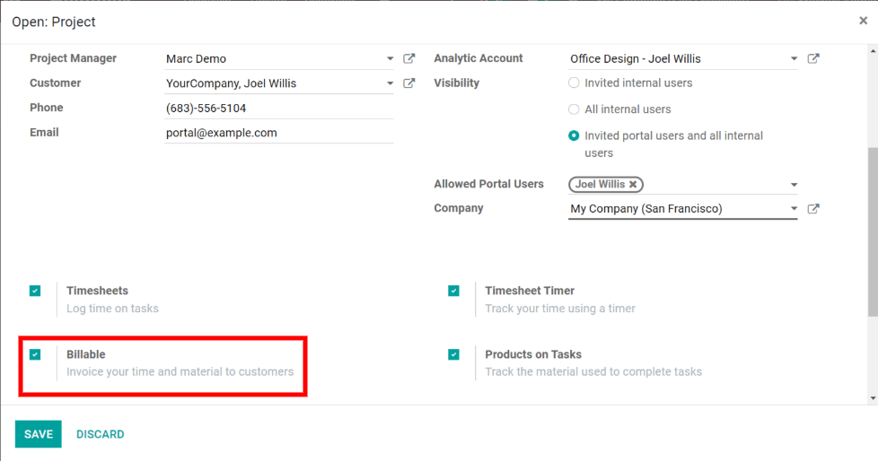
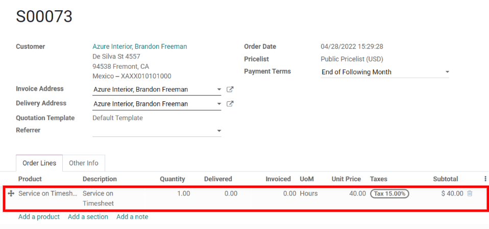
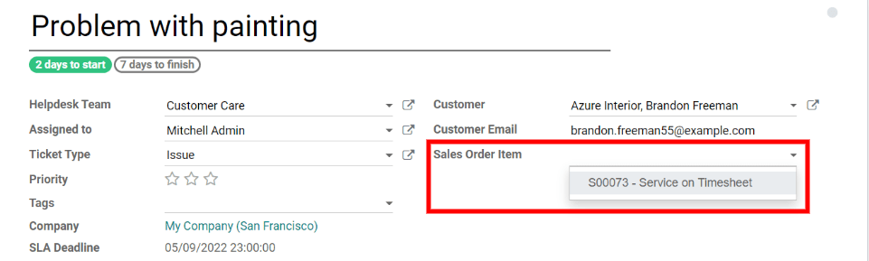

=========================================================
Invoice Time Spent on Tickets (Postpaid Support Services)
=========================================================

The :guilabel:`Timesheet on Ticket` integration provides more control and transparency over how
clients are charged, and what they're specifically billed for.

In Odoo, Project managers can connect Helpdesk tickets to Project tasks. As the Helpdesk agent
works on the ticket, they can use the ticket itself or the Project task to record timesheets.

Thanks to the :guilabel:`Timesheet on Ticket` integration, timesheets will always be consistent and
up-to-date on both records. Once a ticket is solved, the client can be billed for the time spent on
the ticket. Odoo will pull from either the task or the ticket timesheet to accurately bill the
client.

Configuration
=============

To turn on the :guilabel:`Timesheet on Ticket` feature, go to :menuselection:`Helpdesk -->
Configuration --> Helpdesk Teams`, select a Helpdesk team, and then, click :guilabel:`Edit`. Next,
enable the options :guilabel:`Timesheet on Ticket` and :guilabel:`Time Reinvoicing`.

In the :guilabel:`Timesheet on Ticket` drop-down option, choose the Project to which tickets (and
timesheets) will be linked by default. Then, open the Project's external link to edit its settings
and enable the :guilabel:`Billable` option. Finally, save both the Project and the Helpdesk team's
settings to apply these features.

Create a sales order
====================

After a ticket comes into the pipeline, go to :menuselection:`Sales --> Create`. Then, add the
customer from the ticket to the new quotation. In the :guilabel:`Order Lines` tab, add the
:guilabel:`Service on Timesheet` product. Finally, click :guilabel:`Confirm` to turn the quotation
into a sales order.

.. tip::
   Remember the sales order name for later to link the Helpdesk ticket to the correct sales order.

Record a timesheet
==================

To record a timesheet, jump back to the Helpdesk ticket by going to the Helpdesk dashboard and
clicking :guilabel:`Tickets` on the team's card (or by going to the Projects dashboard and clicking
:guilabel:`Tickets` on the project card). Then, click :guilabel:`Edit` and use the
:guilabel:`Timesheets` tab to record the time spent on the ticket.

.. image:: reinvoice_from_project/record-timesheet-ticket.png
   :align: center
   :alt: Record time spent on a ticket.

Link the Helpdesk ticket to the SO
==================================

To link the :abbr:`SO (Sales Order)` to the ticket, start on the ticket form, click
:guilabel:`Edit`, and then, click the :guilabel:`Sales Order Item` field. Next, select the
:abbr:`SO (Sales Order)` that was created earlier from the drop-down menu. Lastly, click
:guilabel:`Save` to connect the ticket and the :abbr:`SO (Sales Order)`.

Create the invoice
==================

When the Helpdesk ticket is completed and the client is ready to be billed for time, begin by
clicking the :guilabel:`Sales Order` smart button on the ticket form to navigate to the :abbr:`SO
(Sales Order)`. The :guilabel:`Delivered` column should match the number of hours recorded on the
ticket's timesheet. After checking and filling out the relevant information, click :guilabel:`Create
Invoice` to bill the client for the time spent on the ticket. Odoo will automatically generate an
invoice to send to the client and the Helpdesk ticket can officially be closed.

.. seealso::
   - :doc:`invoice_time`
   - :doc:`/applications/inventory_and_mrp/inventory/management/products/uom`
