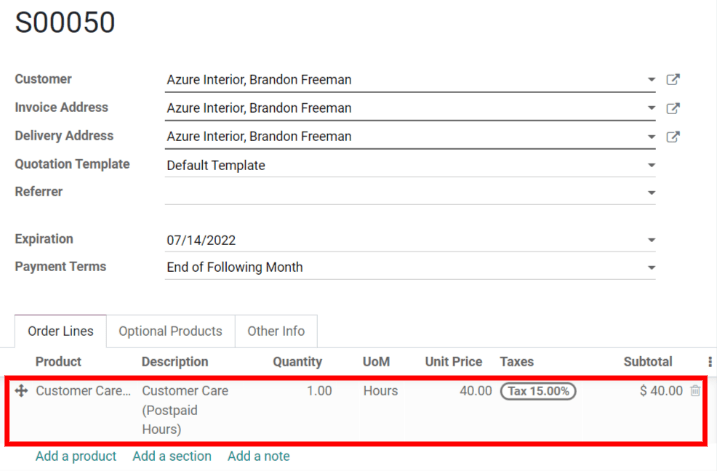
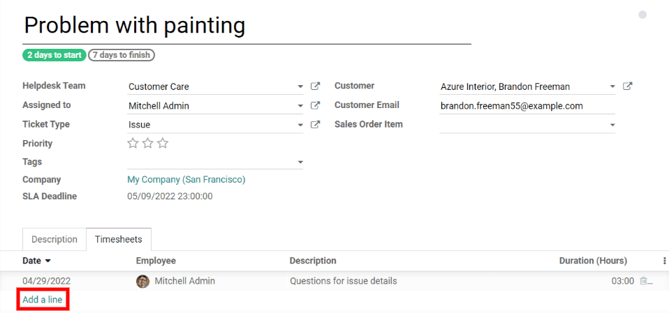
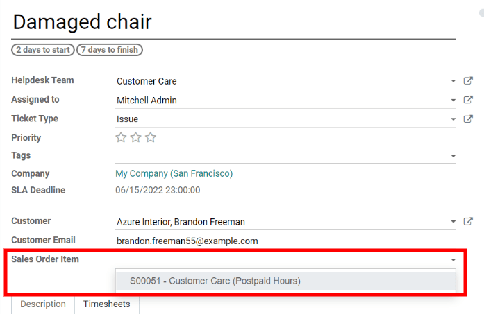

=========================================================
Invoice Time Spent on Tickets (Postpaid Support Services)
=========================================================

The :guilabel:`Timesheets` integration provides more control and transparency over how clients are
charged, and what they're specifically billed for.

In Odoo, the Helpdesk agent can use the ticket to record timesheets. Once a ticket is solved, the
client can be billed for the time spent on the ticket. Odoo will pull from the ticket's timesheet
to accurately bill the client.

Configuration
=============

To turn on the :guilabel:`Timesheets` feature, go to :menuselection:`Helpdesk --> Configuration
--> Helpdesk Teams`, select a Helpdesk team, and then, click :guilabel:`Edit`. Next, enable the
options :guilabel:`Timesheets` and :guilabel:`Time Billing`. Then, click :guilabel:`Save` to apply
these changes to the Helpdesk team settings.

Once the :guilabel:`Timesheets` feature is enabled, a :guilabel:`Project` drop-down option will
appear below :guilabel:`Timesheets`. The :guilabel:`Project` drop-down option will automatically
be set to a project that Odoo created for the Helpdesk team. The tickets' timesheets
will be stored in the selected project.

Create a sales order
====================

After a ticket comes into the pipeline, go to :menuselection:`Sales --> Create`. Then, add the
customer from the ticket to the :guilabel:`Customer` field in the new quotation. In the
:guilabel:`Order Lines` tab, create or select a product to charge the customer for the time spent
on their Helpdesk ticket.

If creating a new product from the sales order form, first give the product a name by typing it in
the :guilabel:`Product` column. Then, click :guilabel:`Create and edit`.

First, in the :guilabel:`General Information` tab, set the :guilabel:`Product Type` to
:guilabel:`Service` and the :guilabel:`Sales Price` to the Helpdesk agent's service rate. Then, set
the :guilabel:`Invoicing Policy` to :guilabel:`Based on Timesheets`. Finally, click
:guilabel:`Save` to create the new product and add it to the quotation.

Once the product is added, click :guilabel:`Confirm` to turn the quotation into a sales order.

Record a timesheet
==================

To record a timesheet, jump back to the Helpdesk ticket by going to the :guilabel:`Helpdesk`
dashboard, clicking :guilabel:`Tickets` on the team's card, and locating the correct ticket. Then,
click :guilabel:`Edit` and use the :guilabel:`Timesheets` tab to record the time spent on the
ticket.

.. tip::
   The ticket's timesheets can be recorded before or after the sales order is made, the order
   doesn't matter.

Link the Helpdesk ticket to the SO
==================================

To link the :guilabel:`Sales Order` to the ticket, start on the ticket form and click
:guilabel:`Edit`. Next, select the :guilabel:`Sales Order` that was created earlier from the
:guilabel:`Sales Order Item` drop-down menu. Odoo will automatically filter the options to only
show sales orders that are connected to the ticket's customer. Lastly, click :guilabel:`Save` to
connect the ticket and the :guilabel:`Sales Order Item`.

.. tip::
   The :guilabel:`Sales Order Item` can be connected to the ticket before or after any timesheets
   are recorded, the order doesn't matter.

Modify billing rates
====================

If a timesheet entry is recorded, but the agent does not want to bill the client for that time, go
to the :guilabel:`Timesheets` tab and toggle on the visibility of the :guilabel:`Sales Order Item`
column. When filling out the information for the timesheet entry, make sure to leave the
non-billable timesheet entry's :guilabel:`Sales Order Item` field blank.

If the agent wants to charge a different rate for a timesheet entry, first, add a new product to
the connected :abbr:`SO (Sales Order)` priced at the new rate. Then, select the new product in the
timesheet entry's :guilabel:`Sales Order Item` field.

Create the invoice
==================

When the Helpdesk ticket is completed and the client is ready to be billed for time, begin by
clicking the :guilabel:`Sales Order` smart button on the ticket form to navigate to the sales
order. The :guilabel:`Delivered` column should match the number of hours recorded on the ticket's
timesheet. After checking and filling out the relevant information, click :guilabel:`Create
Invoice` to bill the client for the time spent on the ticket. Odoo will automatically generate an
invoice to send to the client and the Helpdesk ticket can officially be closed.

.. seealso::
   - :doc:`invoice_time`
   - :doc:`/applications/inventory_and_mrp/inventory/management/products/uom`
