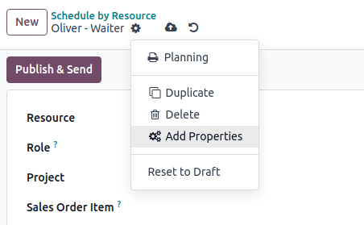
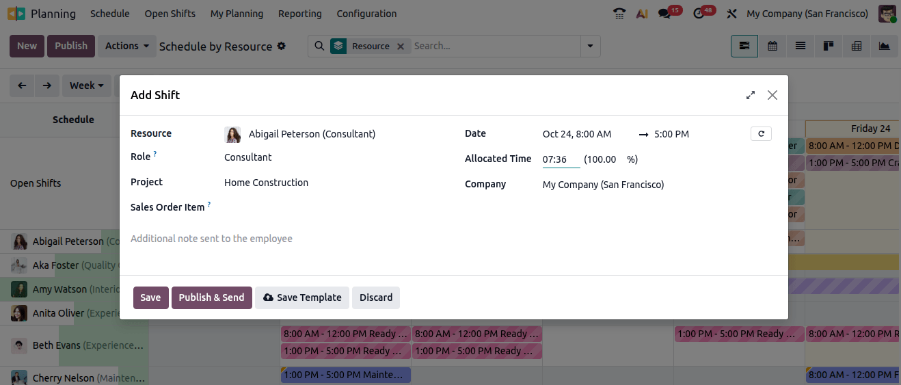
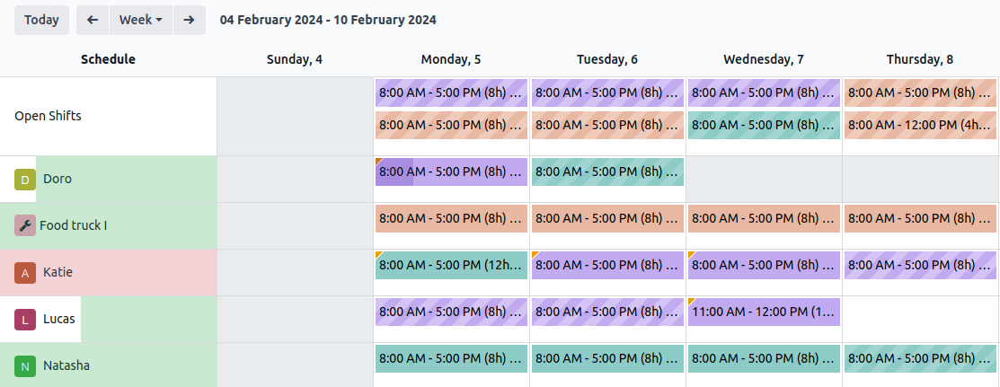

:show-content:

========
Planning
========

**Odoo Planning** allows you to plan your team's schedule and manage shifts and resources.

Handling your team's planning comes with specific requirements that may vary widely depending on
your business needs. The following concepts were introduced in Odoo Planning to meet those needs:

**Shifts** are dispatched to **resources**, which can be either :ref:`human <planning/employees>`
(employees) or :ref:`material <planning/materials>` (e.g., equipment). The resources are assigned
:ref:`roles <planning/roles>`, which allows for organization of work within the team.

Once the initial configuration is done, :ref:`planning shifts <planning/shifts>` can be done
manually or automated by using the :ref:`Auto Plan <planning/open-shifts>` feature.

An integration between the Planning and Sales apps allows the linking of sold services to roles and
shifts in Planning. Additionally, integration with :doc:`Project <project>` allows dedicating
shifts, and thus time and resources, to specific projects.

.. seealso::
   `Odoo tutorials: Planning <https://www.odoo.com/slides/planning-60>`_

.. _planning/configuration:

Configuration
=============

.. _planning/roles:

Roles
-----

To define the roles your resources perform (e.g., chef, bartender, waiter), go to
:menuselection:`Planning --> Configuration --> Roles`, then click :guilabel:`New`, and fill in the
:guilabel:`Name` (e.g., assistant, receptionist, manager). Then, choose the :guilabel:`Resources`
that will perform this role. Resources can be either :ref:`Employees <planning/employees>` or
:ref:`Materials <planning/materials>`.

.. note::
   - If the Sales app is installed in your database, the :guilabel:`Services` field appears,
     allowing you to specify which roles are needed to perform services so that the shifts are
     dispatched to the right person.
   - Roles are taken into account when using the :ref:`Auto Plan feature <planning/open-shifts>`.

Property fields and roles
~~~~~~~~~~~~~~~~~~~~~~~~~

**Property fields** allow you to add custom fields to forms across several Odoo applications.
Planning includes the possibility of adding property fields linked to roles to shifts.

To create a property field, switch to the list view from any schedule. From there, click
:guilabel:`View` on the shift that you wish to edit. If the :guilabel:`Role` field is empty, fill it
in with the desired role, then click the cog icon and select :guilabel:`Add Properties`.
:doc:`Configure </applications/essentials/property_fields>` the new field according to your needs.

The property field is linked to the role and is included in the shift form of all shifts performed
by this role.

.. example::
   Some of the use cases of role property fields include:

   - **Accreditation**: for roles that require a specific permit (e.g., driving license)
   - **Location**: in companies that operate in multiple locations (e.g., shops or restaurants)
   - **Language**: in a multi-lingual environment (e.g., consulting company)

.. _planning/employees:

Employees
---------

All employees can be included in the planning and assigned shifts.

To adapt the employee's planning settings, go to :menuselection:`Planning --> Configuration -->
Employees`, and choose the employee for whom you want to edit the settings. Then, go to the
:guilabel:`Work Information` tab.

.. tip::
   You can do the same from the **Employees** app, which is installed by default along with
   Planning.

Two sections of the employee's :guilabel:`Work Information` tab have an impact on Planning:
:guilabel:`Schedule` (namely, the :guilabel:`Working Hours` field) and :guilabel:`Planning`.

.. _planning/working-hours:

Working hours
~~~~~~~~~~~~~

The :guilabel:`Working Hours` are taken into account when the :guilabel:`Allocated Time` and its
percentage is calculated for :ref:`shifts <planning/templates>`. If the :guilabel:`Working Hours`
field is left blank, the employee is considered to be working flexible hours.

To create individual :guilabel:`Working Hours`, for example, for employees working part-time, click
:guilabel:`Search more...`, then :guilabel:`New`.

.. note::
   The :guilabel:`Working Hours` and the :guilabel:`Allocated Time` in Planning can impact
   **Payroll**, if the employee's contract is configured to generate work entries based on shifts.

.. seealso::
   :doc:`../hr/payroll/working_schedules`

.. _planning/planning-roles:

Planning roles
~~~~~~~~~~~~~~

Once an employee has one or more :guilabel:`Roles`:

- When creating a shift for this employee, only the shift templates from the roles chosen in this
  field are displayed.
- When a schedule is published, the employee is only notified of open shifts for the roles that are
  assigned to them.
- When auto-assigning open shifts or planning sales orders, the employee is only assigned shifts for
  the roles assigned to them.

Additionally, when a :guilabel:`Default role` is defined:

- When creating a shift for the employee, the default role is automatically selected.
- This role also has precedence over the other roles of the employee when auto-assigning open shifts
  or planning sales orders.

.. note::
   If the Planning roles fields are left empty, there are no restrictions in the shift templates and
   open shifts shared with the employee. However, it's not possible to use the **Auto Plan** feature
   for employees with no roles.

.. _planning/materials:

Materials
---------

**Materials** are resources that can be assigned shifts and working hours but are not employees.
For example, a construction company could use materials to create shifts for shared machines
(e.g., cranes, forklifts).

Similarly to employees, materials can be assigned roles and working time.

.. _planning/templates:

Shift templates
---------------

To create a shift template, click :guilabel:`New` on any schedule, then fill in the
:ref:`details of the shift <planning/create-shift>`, and click :guilabel:`Save Template`.

Alternatively, go to :menuselection:`Planning --> Configuration --> Shift Templates`, then
click :guilabel:`New`. Fill in the :guilabel:`Start & End Hours` and the shift's :guilabel:`Span`,
then assign a :guilabel:`Role`.

If the Project app is installed, a :guilabel:`Project` can also be selected.

.. _planning/shifts:

Planning shifts
===============

On opening the Planning app, the users see their own schedule. Users with administrator access
rights can also see the schedule :guilabel:`By Resource`, :guilabel:`By Role`, :guilabel:`By
Project`, and :guilabel:`By Sales Order`, as well as reporting and configuration menus.

.. note::
   The schedule is displayed in the Gantt view, which allows you to reassign, reschedule, resize,
   split, and duplicate shifts without having to open them.

The following visual elements are used on the shifts in the schedules:

- **Full color**: shifts that are planned and :ref:`published <planning/shifts-publish>`.
- **Diagonal stripes**: shifts that are planned but have yet to be :ref:`published
  <planning/shifts-publish>`.
- **Grayed-out background**: employees who are on time off.
- **Progress bar**: currently ongoing shifts with timesheets linked to them.
- **Grayed-out shift**: when copying shifts, the copied shifts are shown in full color, whereas
  previously existing shifts are temporarily greyed out. The color changes back to full color or
  diagonal stripes on the next refresh of the page or by removing the filter.

.. _planning/create-shift:

Create shifts
-------------

To create a shift, go to any schedule, then click :guilabel:`New`. In the pop-up window that opens,
fill in the following details:

- **Templates**: If there is one or more :ref:`shift templates <planning/templates>` existing in the
  database, they are displayed in the upper section of the pop-up window. Once selected, a template
  prefills the shift form accordingly.
- :guilabel:`Resources`: Resources can be both employees or materials. If this field is left empty,
  the shift is considered an :ref:`open shift <planning/open-shifts>`.
- :guilabel:`Date`: Choose the date and time of the shift. This is the only mandatory field when
  creating a shift.
- :guilabel:`Repeat`: Click the :icon:`fa-repeat` :guilabel:`(repeat)` button and configure the
  :guilabel:`Repeat every` fields as needed. The following rules apply to recurring shifts:

  - All fields (e.g., :guilabel:`Resource`, :guilabel:`Role`, :guilabel:`Project`) are copied from
    the original shift except for the date, which is adjusted according to the :guilabel:`Repeat
    Every` field.
  - Recurrences are planned but not published.
  - By default, planned shifts are created six months in advance, after which they are created
    gradually. To change the time frame, :ref:`activate the developer mode <developer-mode>`, then
    go to :menuselection:`Planning --> Configuration --> Settings` and edit the :guilabel:`Recurring
    Shifts`.

- :guilabel:`Allocated Time`: Is calculated based on the shift's date and time, and the employee's
  :guilabel:`Working Schedule`.
- :guilabel:`Role`: Select the role that the assigned resources will be performing. This field is
  especially useful when :ref:`auto-planning <planning/open-shifts>` shifts. Once you select a role,
  the :ref:`shift templates <planning/templates>` associated with it are displayed in the upper
  section of the pop-up window.

Additionally, the following fields may also be available:

- :guilabel:`Project`: If the :guilabel:`Project planning` setting is enabled in the Planning
  settings, select the relevant project to link to the shift. Shifts dedicated to the selected
  project are then planned and tracked accordingly.
- :guilabel:`Task`: If a project is selected, optionally select a task within that project.
- :guilabel:`Sales Order`: If the Sales app is installed, select the relevant sales order to link to
  the shift.
- :guilabel:`Customer`: If the shift is an :doc:`on-site intervention <planning/field_service>`,
  select the relevant customer to link to the shift.
- :guilabel:`Worksheet`: If :ref:`field service worksheets <planning/field-service/worksheets>` are
  configured, optionally select the relevant worksheet template.

Click :guilabel:`Save` to create the shift, or :guilabel:`Publish` to create it and notify the
assigned employee by email.

.. _planning/shifts-sales-orders:

Create shifts from sales orders
~~~~~~~~~~~~~~~~~~~~~~~~~~~~~~~

Shifts are created automatically from sales orders containing products configured as follows:

- :guilabel:`Product Type`: Set to :guilabel:`Service`.
- :guilabel:`Plan Services`: Enable the checkbox, then select the relevant :ref:`role
  <planning/roles>`.

Once the sales order is :ref:`confirmed <sales/sales_quotations/send-and-confirm>`, schedule the
shift:

#. Click the :guilabel:`To Plan` smart button on the sales order form.
#. Click the relevant day in the appropriate resource's schedule.

   .. note::
      Only :ref:`resources whose role <planning/configuration>` matches the role configured for the
      product on the sales order are available for shift assignment.

#. Select the relevant shift from the list of open shifts for that role.
#. :ref:`Publish <planning/shifts-publish>` the shift.

.. tip::
   - To edit the shift before planning it, on the :guilabel:`Schedule by Resource` view:

     - either click :guilabel:`New`;
     - or click the relevant day in the appropriate resource's schedule, then click
       :guilabel:`Create New`.

     Then, :ref:`edit the fields <planning/create-shift>` as needed and :guilabel:`Save` the shift
     or :ref:`Publish <planning/shifts-publish>` it.

   - Once shifts have been planned for the sales order, click the :guilabel:`Planned` smart button
     on the sales order form to view them.

.. _planning/shifts-edit:

Edit and delete shifts
----------------------

To edit a shift, click it in the calendar or schedule, then click :guilabel:`Edit`.

Shifts can also be adjusted directly on the schedule, without opening them:

- Reassign or reschedule a shift by dragging and dropping it to the desired employee and day.
- Extend a shift over several days by hovering over the right edge of the shift block. When the
  cursor changes into a resize pointer, click and drag the edge to the desired day.
- Split a shift spanning multiple consecutive days into two segments by hovering over the boundary
  between the two affected day columns, then clicking the :icon:`fa-scissors` (:guilabel:`scissors`)
  icon.

   .. image:: planning/split-shifts.png
      :alt: Split shifts tool.

To delete a shift, click it in the schedule, then click :guilabel:`Delete`.

.. tip::
   Alternatively, the shift form can be accessed by switching to the list view and clicking
   :guilabel:`View` on the relevant shift's line, or by switching to the Kanban view and clicking
   the relevant shift's card.

.. _planning/shifts-publish:

Publish shifts
--------------

Publishing shifts notifies the assigned employees by email and makes the schedule visible to
all users, including those without :guilabel:`Administrator` Planning :doc:`access rights
</applications/general/users/access_rights>` (via :menuselection:`Planning --> Planning -->
All Planning`).

Shifts can be published individually or in bulk.

To publish an individual shift:

- either click :guilabel:`Publish` at the end of the :ref:`shift creation process
  <planning/create-shift>`;
- or click the shift in the schedule, click :guilabel:`Edit`, then click :guilabel:`Publish` on
  the shift form.

To publish all planned shifts:

#. From any schedule, click :guilabel:`Publish`.
#. In the pop-up, optionally edit the :guilabel:`Period`.
#. Disable :guilabel:`Include Open Shifts` to exclude :ref:`open shifts <planning/open-shifts>` from
   the publication.
#. Optionally edit the list of employees; removing an employee from the list excludes their shifts
   from this publication.
#. Click :guilabel:`Publish & Send`.

Employees are notified of their shifts once they are published:

- Employees without user accounts are redirected to a dedicated **Planning portal**.
- Employees with a user account are redirected to the :guilabel:`My Planning` view.

.. note::
   - If the email address of one or more employees in the list has not been configured, enter their
     :guilabel:`Work Email` in the pop-up that opens, then click :guilabel:`Save & Send Schedule`.
     If the missing email addresses are not added, the corresponding employees' schedules are not
     published.
   - Unpublished shifts are only visible on schedules for users with :guilabel:`Administrator`
     Planning :doc:`access rights </applications/general/users/access_rights>` and are identified by
     diagonal lines.

.. _planning/open-shifts:

Open shifts and auto planning
-----------------------------

The :guilabel:`Auto Plan` button allows you to assign **Open shifts** (shifts with no resource
assigned) and create and assign shifts linked to sales orders or project tasks.

The following features have an impact on auto planning:

- **Roles**: Open shifts are only assigned to resources (employees or materials) that have the
  corresponding role assigned. It is not possible to use the :guilabel:`Auto Plan` feature for
  employees with no role.
- **Default roles**: The default role assigned to a resource is given priority over the other roles
  they have assigned to them.
- **Conflicts**: Employees or materials cannot be assigned multiple shifts at the same time.
- **Time off**: The employees' time off is taken into account, as well as public holidays.
- **Working hours**: Are taken into account when assigning shifts to employees or materials. It is
  not possible to use the :guilabel:`Auto Plan` feature for an employee who is working
  :ref:`flexible hours <planning/working-hours>`.
- **Contracts**: If the employee has an active contract, they won't be assigned shifts that fall
  outside of their contract period.

Click :guilabel:`Publish` to confirm the schedule and notify the employees of their planning.

.. _planning/switching-unassignment:

Switching shifts and unassignment
---------------------------------

Two features are available to allow employees to make changes to their schedule:
**switching shifts** and **unassignment**.

.. note::
   These features are mutually exclusive. Switching shifts is possible by default and cannot be
   disabled. However, once the **Allow unassignment** feature is enabled, it replaces the option to
   switch shifts.

Switching shifts
~~~~~~~~~~~~~~~~

Once shifts are planned and published, employees receive an email notification. If an employee
wishes to switch a shift, they can click the unwanted shift and click :guilabel:`Ask to switch`.

The shift remains assigned to the original employee, but in the schedule, a notification
informing that the assigned employee would like to switch shifts is visible on the shift.

The shift is then displayed to other employees who share the same role, and if they wish to assign
it to themselves, they can click the :guilabel:`I take it` button.

.. note::
   The following rules apply:

   - Only the shifts matching the employee's roles are displayed as available to them.
   - Switching shifts is not available for shifts in the past.

Unassignment
~~~~~~~~~~~~

To allow employees to unassign themselves from shifts, go to
:menuselection:`Planning --> Configuration --> Settings`, then tick the checkbox
:guilabel:`Allow Unassignment`. Then, specify the maximum number of days that the employees can
unassign themselves before the shift.

Once shifts are planned and published, employees receive an email notification. If shift
unassignment is allowed, the employees can click the :guilabel:`I am unavailable` button, and the
shift reverts to an open shift.

.. note::
   The following rules apply:

   - Only the shifts matching the employee's roles are displayed in their schedule.
   - Unassigning shifts is not available for shifts in the past.

.. toctree::
   :titlesonly:

   planning/field_service
