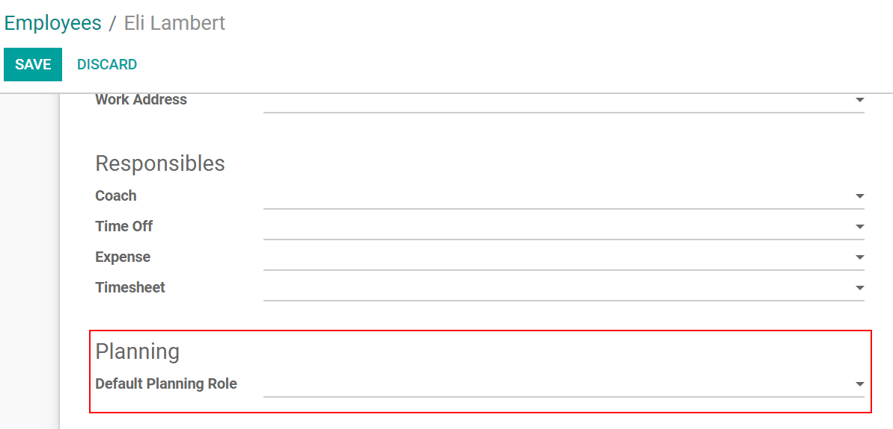
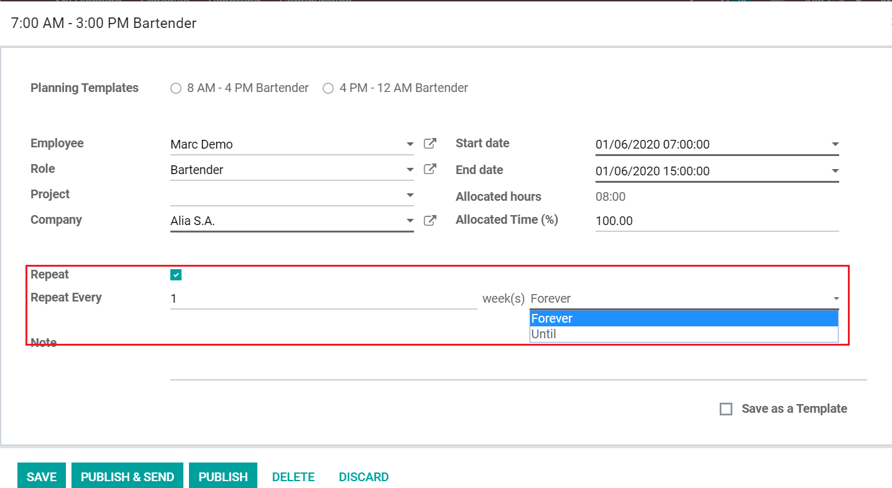
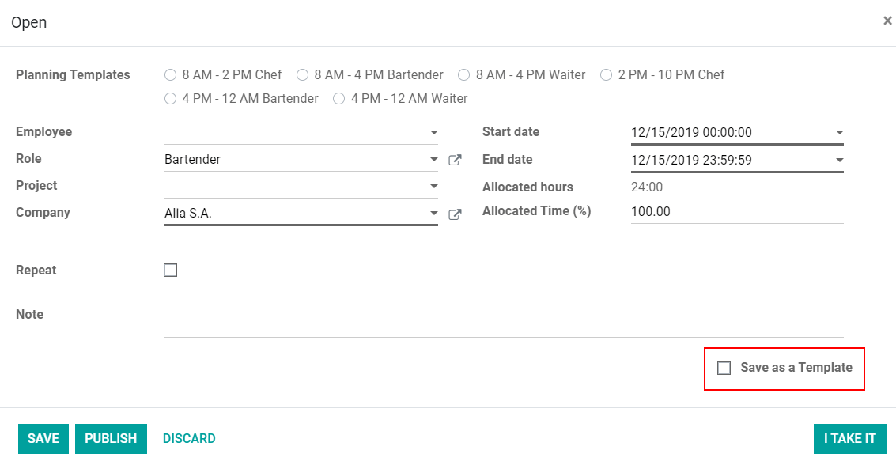
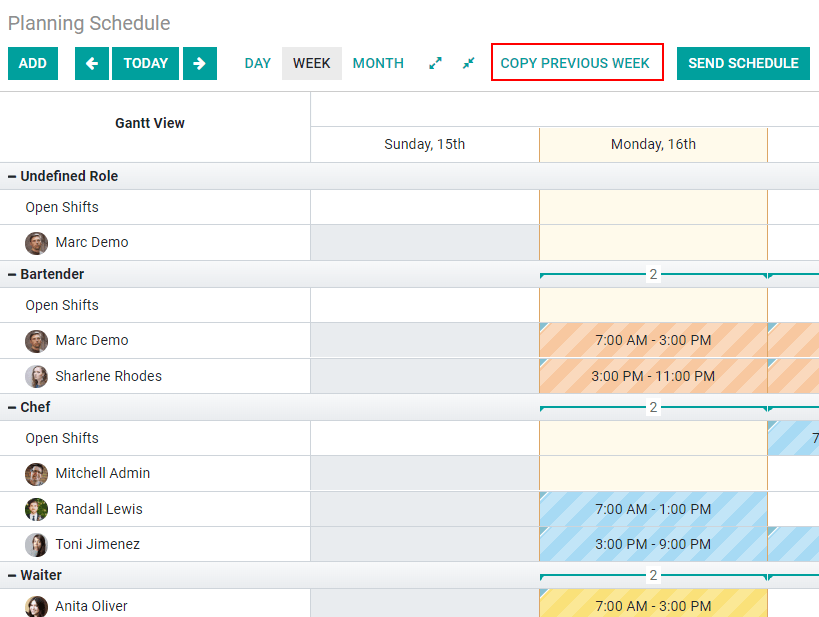

==========================================
Create a Schedule and Make Encoding Easier
==========================================

Organize regular schedules or forecast projects in a long term basis. Create shifts to manage your
tasks, assign employees, and stay organized at a high level.

Organize your team by roles
===========================

Go to :menuselection:`Configuration --> Roles --> Create`.
Optionally, go to the *Employees* application, select the respective employee, and under *Work
Information* select the *Default Planning Role*.

Make shifts recurrent
=====================

While creating a shift, select *Repeat* and configure as needed, saving you from the need
of re-planning it.

.. note::
   Repeated shifts are generated for the next six months. A modification is possible in
   :ref:`developer mode <developer-mode>`, from *Settings*.

      .. image:: media/rate_shift_generation.png
         :align: center
         :alt: Repeat shifts in Odoo Planning Application

.. tip::
   To duplicate a shift in the Gantt view, press CTRL + drag and drop.

Save shifts as templates
========================

If creating a shift on the fly and know you might use that template in the future, click on *Save as
a Template*.

.. tip::
   To create a template in advance, go to :menuselection:`Configuration --> Shifts Templates -->
   Create`.

Duplicate a planning from the previous week
===========================================

When in the Gantt view, either under *Schedule by Employee, Role or Project*, instead of re-planning
shifts that have been planned before, simply click on *Copy Previous Week*.

.. note::
   The integration with the *Time off* and *Employee* applications, show you grayed cells to the
   days when the employee does not work and is on vacation time, for example.