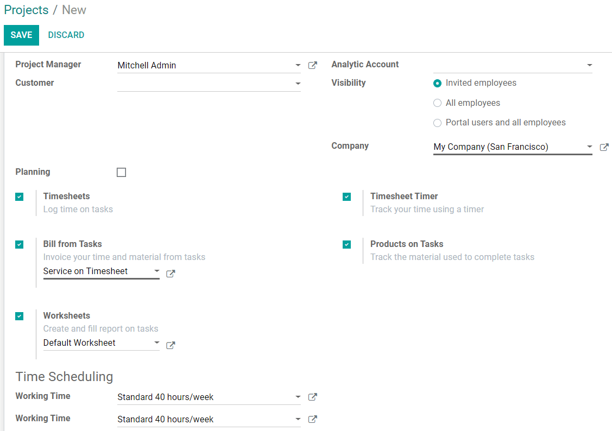
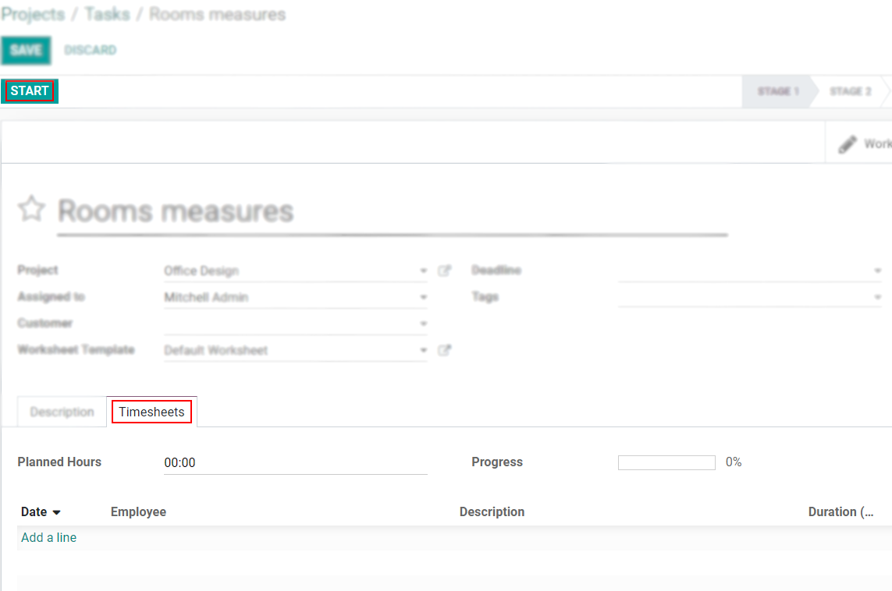
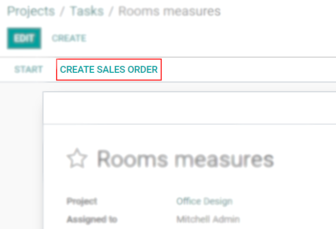
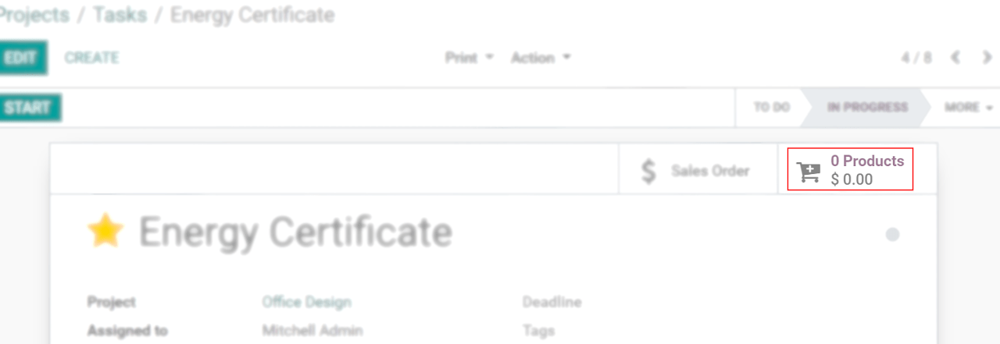
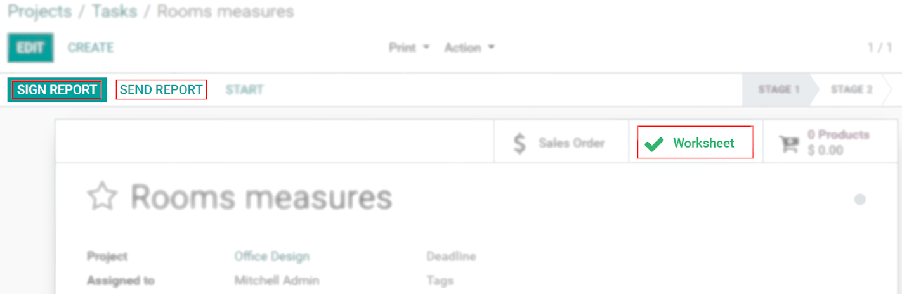
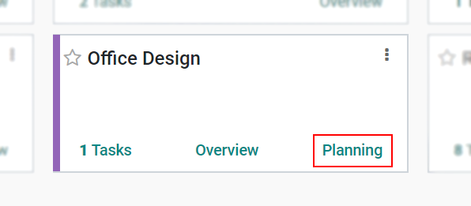
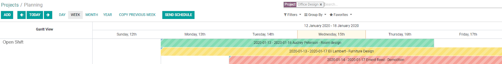
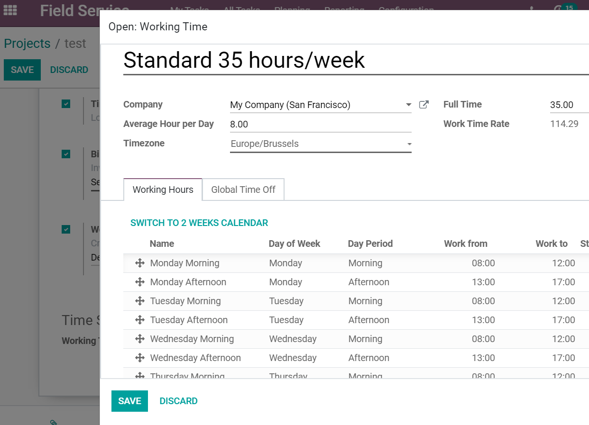
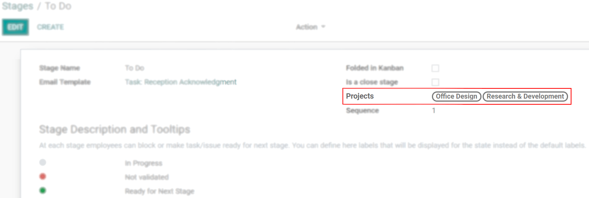

=========================
Advanced Project Settings
=========================

Projects can be created for a specific customer or team, and can be coordinated among your
employees through visibility options. Stages can be shared among tasks, and the exact time spent on
each project can be tracked. All of it in favor of a more integrated and dynamic organization.

Create advanced projects
========================
| Go to :menuselection:`Project --> Configuration --> Projects --> Create`.
| Choose a *Customer* in order to create a project specifically for him. If not, simply leave the
  field blank.

Choose who can access a project
~~~~~~~~~~~~~~~~~~~~~~~~~~~~~~~

To create a project for specific teams, under *Visibility*, choose who can have access to the
project:

- *Invited employees*: the ones who are followers (see :doc:`../tasks/collaborate`)
- *All employees*.
- *Portal users and all employees*: it enables the option *Share*. Recipients receive an
  email with an invitation to access the document (project).

Choose an *Analytic Account* to track the profitability of your project in a specific account.

Timesheet and record time on tasks
~~~~~~~~~~~~~~~~~~~~~~~~~~~~~~~~~~

| To track the time spent on tasks, enable *Timesheets*.
| In order to be able to launch a timer, also enable *Timesheet timer*.

Create sales orders from a task
~~~~~~~~~~~~~~~~~~~~~~~~~~~~~~~

To invoice the time (service) and material used on a task, enable *Bill from tasks*. Then, choose
the service/product which you would like to bill, or create one on the fly.

Track the material used on a task
~~~~~~~~~~~~~~~~~~~~~~~~~~~~~~~~~

After enabling *Bill from Tasks*, enable *Products on Tasks* to track the products/material used
during the work on a specific task.

Take advantage of worksheets
~~~~~~~~~~~~~~~~~~~~~~~~~~~~

Worksheets are reports of the work done. To customize and include them in your tasks, enable
*Worksheets*. Choose an existing template or create one on the fly.

Schedule shifts on projects
~~~~~~~~~~~~~~~~~~~~~~~~~~~

To create shifts to manage your tasks, assign employees, and stay organized, enable *Planning*.

Manage employees work hours
~~~~~~~~~~~~~~~~~~~~~~~~~~~

*Working time* defines the number of your employees’ working hours. It adjusts the Gantt
planning view of your interventions. Open the external link to adjust the daily hours.

Share stages across projects
============================

| In order to have a clean Kanban view that works across projects, and to avoid duplicates,
  delineate specific stages for different projects.
| Activate the :ref:`developer mode <developer-mode>` then go to :menuselection:`Project -->
  Configuration --> Stages`. Choose the respective one and add the projects among which you would
  like to share stages.

