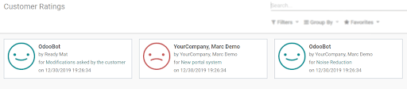

==============================
Gather Feedback from Customers
==============================

Finding out what your clients think about the experience they have with your company, can inspire
you to have insights on how to improve your product/service, adjusting your business to fit
their needs. It shows that you value their opinions and provides a reliable source of information
to other consumers.

Set up
======

Go to :menuselection:`Project --> Configuration --> Settings` and enable *Use Rating on Project*.

| *Set Email Template to Stages* in order to define the template to be sent at a specific stage(s).
| Choose an existing template or create one on the fly.

Choosing the projects I want feedback from
==========================================

| Go to :menuselection:`Project --> Configuration --> Projects --> Edit` and configure the wanted
  projects to have the email template previously set sent, by the change of a stage or periodically.
| Enable *Rating visible publicly* if you would like to publish the ratings in order to communicate
  them to a customer, prospect or the rest of your team.

.. tip::
   See the customer rating email sent under the *Log notes* of your task.

   .. image:: media/rating_chatter.png
      :align: center
      :alt: View of the chatter and the rating email sent to the customer in Odoo Project

Get reports
===========

Under :menuselection:`Project --> Reporting --> Customer Ratings` see ratings by task.

Clicking on the percentage of happy ratings over the last 30 days in the *Projects* overview,
redirects you to your website with more rating details.

