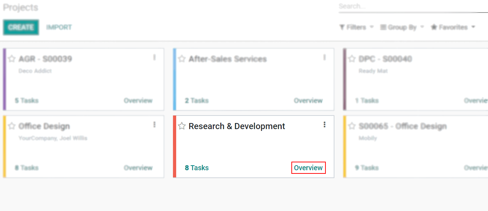
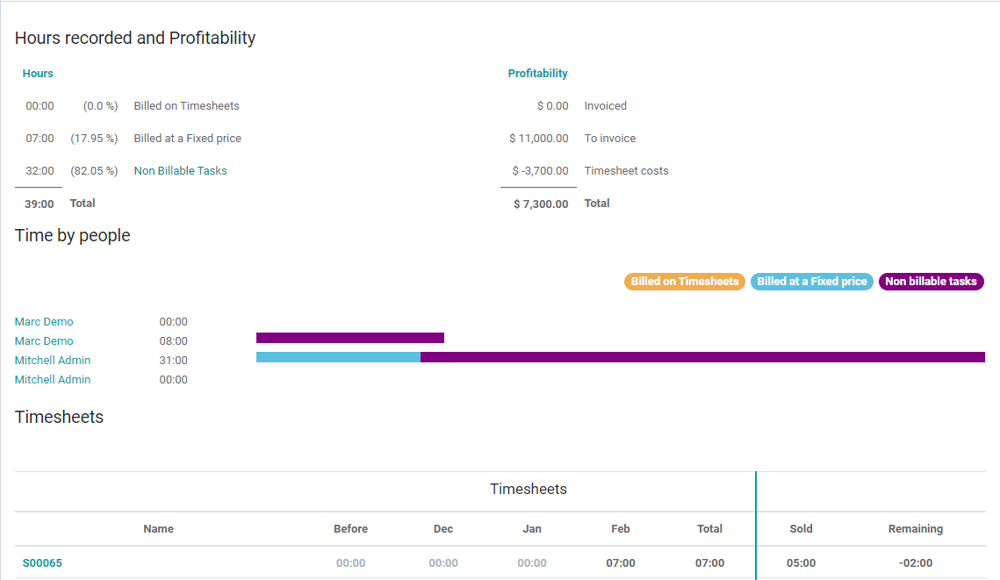
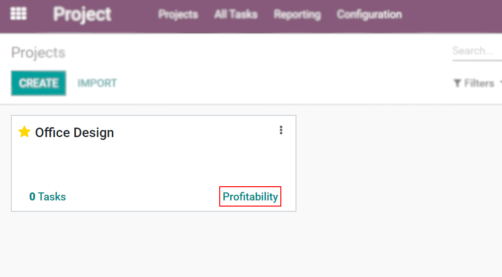
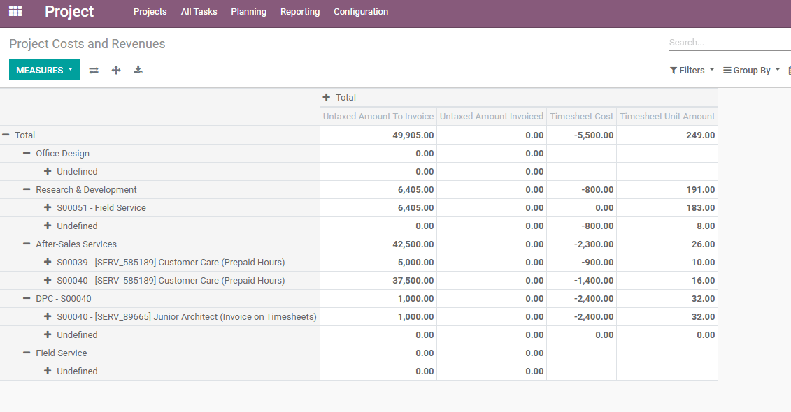

=============================
Track Projects’ Profitability
=============================

A project runs smoother if you can have an overview of its costs, revenues, profitability, tasks,
time and people, all in the same place. It allows you to make smarter business decisions as you know
where you are standing and can course-correct if needed.

Track costs and revenue
=======================

If you have the Timesheets application installed
------------------------------------------------

Go to :menuselection:`Project --> Configuration --> Projects`, choose the respective project,
*Edit* and enable *Timesheets*. A menu *Overview* becomes available in the Kanban view.

The overview shows the hours recorded split by the different billable options, profitability, time
by people according to the billable hours recorded, and even a timesheet table.

If you do not have the Timesheets application installed
-------------------------------------------------------

| Activate the :ref:`developer mode <developer-mode>`. Then go to *Manager Users* and enable
  *Analytic Accounting*. Now, go to :menuselection:`Project --> Configuration --> Projects` and
  specify an *Analytic Account* under the needed project.
| A *Profitability* menu to the costs and revenues of this analytic account is directly available
  in the Kanban view.

Reporting
=========

Under *Reporting*, obtain a report on the *Project Costs and Revenues*. Choose among graph options
or do your analysis through a pivot view.

.. seealso::
   - :doc:`/applications/finance/accounting/others/analytic/usage`
   - :doc:`/applications/finance/accounting/others/analytic/timesheets`
   - :doc:`/applications/finance/accounting/others/analytic/purchases_expenses`
