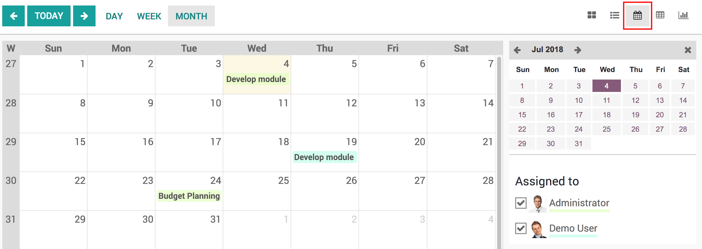

===========================
Visualize a project's tasks
===========================

In day to day business, your company might struggle due to the important
amount of tasks to fulfill. Those tasks already are complex enough.
Having to remember them all and follow up on them can be a burden.
Luckily, Odoo enables you to efficiently visualize and organize the
different tasks you have to cope with.

Create a task
=============

While in the project app, select an existing project or create a new
one.

In the project, create a new task.

.. image:: media/visualization01.png
    :align: center

In that task you can then assigned it to the right person, add tags, a
deadline, descriptions… and anything else you might need for that task.

.. image:: media/visualization02.png
    :align: center

View your tasks with the Kanban view
====================================

Once you created several tasks, they can be managed and followed up
thanks to the Kanban view.

The Kanban view is a post-it like view, divided in different stages. It
enables you to have a clear view on the stages your tasks are in and
which one have the higher priorities.

The Kanban view is the default view when accessing a project, but if you
are on another view, you can go back to it any time by clicking the
kanban view logo in the upper right corner

You can also notify your colleagues about the status of a task right
from the Kanban view by using the little dot, it will notify follower of
the task and indicate if the task is ready.

.. image:: media/visualization04.png
    :align: center

Sort tasks in your Kanban view
==============================

Tasks are ordered by priority, which you can give by clicking on the
star next to the clock and then by sequence, meaning if you manually
move them using drag & drop, they will be in that order and finally by
their ID linked to their creation date.

.. image:: media/visualization05.png
    :align: center

Tasks that are past their deadline will appear in red in your Kanban
view.

.. note::
    If you put a low priority task on top, when you go back to your
    dashboard the next time, it will have moved back below the high priority
    tasks.

Manage deadlines with the Calendar view
=======================================

You also have the option to switch from a Kanban view to a calendar
view, allowing you to see every deadline for every task that has a
deadline set easily in a single window.

Tasks are color coded to the employee they are assigned to and you can
filter deadlines by employees by selecting who's deadline you wish to
see.

.. tip::
    You can easily change the deadline from the Calendar view by
    dragging and dropping the task to another case.
