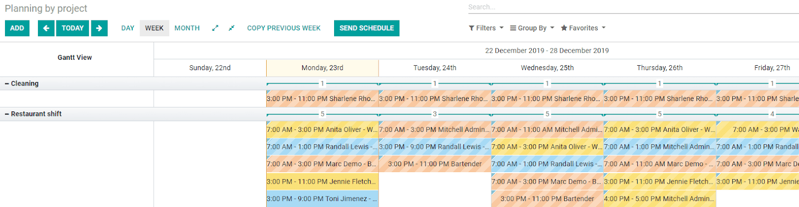
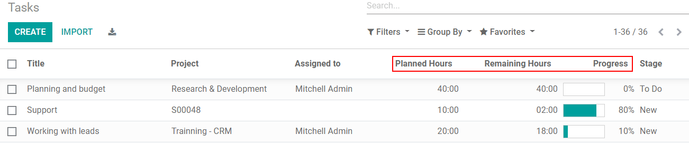

==================================
Forecast Resources Across Projects
==================================

Allocate the needed time for specific tasks under a planned shift. Once that is done, analyse Key
Performance Indicators (KPIs), so you can evaluate your employees’ performance and workload, besides
the progress of your projects/tasks when comparing the planned and effective hours.

Allocate times under shifts
===========================

When planning a shift, in the *Planning* application, create a project and a task on the fly,
or simply select the one you want.

.. image:: media/allocate_time.png
   :align: center
   :alt: Planning form to choose the project, task and allocated hours in Odoo Planning

| *Allocated Time (%)* allows you to define the percentage of time you would like your employee to
  work on that specific task during his shift. See that information in hours on *Allocated hours*.
| The calculation shows you how many hours out of the total shift time (*End date* - *Start date*)
  are spent by the employee on that task.
| On :menuselection:`Project --> Planning --> By Project`, immediately see the total number of
  employees allocated per project.

Compare forecast hours with the effective ones
==============================================

Now, once the employee has timesheeted his hours in the task, go to *Project* and with the
*View list*, under *All Tasks*, conveniently see the *Planned Hours* compared to the
*Remaining Hours*, and a calculation of the *Progress*.

.. important::
   Reminder: the option *Timesheets* has to be enabled on your project.

   .. image:: media/enable_timesheets.png
      :align: center
      :height: 400
      :alt: Under the settings of a project enable timesheets in Odoo Project
