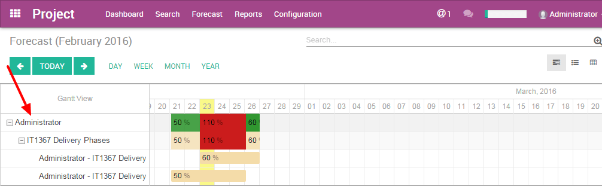

======================
How to forecast tasks?
======================

Introduction to forecast 
========================

Scheduling and forecasting tasks is another way to manage projects. In
Odoo, the Forecast option gives you access to the Gantt chart.

So far, you've been working with the Kanban view, which shows you the
progress of a project and its related tasks.

Now, with the Forecast option, the Gantt view gives you the big picture.
It's highly visual which is a real plus for complex projects, and it
helps team members to collaborate better.

This option is a real benefit in terms of planning and organizing the
workload and human resources.

How to configure the projects? 
==============================

Configure the project application
---------------------------------

The **Forecast** option helps you to organize your projects. This is perfect
when you need to set up a project with a specific deadline. Therefore,
each task is assigned a specific timeframe (amount of hours) in which
your employee should complete it!

First you need to activate the **Forecast** option for the whole project
application:

Go to :menuselection:`Project --> Configuration --> Settings`.
Select the Forecast option and click **Apply**.

.. image:: media/forecast01.png
    :align: center

Once this is done, you still need to activate the **Forecast** option
specifically for your **Project** (maybe you don't need the Gantt chart for
all the projects that you manage).

Configure a specific project. 
-----------------------------

When creating a new project, make sure to select the option "Allow
Forecast" in your project settings.

You'll see the **Forecast** option appearing in the top menu.

.. image:: media/forecast02.png
    :align: center

If you add the Forecasting option to an existing project, whether there
are task deadlines or not scheduled, the task won't be displayed.

The tasks of a project are not related to a forecast.

How to create a forecast?
-------------------------

Before creating a project with forecast, list all the tasks with the
projected time they should take. It will help you to coordinate the
work.

In order to display the projects in the Gantt chart, you need to create
the forecast from the task page. To create a forecast, click on the top
left corner of the task, **Create a Forecast**.

.. image:: media/forecast03.png
    :align: center

.. tip::
    You can also create a new Forecast easily by directly clicking on an empty 
    space in the Gantt chart calendar.

The Forecast interface will fill in the name of the Project and the task
automatically. You just need to add the dates and the time the task
should take.

.. image:: media/forecast04.png
    :align: center

.. tip::
    The "Effective hours" field appears only if you have the **Timesheet** app 
    installed on your database. This option helps you to see the progress of a 
    task thanks to the integration with Timesheet.

    For example: When a user fills in a Timesheet with your Project name 
    (Analytic account), with 10 hours spent, the forecast will display 10 hours 
    in the Effective hours field.

What are the difference between the views?
==========================================

In the **Project** app menu you have a **Forecast** menu. This sub-menu helps
you to see the Gantt chart from different points of view: by users or by
projects.

By users : people management
----------------------------

This option displays the Gantt chart with the people assigned. Odoo's
Gantt chart shows you who's involved; it gives you the big picture of
the project. It's very useful to allocate your resources effectively.

On the left side, first level, you can see which users are involved.
Then, on the second level you see which projects they are assigned to.
On the third, you see which tasks they're on.

Each task is represented by a coloured rectangle. This rectangle
reflects the duration of the task in the calendar.

The top rectangle on the first level is the sum of all the tasks
compiled from the third level. If it's green, it means that the total
time allocated to that user is less than 100%. When it's red, it means
that this user is assigned to multiple tasks which total more than 100%
of his/her time.

Plan the workload
~~~~~~~~~~~~~~~~~

When creating a forecast, you have to select the time the user should
spend on it. 100% means that your user should work on it full time
during those days. He/She has no other tasks to work on. So you can
decide from 1 to 100% how your users should organize their time between
different tasks.

The power of integration helps you to avoid double booking an employee.
For example, if your expert is already at 40% on another task in another
project, you can book him/her for only 60% for that period.

In the example below, the user "Administrator" is working on 2 projects
("IT1367 Delivery Phases" and "Implementation Process56"). The user is
assigned to both projects with a total of 110% of their time. This is
too much so the Project Manager should change the users assigned to the
task. Otherwise, the PM can change the dedicated time or the dates, to
make sure that this is feasible.

.. image:: media/forecast06.png
    :align: center

Gantt view advantages
~~~~~~~~~~~~~~~~~~~~~

This Gantt view ‘by user' helps you to better plan your human resources.
You avoid confusion about the the tasks and the assignations of the
users. The Gantt Chart is highly visual and helps to comprehend all the
different elements at once. Also, you immediately know what has to be
done next. This method helps you to better understand the relations
between the tasks.

The dynamic view of the Gantt in Odoo allows you to:

-   change the time and date of a forecast by clicking and sliding the
    tasks in the future or in the past

-   create a new forecast into the Gantt chart immediately

-   modify an existing forecast

-   change the length of a task by extending or shortening the rectangle.

By projects: project management
-------------------------------

The Gantt Chart is the perfect view of a project to better understand
the interactions between the tasks. You can avoid overlapping tasks or
starting one too early if another one isn't finished. Odoo Gantt chart
is clear and helps you to coordinate tasks efficiently.

This option displays the Gantt chart by showing the projects on the
first level of hierarchy.

On the left side, first level, you can see the projects. Then, on the
second level you see which users are assigned. On the third, you see
which tasks they're on.

This view won't show your HR time. The colours don't apply. (see **By
Users** section)

.. image:: media/forecast07.png
    :align: center

Gantt view advantages
~~~~~~~~~~~~~~~~~~~~~

The dynamic view of the Gantt in Odoo allows you to:

-   change the time and date of a forecast by clicking and sliding the
    tasks in the future or in the past

-   create a new forecast into the Gantt chart immediately

-   modify an existing forecast

-   change the length of a task by extending or shortening the rectangle.
