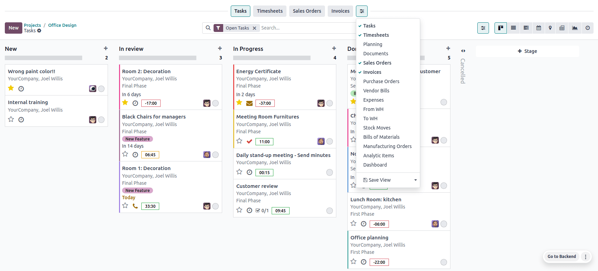

:show-content:

==================
Project management
==================

Odoo Project uses the **Kanban** project management system. This means all projects are broken down
into tasks, which are categorized on a whiteboard according to what production phase they are in.

.. admonition:: Did you know?

   The word **Kanban** comes from Japanese and refers to the "visual board" management method.

.. _project_management/configuration:

Configuration
=============

Open the **Project** app and click :guilabel:`Create` to start a new project. Enter a
:guilabel:`Name` for your project and click :guilabel:`Create Project`.

You can customize your existing **projects** from the dashboard by clicking the drop-down toggle
button (:guilabel:`⋮`) on your project's **card**.

.. image:: project_management/project-settings.png
   :align: center
   :alt: Project card

This enables a new menu divided into four parts:

- :guilabel:`View`: see an overview of your project's components, such as its :guilabel:`Tasks`,
  :guilabel:`Milestones` and :guilabel:`Project Updates`. Depending on which apps you have
  activated, more options may be available, such as :guilabel:`Documents`. All uploaded files can be
  found under this menu, as well as in the **Documents** app, under :guilabel:`Projects`;
- :guilabel:`Reporting`: analyze your project's progress and profitability through graphics and
  statistics;
- **Color**: make a line of color appear on the left side of the card so that your project is more
  recognizable;
- :guilabel:`Settings`: you can change the following:

  - the :guilabel:`Name` of the project;
  - the :guilabel:`Name of the tasks` found under that project;
  - the :guilabel:`Customer` for whom the project is intended;
  - the :guilabel:`Tags` used for filtering;
  - the :guilabel:`Company` responsible for the project;
  - the employee designated as :guilabel:`Project Manager`;
  - the :guilabel:`Planned Date` of the project;
  - the total :guilabel:`Allocated Hours` for that project.

Additionally, you can mark the project as :guilabel:`Favorite`, allowing you to find it using the
:guilabel:`My Favorites` filter on the Kanban view;

.. image:: project_management/project-settings-opened.png
   :align: center
   :alt: Project settings

.. seealso::
   `Odoo Tutorials: Customize projects
   <https://www.odoo.com/slides/slide/customize-projects-3615?fullscreen=1>`_

Further settings are available under the :guilabel:`Settings` tab. Most of them are *only* available
depending on the activated apps.

Visibility and collaboration
----------------------------

Odoo allows you to set visibility settings for each project, enabling you to make your project
available to everyone in your organization or restrict access to certain internal or external users.

To do so, go to the project's :guilabel:`Settings` tab and choose the desired :guilabel:`Visibility`
option:

- :guilabel:`Invited internal users (private)`: Only users following the project and users with the
  Project Administrator :doc:`access right </applications/general/users/access_rights>` can
  access the project and its tasks.
- :guilabel:`All internal users`: All internal users can access the project and all of its tasks.
- :guilabel:`Invited portal users and all internal users (public)`: All internal users can access
  the project and all of its tasks. When following a project, :doc:`portal users
  </applications/general/users/portal>` only have access to the specific tasks they are following.
  This option is selected by default.

Inviting external users
-----------------------

To invite external users, make sure that :guilabel:`Invited portal users and all internal users
(public)` is selected, then click :guilabel:`Share Project` at the top of the project’s settings.
The following options are available:

- Copy and share the :guilabel:`Public Link` displayed at the top of the pop-up window. Anyone with
  this link can access the project in read mode.
- Or click :guilabel:`Add a line`, select a :guilabel:`Collaborator`, choose the
  :guilabel:`Access Mode`, and check the box to send an invitation to their email address.

  There are three types of :guilabel:`Access Mode` for collaborators:

  - :guilabel:`Read`: Collaborators can view tasks but cannot edit them.
  - :guilabel:`Edit with limited access`: Collaborators can view and edit the tasks they follow.
  - :guilabel:`Edit`: Collaborators can view and edit all tasks.

To revoke an invited collaborator's access, click :guilabel:`Share Project` at the top of the
project’s settings, then click the :icon:`fa-trash-o` :guilabel:`(trash)` icon.

.. note::
   Internal users without access to the project can still access a task if the URL has been shared
   with them. For projects set as :guilabel:`Invited internal users (private)`, they must also
   be a follower of the task.

Scheduling activities
=====================

You can schedule **activities** (ex. :guilabel:`Call`, :guilabel:`Meeting`, etc.) per project by
clicking on the **clock** icon on a project. Doing so opens a list with already scheduled activities
and allows planning **new** activities by clicking :guilabel:`+ Schedule an activity`. On the pop-up
window, select the :guilabel:`Activity Type`, enter a :guilabel:`Summary` for that activity, a
:guilabel:`Due Date`, and assign it to an employee. According to the :guilabel:`Activity Type`, you
may have **additional options** available.

.. note::
   If an activity is **already** scheduled, the icon may change to a **phone**, **group of people**,
   or other.

.. _project/project-management/top-bar:

Top bar
=======

In project management, reviewing the various records and documents related to a project is often
necessary. Odoo Project’s **top bar** provides quick access to these essential resources. You can
customize each project's top bar to match its specific needs.

To set up the top bar for a project, go to the :guilabel:`Project` app, click the project's card,
then click the top bar :icon:`fa-sliders` :guilabel:`(sliders)` button. In the bar that appears
above the search bar, click the :icon:`fa-sliders` :guilabel:`(sliders)` button to select the records
you want to display, such as timesheets, sales orders, invoices, documents, dashboards, etc.

You can then click the buttons to access the related records without leaving the Project app. To
return to your project tasks' Kanban view, click the :guilabel:`Tasks` button in the top bar.

Custom top bar buttons
----------------------

You can also create your own buttons to access more specific views:

#. Click an existing top bar button to access the view.
#. Customize the view with keywords, filters, and grouping options using the search bar.
#. Click the :icon:`fa-sliders` :guilabel:`(sliders)` button in the top bar and select
   :guilabel:`Save View`.
#. Edit the default button name if necessary, then enable :guilabel:`Shared` if you want to share
   the button with other users.

.. toctree::
   :titlesonly:

   project_management/project_dashboard
   project_management/project_profitability
   project_management/project_templates
