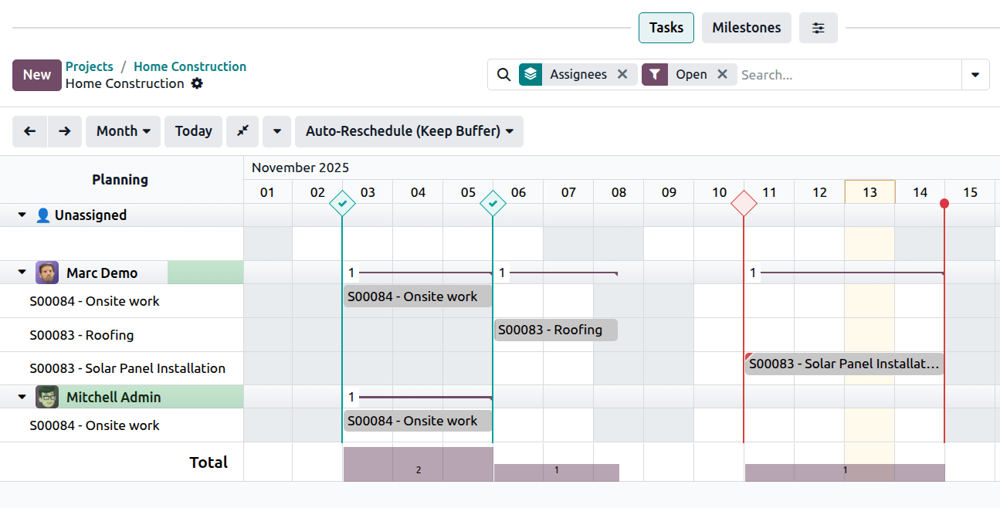

==================
Project milestones
==================

**Milestones** enable you to track ongoing project work by designating a sequence of key steps that
must be reached before the project’s completion. Milestones are particularly useful in expensive,
long, or large-scale projects. They can be used purely for indicative purposes, as a way to ensure
that the project is completed in a timely manner.

Milestones can also be used as a basis for :doc:`invoicing the client </applications/sales/sales/invoicing/milestone>`.
This benefits both parties, as it ensures consistent cash flow for project funding and allows the
client to pay for the project in several installments.

Configuration
=============

Enable milestones for the desired project by opening the :guilabel:`Project` app, clicking the
:icon:`fa-ellipsis-v` (:guilabel:`vertical ellipsis`) on the project’s card, and clicking
:guilabel:`Settings`. Under :guilabel:`Tasks Management`, enable :guilabel:`Milestones`.

.. note::
   Milestones are automatically enabled for projects created from a sales order for a service
   :doc:`invoiced by milestone </applications/sales/sales/invoicing/milestone>`.

Configure project milestones by clicking the :icon:`fa-ellipsis-v` (:guilabel:`vertical ellipsis`)
on the project’s card and selecting :guilabel:`Milestones`. Create a milestone by clicking
:guilabel:`New`, entering the milestone's :guilabel:`Name`, selecting a :guilabel:`Deadline` if
desired, and clicking :guilabel:`Save`.

Add or remove options by clicking the :icon:`oi-settings-adjust` :guilabel:`sliders`. The following
options are relevant when using
:doc:`invoicing based on milestones </applications/sales/sales/invoicing/milestone>`:

 - :guilabel:`Sales Order Item`: this field is filled in automatically with the Sales Order number.
 - :guilabel:`Quantity (%)`: percentage of the ordered quantity that will automatically be delivered
   on the sales order once the milestone is marked as reached.

Once milestones are configured, **you can link project tasks to milestones**. To do so, navigate to
the project you created the milestones in, then click one of the tasks to open it. Then, click the
:guilabel:`Milestone` field to open a drop-down menu. Select the desired milestone from the list.

Once all the tasks linked to the milestone are completed (marked as
:doc:`Done or Cancelled <../tasks/task_stages_statuses>`), the milestone will be automatically
marked as :guilabel:`Reached` in the :menuselection:`Project --> Settings --> Milestones`. You can
also check the :guilabel:`Reached` box manually whenever the milestone is reached. Manual checking
of the box will not impact the tasks linked to the milestone.

Using milestones
================

Odoo offers several ways to oversee the project’s milestones and their relationship to ongoing
tasks.

In the **Gantt view**, a milestone is shown as a vertical line marked with a diamond shape,
displayed on the day of the milestone’s deadline. The line is color-coded in blue to indicate that
the milestone has not yet reached its deadline, or it has been marked as reached (in which case, a
check mark is displayed on the milestone). A milestone is color-coded in red if it has not been
reached by its deadline.

If a milestone’s deadline falls on the same day as the project’s deadline, it is displayed with a
vertical line marked with a circle, and the same color coding principles as above apply.

Aside from the Gantt view, you can also create, edit, and mark milestones as reached from
:ref:`the project dashboard <project/project-dashboard/milestones>`.

