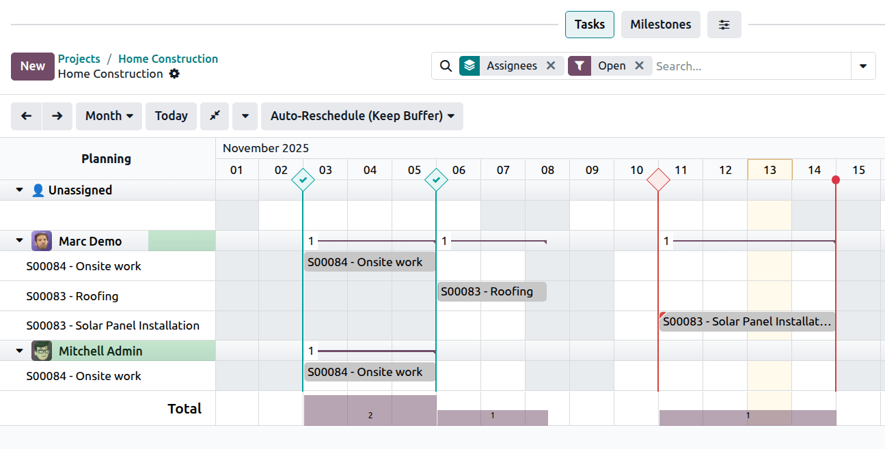

==================
Project milestones
==================

**Milestones** enable you to track ongoing project work by designating a sequence of key steps that
must be reached before the project’s completion. Milestones are particularly useful in expensive,
long, or large-scale projects. They can be used purely for indicative purposes, as a way to ensure
that the project is completed in a timely manner.

Milestones can also be used as a basis for :doc:`invoicing the client </applications/sales/sales/invoicing/milestone>`.

This benefits both parties, as it ensures consistent cash flow for project funding and allows the
client to pay for the project in several installments.

Enabling milestones
===================

Go to the **Project** app, click the :icon:`fa-ellipsis-v` (:guilabel:`vertical ellipsis`) on a
project’s card, and click :guilabel:`Settings`. Click the :guilabel:`Settings` tab, look for
:guilabel:`Task's Management`, and enable :guilabel:`Milestones` by checking the box.

.. note::
   Milestones are automatically enabled in projects created from a sales order for a service
   :doc:`invoiced by milestone </applications/sales/sales/invoicing/milestone>`.

Milestones configuration
========================

From the **Project** app, click the :icon:`fa-ellipsis-v` (:guilabel:`vertical ellipsis`) on a
project’s card, and click :guilabel:`Milestones`.

Then click :guilabel:`New`, type the name of your milestone in the corresponding field, and click
:guilabel:`Save`. Add or remove options by clicking the :icon:`oi-settings-adjust`
:guilabel:`sliders`:

 - :guilabel:`Sales Order Item`: this field is filled in automatically when using milestones as an
   invoicing method on a sales order.
 - :guilabel:`Quantity (%)`: percentage of the ordered quantity that will automatically be delivered
   once the milestone is reached.
 - :guilabel:`Deadline`: date by which the milestone should be reached. Milestones that are past the
   deadline are displayed in red.
 - :guilabel:`Reached`: This box is automatically checked when all tasks linked to the milestone are
   completed (marked as :doc:`Done or Cancelled <../tasks/task_stages_statuses>`).
   You can also check it manually whenever the milestone is reached. Manual checking of the box will
   not impact the tasks linked to the milestone. When
   :doc:`invoicing based on milestones </applications/sales/sales/invoicing/milestone>`, once a
   milestone is marked as reached, the delivered amount is automatically updated on the sales order.

.. note::
   Milestones are project-specific, meaning that they only exist within a given project.

Using milestones
================

Odoo offers several ways to oversee the project’s milestones and their relationship to ongoing tasks.

In the **Gantt view**, a milestone is shown as a vertical line marked with a diamond shape,
displayed on the day of the milestone’s deadline. The line is color-coded in blue to indicate that
the milestone has not yet reached its deadline, or it has been marked as reached (in which case, a
check mark is displayed on the milestone). A milestone is color-coded in red if it has not been
reached by its deadline.

If a milestone’s deadline falls on the same day as the project’s deadline, it is displayed with a
vertical line marked with a circle, and the same color coding principles as above apply.

Aside from the Gantt view, you can also create, edit, and mark milestones as reached from
:ref:`the project dashboard <project/project-dashboard/milestones>`.

