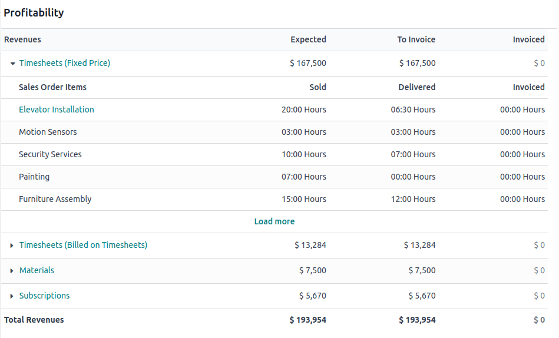

=====================
Project profitability
=====================

When handling billable projects, it is essential to determine whether your projects are turning a
profit. Measuring **project profitability** involves keeping track of the costs of resources used to
carry out the project, such as employee costs, materials used, purchases, expenses, or after-sales
services, and comparing them with the project revenues.

Project profitability is tracked in the :doc:`project dashboard <project_dashboard>` on all billable
projects.

To access the :doc:`project dashboard <project_dashboard>`, open the **Project** app and navigate to
the applicable project. Click the :icon:`fa-sliders` (:guilabel:`sliders`) icon to add
:guilabel:`Dashboard` to the project's :ref:`top bar <project/project-management/top-bar>`.

.. tip::
   You can also access the :doc:`project dashboard <project_dashboard>` by hovering over the desired
   project’s card, clicking the :icon:`fa-ellipsis-v` (:guilabel:`vertical ellipsis`), and selecting
   :guilabel:`Dashboard`.

The **profitability dashboard** is on the right side of the project dashboard and displays data for
all records linked to the project and its
:doc:`analytic account </applications/finance/accounting/reporting/analytic_accounting>`. It’s
divided into two major sections: :ref:`revenues <project/project-profitability/revenues>`, which
displays a breakdown of income generated by the project, and
:ref:`costs <project/project-profitability/costs>` accrued by your company. The same record can be
displayed in both sections, e.g., the same timesheet is listed under :guilabel:`Revenues` with the
amount the customer paid for the work and under :guilabel:`Costs` with the amount of wages paid to
the employees.

The amounts displayed in the profitability report are divided into three columns:

 - :guilabel:`Expected`: the amounts expected based on existing sales or purchase orders.
 - :guilabel:`To invoice` (revenues) or :guilabel:`To bill` (costs): the amounts are moved to this
   column when the work or goods have been delivered, e.g., a
   :doc:`timesheet </applications/services/timesheets>` has been created and/or validated, a
   delivery order has been marked as done, or the delivered quantity has been manually updated on
   the sales order.
 - :guilabel:`Invoiced` or :guilabel:`Billed`: the amounts are moved to this column once an invoice
   or bill has been confirmed.

Based on the same principle, the revenues section is further divided into :guilabel:`Sold`,
:guilabel:`Delivered`, and :guilabel:`Invoiced` columns. Use the :icon:`fa-caret-right`
(:guilabel:`arrow`) icon to see a detailed breakdown for each line.

.. tip::
   Use the project’s :ref:`top bar <project/project-management/top-bar>` to easily access and edit
   records linked to the project’s profitability from the project’s Kanban view.

.. important::
   In order for a record to be displayed on the profitability dashboard, it must be linked to the
   project and its :doc:`analytic account </applications/finance/accounting/reporting/analytic_accounting>`.

The following records can be displayed in the profitability dashboard.

.. _project/project-profitability/revenues:

Revenues
--------

 - :guilabel:`Timesheets`: revenues from :doc:`timesheets </applications/services/timesheets>`,
   broken down according to the :guilabel:`Invoicing Policy` selected on the product form (e.g.,
   :doc:`Prepaid/Fixed Price </applications/sales/sales/invoicing/invoicing_policy>`,
   :doc:`Based on Timesheets </applications/sales/sales/invoicing/time_materials>`,
   :doc:`Based on Milestones </applications/sales/sales/invoicing/milestone>`).
 - :guilabel:`Materials`: total of sales prices of products sold via sales orders linked to the
   project.
 - :guilabel:`Customer invoices`: a total of invoices linked to the project.
 - :guilabel:`Subscriptions`: a total of sales prices of
   :doc:`subscriptions </applications/sales/subscriptions>` linked to the project.
 - :guilabel:`Down payments`: a total of
   :doc:`down payments </applications/sales/sales/invoicing/down_payment>` linked to the project.
 - :guilabel:`Expenses`: any :doc:`expenses </applications/finance/expenses>` that have been
   :doc:`reinvoiced to the customer </applications/sales/sales/invoicing/expense>`.

.. _project/project-profitability/costs:

Costs
-----

 - :guilabel:`Timesheets`: total cost of time tracked by employees via :doc:`timesheets
   </applications/services/timesheets>`, based on the employee's
   :ref:`HR settings <employees/hr-settings>`.
 - :guilabel:`Purchase Orders`: total cost of
   :doc:`purchase orders </applications/inventory_and_mrp/purchase/manage_deals>` linked to the
   project. Those could cover goods, materials, or even subcontracted services. This entry only
   appears once the vendor bill is posted.
 - :guilabel:`Materials`: total cost of products included in
   :doc:`stock moves </applications/inventory_and_mrp/inventory/shipping_receiving>` (deliveries and
   receipts) that have been validated for the project. This section is only displayed if
   :guilabel:`Analytic Costs` have been enabled in
   :menuselection:`Inventory --> Configuration --> Operations Types` for applicable operations. This
   ensures that the product's cost is tracked during the stock move.
 - :guilabel:`Expenses`: total costs of :doc:`expenses </applications/finance/expenses>` linked to
   the project that have been submitted and approved.
 - :guilabel:`Vendor bills`: total costs of
   :doc:`vendor bills </applications/inventory_and_mrp/purchase/manage_deals/manage>` linked to the
   project's analytic account.
 - :guilabel:`Manufacturing orders`: total costs of manufacturing orders linked to the project's
   analytic account.
 - :guilabel:`Other costs`: any other costs linked to the project's analytic account.
