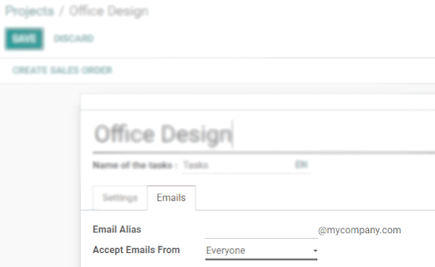

==========================================
Create Project's Tasks from an Email Alias
==========================================

When you already have an email address that customers know from the top of their heads, changing
it is the last thing you want to do. Instead, link that address to your project and transform
those conversations into structured work. It automatically creates a task in the first stage
of a project.

Set up an incoming email server
===============================

| On the *Settings* application, enable *External Email Servers* and define the incoming email
  alias you would like to use.
| **For more information**: :doc:`/applications/general/email_communication/email_servers`

Configure the email alias in your project
-----------------------------------------

| Now that you have the incoming email server set up, go to
  :menuselection:`Project --> Configuration --> Projects --> Edit`. Under the *Emails* tab, define
  the wanted email alias and choose the policy to receive a message.
| In addition, you can now directly set it when creating a new project.

.. important::
   All the recipients of the email (To/Cc/Bcc) are automatically added as followers of the task.

The email can be seen under the name of your project on the dashboard.

.. image:: email_alias/email_dashboard_project.png
   :align: center
   :height: 300
   :alt: View of the email alias chosen on the dashboard view in Odoo Project
