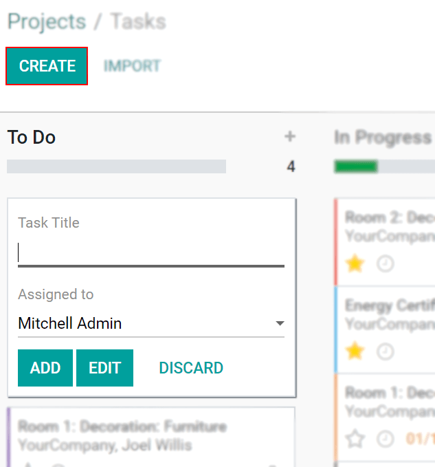
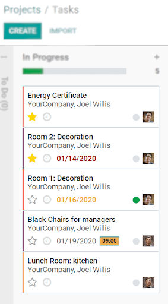
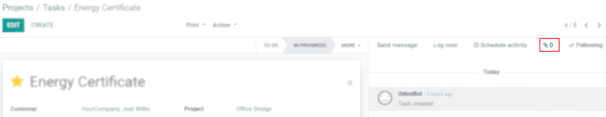
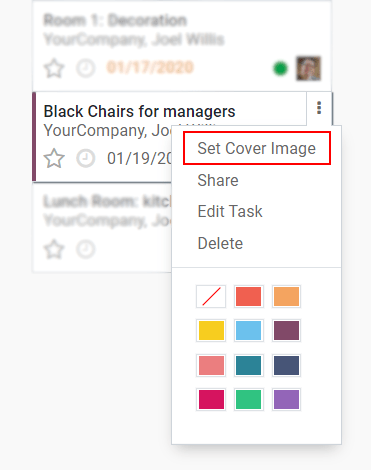
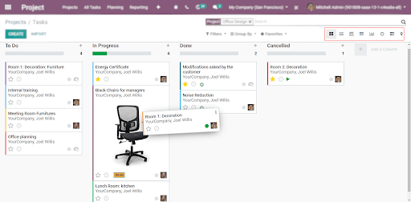
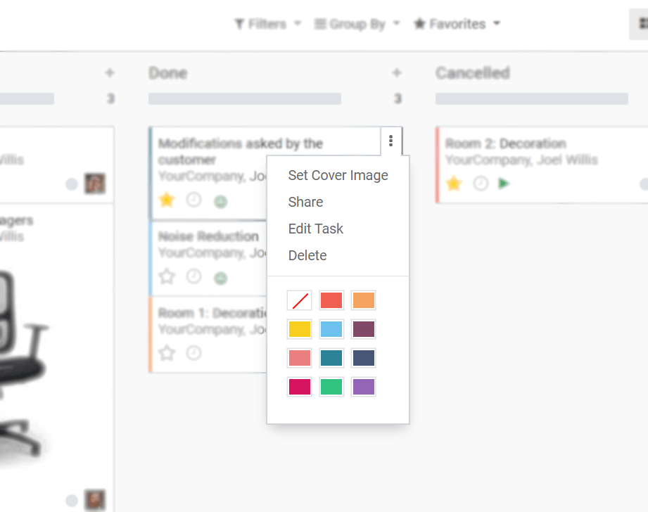

======================
Get Started with Tasks
======================

Break down a project by creating, assigning and organizing tasks. Set priorities to help you
determine where you want to invest your time first, manage files within it and keep everything you
need to complete your work in one place. Ensure that your strategies are turned into actionable
plans and, as a result, have a successful project.

Create a task
=============

Click on *Create*. Once created, add more details opening it and clicking on *Edit*.

Assignation
-----------

Choose the responsible person for a task under *Assigned to*.

.. image:: media/assignation.png
   :align: center
   :alt: Choosing the responsible person for the task in Odoo Project

Sort tasks by priority
======================

| Mark the star on your task to set it as a high priority one. That automatically moves the task
  to the top of the column. Tasks that are not starred are classified according to their
  deadlines.
| Note that tasks with dates passed their deadlines are shown in red; tasks with a deadline for
  the current date are orange.

Manage files in tasks
=====================

Add images/documents to your task by clicking on the *Attachment icon*.

.. tip::
   Files from emails are automatically saved.

Set cover images in tasks
=========================

Use *Set Cover Image* to your task and quickly get to comprehend what the task is about. The image
is directly shown in the Kanban view.

Choose how to visualize tasks
=============================

Tasks can be managed and followed up in the Kanban view, which is a post-it kind of view divided
into different stages. More options are otherwise available.

Drag and drop tasks to change their stage and define colors to help you identify them.

.. seealso::
   - :doc:`/applications/general/tags`

