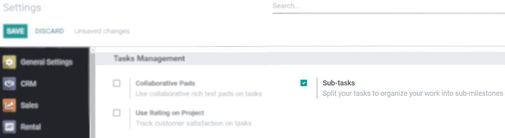
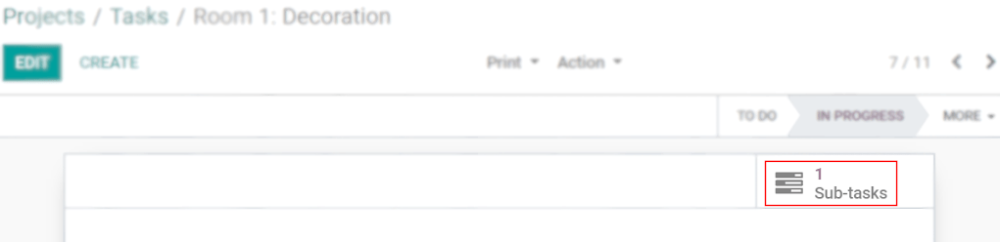
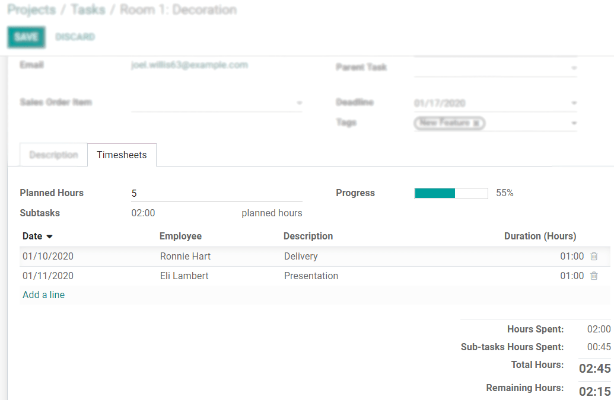
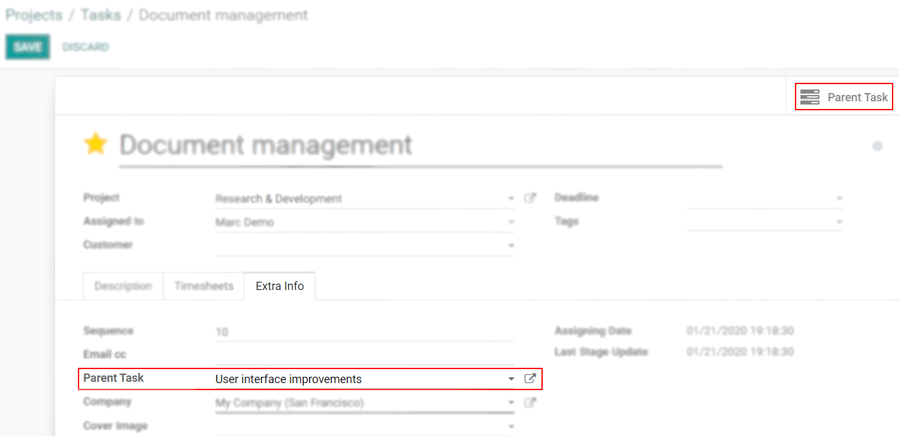
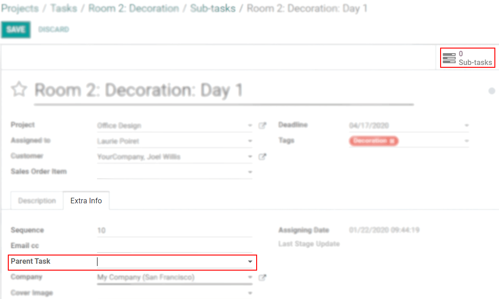

===================
Work with Sub-tasks
===================

Being a dynamic and organized company is important as it also helps you to not overload your
employees. For that, split large tasks into smaller ones by creating subs-tasks, timesheet
on them, and have an overview of all hours recorded.

Configuration
=============

Go to :menuselection:`Project --> Configuration --> Settings --> Sub-tasks`.

From now on, a *Sub-tasks* menu is available within your task.

Select a specific project in which sub-tasks will be created by default
-----------------------------------------------------------------------

By default, sub-tasks are created under the same project. However, you can select another one
by going to :menuselection:`Project --> Configuration --> Projects --> Sub-task Project`.

.. image:: media/specific_project.png
   :align: center
   :alt: Under the settings of a project, select the sub-task project in Odoo Project

Timesheet on sub-tasks
======================

Make sure the feature *Timesheets* is enabled under :menuselection:`Project --> Configuration -->
Settings` and under the settings of the needed *Project*. Now you are able to timesheet on your
tasks and sub-tasks. The time recorded on a sub-task is counted on the parent task.

Transform an existing task into a sub-task
==========================================

| Go to :menuselection:`Settings --> Activate the developer mode`.
| Now access your task, *Edit*, and add a *Parent Task*.

Unlink a sub-task from a parent task
====================================

| Go to :menuselection:`Settings --> Activate the developer mode`.
| Open and *Edit* the respective sub-task to remove the *Parent Task*.

.. seealso::
   - :doc:`../record_and_invoice/time_record`
