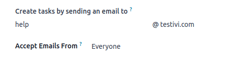

=============
Task creation
=============

Tasks in Odoo Project can be created manually or automatically, including from emails or website
forms.

Manual task creation
====================

Open the Project app and choose the desired project. Create a new task by doing one of the
following:

 - Clicking the :icon:`fa-plus` (:guilabel:`plus`) button in the upper left corner. This creates
   a new task in the first stage of your Kanban view.
 - Pressing the :icon:`fa-plus` (:guilabel:`plus`) button next to the Kanban stage name. This
   creates a new task in this Kanban stage.

Fill in the :guilabel:`Task Title` and add one or more :guilabel:`Assignees`, then click
:guilabel:`Add`.

.. _task_creation/task-configuration:

Task configuration
------------------

Click the task to open it. The task form includes the following fields that you can fill in:

 - :guilabel:`Task Title`: title of the task.
 - :icon:`fa-star-o` (:guilabel:`Star`): click the :icon:`fa-star-o` (:guilabel:`star`) icon to mark
   the task as high priority. The icon will turn yellow. Click it again to remove the high priority.
 - :guilabel:`Project`: the project that this task belongs to.
 - :guilabel:`Assignees`: the person(s) in charge of handling the work on this task.
 - :guilabel:`Tags`: custom labels allowing to categorize and filter your tasks.
 - :guilabel:`Customer`: the person or company that will be billed for this task. This field only
   appears in tasks that belong to billable projects.
 - :guilabel:`Sales Order Item`: this can be either the sales order that was used to create this
   task, or a sales order that was linked to this task manually. This field only appears in tasks
   linked to billable projects.
 - :guilabel:`Allocated Time`: the amount of time that the work on this task is expected to last,
   tracked by timesheets.
 - :guilabel:`Deadline`: the expected end date of the task. Once this field is filled in, you can
   also add a start date to designate the entire time frame of the tasks' duration.

.. tip::

   - You can also create new tasks by switching to the list or Gantt view and clicking
     :guilabel:`New`.
   - The following fields can also be edited directly from the Kanban view without opening the
     individual task: :icon:`fa-star-o` (**priority**), :guilabel:`Allocated hours`,
     :guilabel:`Assignees`, and **task status**. You can also **color code** or :guilabel:`Set a
     Cover image` to your task by clicking the :icon:`fa-ellipsis-v` (**vertical ellipsis**).
   - You can use the following keyboard shortcuts in the task title to configure new tasks (modify
     the values in the examples below according to your needs):

     - **30h**: to allocate 30 hours to the task.
     - **#tags**: to add tags to the task.
     - **@user**: to assign the task to a user.
     - **!**: to star the task as high priority.

     Along with using the correct format, follow this order: the task's name, followed by the
     allocated time, the tags, the assignee, and then the priority.

     For example, if you want to create a task named "Prepare workshop", allocate 5h hours to it,
     add the "School" tag, assign it to Audrey and set its priority to :guilabel:`High`, enter the
     following task title: Prepare workshop 5h #school @Audrey !

     .. image:: task_creation/task-shortcuts.png
        :alt: Using keyboard shortcuts to create a task in Project.

.. _task_creation/email_alias:

Creating tasks from an email alias
==================================

This feature allows for project tasks to be automatically created once an email is delivered to a
designated email address.

To configure it, open the Project app, then click the :icon:`fa-ellipsis-v` (:guilabel:`vertical
ellipsis`) icon next to the desired project's name. Select :guilabel:`Settings`, then open the
:guilabel:`Settings` tab.

Fill in the :guilabel:`Create tasks by sending an email to` field as follows:

 - **Section of the alias before the @ symbol**: type the name of the email alias, e.g. `contact`,
   `help`, `jobs`.
 - **Domain**: in most cases, this is filled in by default with your :doc:`domain
   <../../../general/email_communication>`.
 - **Accept Emails From**: refine the senders whose emails will create tasks in the project.

Once configured, the email alias can be seen under the name of your project on the Kanban dashboard.

When an email is sent to the alias, the email is automatically converted into a project task. The
following rules apply:

- The email sender is displayed in the :guilabel:`Customer` field.
- The email subject is displayed in the :guilabel:`Task Title` field.
- The email body is displayed in the :guilabel:`Description` field.
- The whole content of the email is additionally displayed in the **chatter**.
- All the recipients of the email (To/Cc/Bcc) that are Odoo users are automatically added as
  **followers** of the task.

Creating tasks from a website form
==================================

If you have the Website app installed in your database, you can configure any form on your
website to trigger the creation of tasks in a project.

#. Go to the website page where you wish to add the the form and
   :ref:`add the Form building block <websites/website/web_design/building_blocks>`.
#. In the website editor, edit the following fields:

   - :guilabel:`Action`: select :guilabel:`Create a Task`.
   - :guilabel:`Project`: choose the project that you want the new tasks to be created in.

#. :ref:`Customize the form <dynamic_content/form>`.

When the form is submitted, it automatically creates a project task. The task's content is defined
by the form's corresponding fields.

.. seealso::
   :doc:`Dynamic website content <../../../websites/website/web_design/building_blocks/dynamic_content>`
