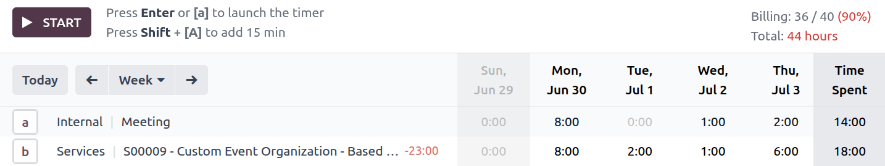
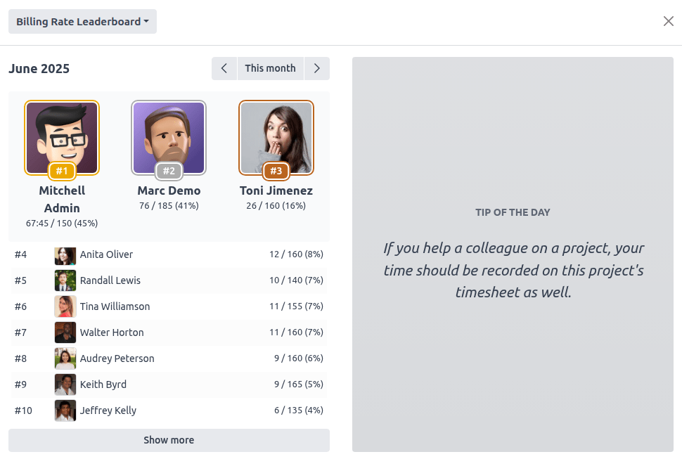

:show-content:

=======================================
Timesheet billing rates and leaderboard
=======================================

Odoo’s **Timesheets** app allows you to set personalized :ref:`billing rate targets <timesheets/billing_rates/targets>`
for employees. In addition to billing rate targets, a :ref:`leaderboard <timesheets/billing_rates/leaderboard>`
can be enabled to motivate employees and gamify their experience. The leaderboard displays the
billable and total time logged by employees, and can be enhanced with
:ref:`motivational tips <timesheets/billing_rates/tips>`.

.. _timesheets/billing_rates/targets:

Billing rate indicators
=======================

Configuration
-------------

To enable billing rate indicators, navigate to :menuselection:`Timesheets --> Configuration -->
Settings`, then enable :guilabel:`Billing Rate Indicators`, and click :guilabel:`Save`.

To set up the targets, click :guilabel:`Set employee billable time targets`, access the employee
form that you wish to edit, navigate to the :guilabel:`Settings` tab, then encode the monthly
:guilabel:`Billing Time Target` in hours or days, depending on the :guilabel:`Encoding Method`
selected in the **Timesheets** :guilabel:`Settings`.

.. note::
  Once the :guilabel:`Billing Rate Indicators` have been enabled, you can also set the employees'
  :guilabel:`Monthly Billing Time Target` directly from the **Employees** app.

Using the billing rate indicators
---------------------------------

Once enabled, the billing rate indicators are displayed in the upper right corner of the
:guilabel:`My Timesheets` menu in Kanban, grid, and list views for all users. The monthly amount of
time logged by the user is displayed in the following format: **logged billable time / billable time
target**. The percentage of completion of the billing rate target is also displayed, highlighted in
red if the user falls below the target and in green once the target is reached.

Below the billing rate indicators, the total monthly amount of time logged by the user is also
displayed.

.. _timesheets/billing_rates/leaderboard:

Billing rate leaderboard
========================

Configuration
-------------

After the :ref:`monthly billing time targets <timesheets/billing_rates/targets>` have been enabled,
Odoo offers the possibility of activating a **billing rate leaderboard** in order to motivate
employees and enhance workplace transparency.

To enable the billing rate leaderboard, navigate to :menuselection:`Timesheets --> Configuration -->
Settings`, activate :guilabel:`Billing Rate Leaderboard`, then click :guilabel:`Save`.

Using the billing rate leaderboard
----------------------------------

The billing rate leaderboard is then displayed in the upper right corner of the
:guilabel:`My Timesheets` view, next to the billing rate indicators. It displays the current top
three performers who have logged the highest percentage of their allocated billing hours.

It also shows the amount of time logged by the signed-in user in the format: logged billable
time / billable time target, as well as the total time logged.

Clicking on the area of the top three performers opens the leaderboard for all team members. Use the
drop-down menu in the upper left corner to switch between the :guilabel:`Billing Rate Leaderboard`
and the :guilabel:`Total Time Leaderboard`, which displays the total time logged by team members
across billable and internal projects.

.. _timesheets/billing_rates/tips:

Leaderboard tips
================

**Daily motivational tips**, displayed on the right side of the leaderboard, enhance the billing
rate and total time leaderboard. The tips are randomly selected and change daily.

To create or edit existing tips, navigate to :menuselection:`Timesheets --> Configuration --> Tips`,
then click :guilabel:`New` or double-click a tip's text.
