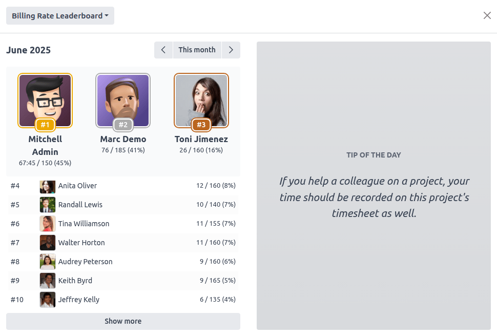

:show-content:

=======================================
Timesheet billing rates and leaderboard
=======================================

Odoo’s **Timesheets** app allows you to set personalized billable time targets for employees. In
addition to billable time targets, a leaderboard can be enabled to motivate employees and gamify
their experience. The leaderboard displays billable and total time logged by employees, and can be
enhanced with motivational tips.

Billing rate indicators
=======================

To enable billing rate indicators, navigate to :menuselection:`Timesheets --> Configuration --> Settings`,
then enable :guilabel:`Billing Rate Indicators`, and press :guilabel:`Save`.

A new item, :guilabel:`Billing Time Targets` is then added in the :guilabel:`Configuration` menu. To
set up the targets, click :guilabel:`Billing Time Targets`, then encode the :guilabel:`Monthly
Billing Time Target` in hours or days, depending on the **Encoding Method** selected in the
**Timesheets** app configuration.

.. note::
   Once the :guilabel:`billing rate indicators` have been enabled in **Timesheets** app
   configuration, you can also navigate to the **Employees** app, access the employee form that you
   wish to edit, and navigate to the :guilabel:`Settings` tab. Scroll down to
   :guilabel:`Application settings`, then encode the :guilabel:`Monthly Billing Time Target`.

Billing rate leaderboard
========================

After the **monthly billing time targets** have been enabled, Odoo offers the possibility of
activating a **billing rate leaderboard** in order to motivate employees and enhance workplace
transparency.

To enable the billing rate leaderboard, navigate to :menuselection:`Timesheets --> Configuration --> Settings`,
activate :guilabel:`Billing Rate Leaderboard`, then click :guilabel:`Save`.

The billing rate leaderboard is then displayed in the upper right corner of the Kanban, grid, and
list views of the :guilabel:`My Timesheets` menu for all users. It displays the current top three
performers who have logged the highest percentage of their allocated billing hours. For the top
performer, it also shows the amount of their logged time in the format: logged billable time /
billable time target, as well as the total time logged.

Clicking on the area of the top three performers opens the leaderboard for all team members. Use the
drop-down menu in the upper left corner to switch between the :guilabel:`Billing Rate Leaderboard`
and the :guilabel:`Total Time Leaderboard`, which displays the total time logged by team members
across billable and internal projects.

Leaderboard tips
================

The billing rate and total time leaderboard can be enhanced with daily **motivational tips**.
They’re displayed on the left side of the leaderboard. The tips are randomly selected and change
daily.

To create or edit existing tips, navigate to :menuselection:`Timesheets --> Configuration --> Tips.
To create a new tip, press :guilabel:`New`, and to edit the existing one, double-click on its text.
