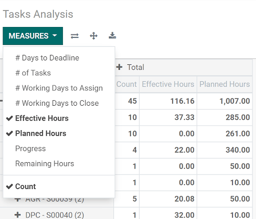
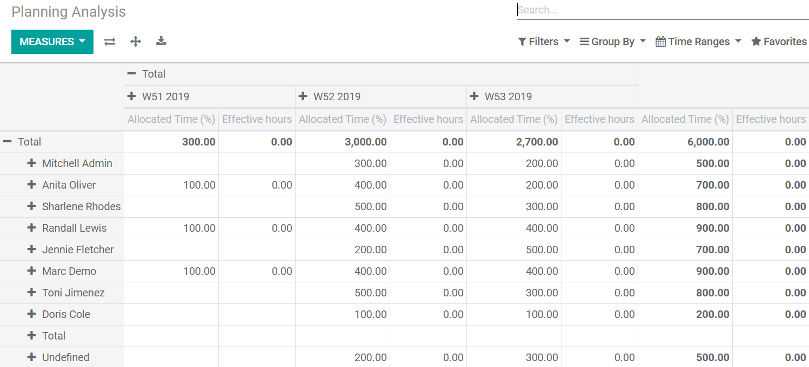
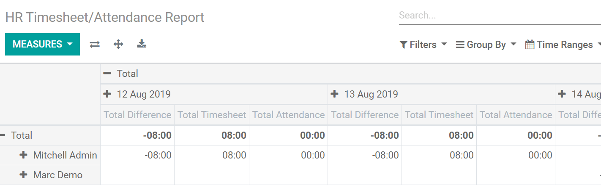

=============================
Compare Hours and do Analyses
=============================

Make sure your employees’ workload is being fairly distributed and control your tasks to get
powerful insights when comparing planned versus effective hours.

Compare the planned and effective hours of your tasks
=====================================================

Go to :menuselection:`Project --> Reporting --> Tasks Analysis`, select the *Pivot* view and
refine your *Measures* to *Effective Hours* and *Planned Hours*.

Still on *Project*, under :menuselection:`Reporting --> Planning Analysis` find a pivot view with
an analysis of allocated and effective hours of your tasks by user and start date, or by any of
the other available filters.

HR analysis
===========

Under :menuselection:`Timesheets --> Reporting --> Timesheet/Attendance` have an overview of the
worked hours and allocated time of your employees.

