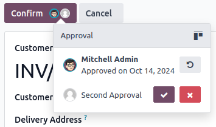

==============
Approval rules
==============

Approval rules are used to automate approval processes for actions. They allow you to define
the criteria for when an approval is required before an action can be performed using a button.

Configuration
=============

To add approval rules with Studio, proceed as follows:

#. :ref:`Open Studio <studio/access>` and switch to the required :doc:`view <views>`.
#. Select the button to which the rule should be applied.
#. Click :icon:`fa-plus` :guilabel:`Add an approval step` in the :icon:`fa-server`
   :guilabel:`Properties` tab.
#. Specify which users are responsible for approving the action by using one of the following fields
   or both:

    - :guilabel:`Approvers` to specify one or several users;
    - :guilabel:`Approver Group` to specify one user group.

      .. note::
         An activity is created for all users set as :guilabel:`Approvers` when their approval is
         requested.

#. (*optional*) Select the :guilabel:`Users to Notify` via an internal note when the action is
   approved or rejected.
#. (*optional*) Add a :guilabel:`Description` to be displayed on the button.

.. tip::
   You can specify under which condition(s) an approval step should be applied by clicking the
   :icon:`fa-filter` (:guilabel:`filter`) icon next to the :guilabel:`Approvers` field.

To add another approval step, click :icon:`fa-plus` :guilabel:`Add an approval step`. When there are
multiple steps, you can:

- Enable :guilabel:`Exclusive Approval` on any step so that a user who approves a step cannot
  approve another step for the same record.
- Change the :guilabel:`Approval Order` of the steps by selecting a number, `1` being the first
  step, `2` the second step, and so on. A user responsible for a higher step can approve/reject
  previous step(s) unless :guilabel:`Exclusive Approval` is selected.

Click the :icon:`fa-trash` (:guilabel:`trash`) icon next to the :guilabel:`Approvers` field to
remove an approval step.

.. tip::
   You can create :ref:`user groups <access-rights/groups>` specifically for approvals.

.. _approval-rules/use:

Use
===

Once an approval rule has been defined for a button, a **user avatar** icon is displayed next to the
button's label for each approval step. Clicking an icon reveals the step(s).

.. note::
   If an unauthorized user clicks the button, an error message is displayed and an activity is
   created for the users specified in the :guilabel:`Approvers` field, if any.

Authorized users can:

- Perform the action directly by clicking the button if it is the last/only approval step.
- Approve the action and let another user perform it - or move it to the next approval step - by
  clicking the **user avatar** icon next to the button's label, then clicking the :icon:`fa-check`
  (:guilabel:`approve`).
- Reject the action by clicking the **user avatar** icon next to the button's label and then the
  :icon:`fa-times` (:guilabel:`reject`) button.
- (only for users selected under the :guilabel:`Approvers` field) Delegate their approval rights to
  one or several users for **all records** by:

  - Clicking the :icon:`oi-view-kanban` (:guilabel:`kanban view`) icon and then
    :guilabel:`Delegate`.
  - Selecting one or several :guilabel:`Approvers`, :guilabel:`Until` when they will have approval
    rights (forever if left empty), and, optionally, the user(s) who should be notified via an
    internal note using the :guilabel:`Notify to` field.

    .. image:: approval_rules/delegate-dialog.png
       :alt: Delegate to dialog

.. tip::
   - A user who approves/rejects an action can revoke their decision by clicking the **user avatar**
     icon next to the button's label and then the :icon:`fa-undo` (:guilabel:`revoke`) button. They
     can also revoke the decision of other users for steps with a lower :guilabel:`Approval Order`
     unless :guilabel:`Exclusive Approval` is enabled.
   - Approvals are tracked in the record's chatter. An approval entry is also created every time
     a Studio approval-related action is performed. To access approval entries, :doc:`activate the
     developer mode </applications/general/developer_mode>` and go to :menuselection:`Settings -->
     Technical --> Studio Approval Entries`.
