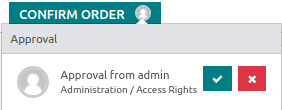

==============
Approval rules
==============

Approval rules are used to automate approval processes for actions. They allow you to define
the criteria for when an approval is required before an action can be performed using a button.

Configuration
=============

To add approval rules with Studio, proceed as follows:

#. :ref:`Open Studio <studio/access>` and switch to the required :doc:`view <views>`.
#. Select the button for which you want to add approval rules.
#. In the :guilabel:`Properties` tab on the left, enable the :guilabel:`Set approval rules`
   feature.
#. Specify the :guilabel:`Approval Group` to limit the approval permission to a specific user
   group.
#. Define the :guilabel:`Responsible` user to create an activity for a specific user when an
   approval is requested from them.
#. Add a :guilabel:`Description` to be displayed in the :ref:`Approval dialog <approval-rules/use>`.
#. Enable :guilabel:`Limit approver to this rule` to require approvers to be different users (when
   there are multiple approval rules).

Optionally, you can also add conditions for the approval rule to be applied by clicking the
:icon:`fa-filter` (:guilabel:`filter`) icon next to the :guilabel:`Approval Group` field.

Click :guilabel:`Add an approval rule` to add another rule.

Click the :icon:`fa-trash` (:guilabel:`trash`) icon next to the :guilabel:`Approval group` field to
delete the approval rule.

.. tip::
   You can create :ref:`user groups <access-rights/groups>` specifically for approvals.

.. _approval-rules/use:

Use
===

Once approval rules have been defined for a button:

- A **user avatar** icon is displayed next to the button's label for each approval rule that has
  been defined.

   .. image:: approval_rules/approvals-button.png
      :alt: Confirm button with approval for purchase orders

- When an unauthorized user clicks the button, an error message is displayed in the top-right corner
  and an activity is created for the user specified in the :guilabel:`Responsible` field.
- Only users from the group defined in the :guilabel:`Approval Group` field are allowed to approve
  or reject the action.

Authorized users can:

- approve and perform the action by clicking the button;
- approve the action and allow another user to perform it by clicking the **user avatar** icon next
  to the button's label, then clicking the :icon:`fa-check` (:guilabel:`Approve`) button in the
  dialog that opens.
- reject the action by clicking the **user avatar** icon next to the button's label, then clicking
  the :icon:`fa-times` (:guilabel:`Reject`) button in the dialog that opens.

.. tip::
   - The user who approved/rejected the action can revoke their decision by clicking the **user
     avatar** icon next to the button's label, then clicking the :icon:`fa-undo`
     (:guilabel:`Revoke`) button.
   - Approvals are tracked in the record's chatter. An approval entry is also created every time
     a Studio approval-related action is performed. To access the approval entries, :doc:`activate
     the developer mode </applications/general/developer_mode>` and go to :menuselection:`Settings
     --> Technical --> Studio Approval Entries`.
