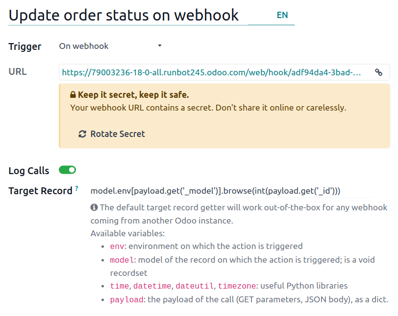
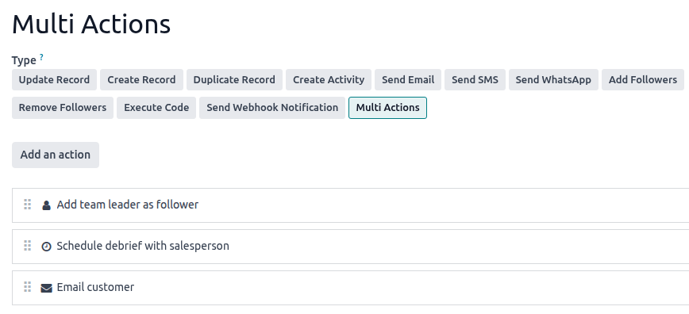

:show-content:

================
Automation rules
================

Automation rules allow the execution of one or more predefined actions in response to a specific
trigger, e.g., create an activity when a field is set to a specific value, or archive a record 7
days after its last update.

When creating an automation rule, it is possible to :ref:`add conditions that must be met
<studio/automated-actions/conditions>` for the automation rule to run, e.g., the opportunity must be
assigned to a specific salesperson, or the state of the record must not be :guilabel:`Draft`.

To create an automation rule with **Odoo Studio**:

#. :ref:`Open Studio <studio/access>` and click :guilabel:`Automations`, then :guilabel:`New`.
#. Give the automation rule a clear, meaningful name that identifies its purpose.
#. Select the :ref:`Trigger <studio/automated-actions/trigger>` and, if necessary, fill in the
   fields that appear on the screen based on the chosen trigger.
#. Click :guilabel:`Add an action` in the :guilabel:`Actions To Do` tab.

   .. tip::
      If no explicit name is entered, the name of the action will be automatically generated based
      on the action you define; the name can be updated at any time.

#. Select the :guilabel:`Type` of :ref:`action <studio/automated-actions/action>` and complete the
   relevant fields based on the chosen action.
#. Click :guilabel:`Save & Close` or, to define additional actions, :guilabel:`Save & New`.

.. example::

   To ensure follow-up on less satisfied clients, this automation rule creates an activity 3 months
   after a sales order is created for clients with a satisfaction percentage lower than 30%.

   .. image:: automated_actions/trigger-timing-conditions.png
      :alt: Example of an automation rule on the Subscription model
      :scale: 90%

.. tip::
   - Use the :guilabel:`Notes` tab to document the purpose and functioning of automation rules. This
     makes rules easier to maintain and facilitates collaboration between users.
   - To modify the :doc:`model <models_modules_apps>` targeted by the automation rule, switch models
     before clicking :guilabel:`Automations` in Studio, or :ref:`activate developer mode
     <developer-mode>`, create or edit an automation rule, and select the :guilabel:`Model` in the
     :guilabel:`Automation Rules` form.
   - Automation rules can be created from any kanban stage by clicking the :icon:`fa-cog`
     :guilabel:`(Settings)` icon that appears when hovering over the kanban stage name, then
     selecting :guilabel:`Automations`. In this case, the :guilabel:`Trigger` is set to
     :guilabel:`Stage is set to` by default, but it can be changed if necessary.

     .. image:: automated_actions/automations-kanban.png
        :alt: Create automations from a kanban stage

.. _studio/automated-actions/trigger:

Trigger
=======

The :guilabel:`Trigger` is used to define what kind of event needs to occur for the automation rule
to run. The available triggers depend on the :doc:`model <models_modules_apps>`. Five trigger
categories are available overall:

- :ref:`studio/automated-actions/trigger-values-updated`
- :ref:`studio/automated-actions/trigger-email-events`
- :ref:`studio/automated-actions/trigger-timing-conditions`
- :ref:`studio/automated-actions/trigger-custom`
- :ref:`studio/automated-actions/trigger-external`

.. _studio/automated-actions/conditions:

Adding conditions
-----------------

Domain filters allow you to determine the records an automation rule should target or exclude.
Efficient filtering enhances overall performance as it avoids unnecessary processing on records that
are not impacted by the rule.

.. tip::
   :ref:`Activate developer mode <developer-mode>` before creating an automation rule to have the
   most flexibility in adding domain filters.

Depending on the trigger chosen, it is possible to define one or more conditions a record must meet
*before* and/or *after* a trigger occurs.

- The :guilabel:`Before Update Domain` defines the conditions a record must meet *before* the
  trigger event occurs, e.g., the record must have `Type = Customer Invoice` and `Status = Posted`.

  With :ref:`developer mode activated <developer-mode>`, click :guilabel:`Edit Domain`, if
  available, then :guilabel:`New Rule`.

- :guilabel:`Extra Conditions`, or in some cases :guilabel:`Apply on` filters, define the conditions
  a record must meet *after* the trigger event occurs, e.g., the customer invoice must have `Payment
  Status = Partially Paid`.

  With :ref:`developer mode activated <developer-mode>` if needed, click :guilabel:`Add conditions`
  or :guilabel:`Edit Domain`, as relevant, then :guilabel:`New Rule`.

When a :ref:`trigger <studio/automated-actions/trigger>` occurs, e.g., the payment status of a
posted customer invoice is updated, the automation rule checks the defined conditions and only
executes the :ref:`action <studio/automated-actions/action>` if the record matches those conditions.

.. example::
   If the automated action should be executed when an email address is set for the first time (in
   contrast to modifying an email address) on an existing contact that is an individual rather than
   a company, use `Email is not set` and `Is a Company is not set` as the :guilabel:`Before Update
   Domain` and `Email is set` as the :guilabel:`Apply on` domain.

   .. image:: automated_actions/before-update-domain.png
      :alt: Example of a trigger with a Before Update Domain
      :scale: 80%

.. note::
   The :guilabel:`Before Update Domain` is not checked upon the creation of a record.

.. _studio/automated-actions/trigger-values-updated:

Values Updated
--------------

Trigger automated actions when specific changes happen in the database. The triggers available in
this category depend on the model and are based on common changes, such as adding a specific tag
(e.g., to a task) or setting a field's value (e.g., setting the :guilabel:`User` field).

Select the trigger, then select a value if required.

.. _studio/automated-actions/trigger-email-events:

Email Events
------------

Trigger automated actions upon receiving or sending emails.

.. _studio/automated-actions/trigger-timing-conditions:

Timing Conditions
-----------------

Trigger automated actions at a point in time relative to a date field or to the creation or update
of a record. The following triggers are available:

- :guilabel:`Based on date field`: The action is triggered a defined period of time before or after
  the date of the selected date field.
- :guilabel:`After creation`: The action is triggered a defined period of time after a record is
  created and saved.
- :guilabel:`After last update`: The action is triggered a defined period of time after an existing
  record is edited and saved.

You can then define:

- a :guilabel:`Delay`: Specify the number of :guilabel:`Minutes`, :guilabel:`Hours`,
  :guilabel:`Days`, or :guilabel:`Months` after which the action should be triggered. If you
  selected the :guilabel:`Based on date field` trigger, the action can be triggered
  :guilabel:`After` or :guilabel:`Before` the selected date field.

  .. note::
     By default, the scheduler checks for time-triggered automation rules every 240 minutes, or 4
     hours. This frequency is generally sufficient for delays such as 3 months after the order date
     or 7 days after the last update.

     For delays of less than the equivalent of 2400 minutes, or 40 hours, the system recalculates
     the frequency of this check to ensure that more granular delays, e.g., 1 hour before the event
     start date and time, or 30 minutes after creation, can be respected as closely as possible.

     To view or manually edit the frequency of the scheduler for a time-triggered automation rule,
     with :ref:`developer mode activated <developer-mode>`, click :guilabel:`Scheduled action`.

     .. image:: automated_actions/trigger-delay-scheduled-action.png
        :alt: Direct link to scheduled action for automations

     In the :guilabel:`Automation Rules: check and execute` scheduled action that opens, update the
     value of the :guilabel:`Execute Every` field, if desired. Clicking :guilabel:`Run Manually`
     triggers the scheduled action to run immediately. To return to the automation rule setup, click
     the automation rule name in the breadcrumbs.

- :guilabel:`Extra Conditions`: Click :guilabel:`Add condition`, then specify the conditions to be
  met for the automation rule to run. Click :guilabel:`New Rule` to add another condition.

The action is executed when the delay is reached and the conditions are met.

.. _studio/automated-actions/trigger-custom:

Custom
------

Trigger automated actions:

- :guilabel:`On create`: when a record is saved for the first time.
- :guilabel:`On create and edit`: when a record is saved for the first time and any subsequent time.
- :guilabel:`On deletion`: when a record is deleted.
- :guilabel:`On UI change`: when a field's value is changed on the :ref:`Form view
  <studio/views/general/form>`, even before the record is saved.

For the :guilabel:`On create and edit` and :guilabel:`On UI change` triggers, you **must** then
select the field(s) to be used to trigger the automation rule in the :guilabel:`When updating`
field.

.. warning::
   If no field is selected in the :guilabel:`When updating` field, the automated action may be
   executed multiple times per record.

Optionally, you can also define additional conditions to be met to trigger the automation rule in
the :guilabel:`Apply on` field.

.. note::
   The :guilabel:`On UI change` trigger can only be used with the :ref:`Execute Code
   <studio/automated-actions/action-execute-code>` action and only works when a modification is made
   manually. The action is not executed if the field is changed through another automation rule.

.. _studio/automated-actions/trigger-external:

External
--------

Trigger automated actions based on a specific event in an external system or application using a
:doc:`webhook <automated_actions/webhooks>`.

After the webhook is configured in Odoo, where the webhook's URL is generated and the target record
defined, it needs to be implemented in the external system.

.. warning::
  It is *highly recommended* to consult with a developer, solution architect, or another technical
  role when deciding to use webhooks and throughout the implementation process. If not properly
  configured, webhooks may disrupt the Odoo database and can take time to revert.

.. note::
   It is also possible to set up an automated action that :ref:`sends data to a external system's
   webhook <studio/automated-actions/action-webhook>` when an event occurs in your Odoo database.

.. seealso::
   :doc:`Webhook documentation <automated_actions/webhooks>`

.. _studio/automated-actions/action:

Actions
=======

Once you have defined the automation rule's :ref:`trigger <studio/automated-actions/trigger>`,
click :guilabel:`Add an action` in the :guilabel:`Actions To Do` tab to define the action(s) to be
executed.

.. tip::
   You can define multiple actions for the same automation rule. By default, actions are executed in
   the order in which they were defined.

   This means, for example, that if you define an :guilabel:`Update record` action and then a
   :guilabel:`Send email` action where the email references the field that was updated, the email
   uses the updated values. However, if the :guilabel:`Send email` action is defined before the
   :guilabel:`Update record` action, the email uses the values set *before* the record is updated.

   To change the order of defined actions, click the :icon:`oi-draggable` :guilabel:`(drag handle)`
   icon beside an action and drag it to the desired position.

.. _studio/automated-actions/action-update-record:

Update Record
-------------

This action is used to update one of the record's (related) fields. The following options are
available:

- :guilabel:`Update`: updates the selected field with the specified value.
- :guilabel:`Update with AI`: updates the selected field dynamically based on the AI prompt
  provided. This option requires the **Odoo AI** app to be installed.
- :guilabel:`Compute`: updates the selected field dynamically using Python code.

To define the action:

#. With the :guilabel:`Update`, :guilabel:`Update with AI`, or :guilabel:`Compute` option selected,
   as relevant, select or search for the field to be updated in the list that opens. If needed,
   click the :icon:`oi-chevron-right` :guilabel:`(right arrow)` next to the field name to access the
   list of related fields.
#. Provide the relevant information based on the option selected.

Update
~~~~~~

Select or enter the updated value for the field.

If a :ref:`many2many field <studio/fields/relational-fields-many2many>` is being updated, choose
whether the field must be updated by :guilabel:`Adding`, :guilabel:`Removing`, or :guilabel:`Setting
it to` the selected value or by :guilabel:`Clearing it`.

.. example::
   If you want the automated action to remove a tag from the customer record, set the
   :guilabel:`Update` field to :guilabel:`Customer > Tags`, select :guilabel:`by Removing`, then
   select the tag to be removed.

   .. image:: automated_actions/update-record-tags.png
      :alt: Example of an Update Record action
      :scale: 80%

Update with AI
~~~~~~~~~~~~~~

Enter a prompt to instruct Odoo AI how to update the field. Type `/` to open the :guilabel:`AI
prompt tools`; use :guilabel:`Field Selector` to tell Odoo AI which related fields to check for
context, and :guilabel:`Records Selector` to provide possible values for the updated field.

.. example::
   If you want the automation rule to update the :guilabel:`Assignees` field of a newly created
   task based on the employees' expertise, you can write a prompt to instruct the Odoo AI to check
   the :guilabel:`Display Name` field of the task for the context, then to assign the most suitable
   employee.

   .. image:: automated_actions/update-record-ai.png
      :alt: Example of an Update Record action using AI
      :scale: 80%

Compute
~~~~~~~

Enter the code to be used for computing the field's value.

.. example::
   If you want the automation rule to compute a custom :ref:`datetime field
   <studio/fields/simple-fields-date-time>`, :guilabel:`Escalated on`, when a task's priority is set
   to `Very high` (three stars), you can define the trigger :guilabel:`Priority is set to` to `Very
   High` and define the :guilabel:`Update Record` action as follows:

   .. image:: automated_actions/update-record-compute.png
      :alt: Compute a custom datetime field using a Python expression
      :scale: 80%

.. _studio/automated-actions/action-create-record:

Create Record and Duplicate Record
----------------------------------

These actions are used to create a new or duplicated record on any model.

To define the action:

#. With :guilabel:`Create Record` or :guilabel:`Duplicate Record` selected as the :guilabel:`Type`
   of action, as relevant, select the required model in the :guilabel:`Record to Create` field; the
   field contains the current model by default.
#. Specify a :guilabel:`Name` for the record, or, if the action duplicates a record, indicate the
   record being duplicated in the :guilabel:`Duplicate from` field.
#. If the new or duplicated record is being created on another model, select a field in the
   :guilabel:`Link Field` field to link the record that triggered the creation of the new or
   duplicated record.

.. tip::
   The :guilabel:`Link Field` dropdown menu only contains :ref:`one2many fields
   <studio/fields/relational-fields-one2many>` existing on the current model that are linked to a
   :ref:`many2one field <studio/fields/relational-fields-many2one>` on the target model.

.. example::
   If you want the automation rule to duplicate a project, e.g. a project template with predefined
   tasks, when an opportunity is set to `Won`, add a custom `Related opportunity` :ref:`many2one
   field <studio/fields/relational-fields-many2one>` field on the *Project* model and a custom
   `Related project` :ref:`one2many field <studio/fields/relational-fields-one2many>` field on the
   *Lead* model, then provide the following details about the record being duplicated:

   .. image:: automated_actions/duplicate-record.png
      :alt: Duplicate a record in a different model
      :scale: 80%

.. tip::
   You can create another automation rule with :ref:`studio/automated-actions/action-update-record`
   actions to update the fields of the new or duplicated record if necessary. For example, you can
   use a :guilabel:`Create Record` action to create a new project task and then assign it to a
   specific user using an :guilabel:`Update Record` action.

.. _studio/automated-actions/action-create-activity:

Create Activity
---------------

This action is used to schedule a new activity linked to the record.

To define the action:

#. With :guilabel:`Create Activity` selected as the :guilabel:`Type` of action, select the
   appropriate :guilabel:`Activity Type` from the dropdown menu.
#. Enter a :guilabel:`Title`.
#. Indicate by when the activity should be completed by specifying a number of :guilabel:`Days`,
   :guilabel:`Weeks`, or :guilabel:`Months` in the :guilabel:`Due Date In` field.
#. Select a :guilabel:`User type`:

   - To always assign the activity to the same user, select :guilabel:`Specific User`, then add the
     user in the :guilabel:`Responsible` field.
   - To target a user linked to the record dynamically, select :guilabel:`Dynamic User (based on
     record)`. If needed, change the :guilabel:`User Field` by clicking on the placeholder field
     name then selecting or searching for the user field in the list that appears. Clicking the
     :icon:`oi-chevron-right` :guilabel:`(right arrow)` next to the field name allows you to access
     related fields if needed.
#. Optionally, add a :guilabel:`Note` to provide more information about the activity.

.. example::
   After a proposition is sent to a opportunity with a high expected revenue, you want to create an
   activity for the salesperson's team leader to call the potential client to increase the chances
   of closing the deal.

   To do so, set the :guilabel:`Activity Type` to :guilabel:`Call` and the :guilabel:`User Type` to
   :guilabel:`Dynamic User (based on record)`. Click on the placeholder field and select
   :guilabel:`Sales Team`, then click the :icon:`oi-chevron-right` :guilabel:`(right arrow)` and
   select :guilabel:`Team Leader`.

   .. image:: automated_actions/create-activity-action.png
      :alt: Example of a Create Activity action
      :scale: 80%

.. _studio/automated-actions/action-send-email-sms:

Send Email and Send SMS
-----------------------

These actions are used to send an email or a text message to a contact linked to a specific record.

To define the action:

#. With :guilabel:`Send Email` or :guilabel:`Send SMS` selected as the :guilabel:`Type` of action,
   as relevant, select or create an :guilabel:`Email Template` or :guilabel:`SMS Template`.
#. In the :guilabel:`Send Email As` or :guilabel:`Send SMS As` field, choose how you want to send the
   email or text message.

   For an email, select:

   - :guilabel:`Email`: to send the message as an email to the recipients of the :guilabel:`Email
     Template`.
   - :guilabel:`Message`: to post the message on the record and notify the record's followers.
   - :guilabel:`Note`: to send the message as an internal note visible to internal users in the
     chatter.

   For a text message, select:

   - :guilabel:`SMS (without note)`: to send the message as a text message to the recipients of the
     :guilabel:`SMS template`.
   - :guilabel:`SMS (with note)`: to send the message as a text message to the recipients of the
     :guilabel:`SMS template` and post it as an internal note in the chatter.
   - :guilabel:`Note only`: to only post the message as an internal note in the chatter.

.. _studio/automated-actions/action-send-whatsapp:

Send WhatsApp
-------------

.. important::
   To automate the sending of WhatsApp messages, one or more
   :ref:`WhatsApp templates <productivity/whatsapp/templates>` must be created.

This action is used to send a WhatsApp message to a contact linked to a specific record.

With :guilabel:`Send WhatsApp` selected as the :guilabel:`Type` of action, select the appropriate
:guilabel:`WhatsApp Template` from the dropdown menu.

.. _studio/automated-actions/action-add-remove-followers:

Add Followers and Remove Followers
----------------------------------

This action is used to subscribe/unsubscribe existing contacts as followers of the record.

With :guilabel:`Add Followers` or :guilabel:`Remove Followers` selected as the :guilabel:`Type` of
action, as relevant, select a :guilabel:`Followers Type`:

- To always add/remove the same contact(s), select :guilabel:`Specific Followers` then select the
  contact(s) from the dropdown menu. Multiple contacts can be added/removed.

- To add/remove a contact linked to the record dynamically, select :guilabel:`Dynamic Followers`. If
  needed, change the :guilabel:`Followers Field` by clicking on the placeholder field name then
  selecting or searching for the partner field in the list that appears. Clicking the
  :icon:`oi-chevron-right` :guilabel:`(right arrow)` next to the field name allows you to access
  related fields if needed.

.. example::
   To keep customers informed of progress on a project, this automated action adds the relevant
   customer as a follower when a project task is set to `In progress`.

   .. image:: automated_actions/add-followers-action.png
      :alt: Adding the customer as a follower when project task set to in progress
      :scale: 80%

.. _studio/automated-actions/action-execute-code:

Execute Code
------------

.. important::
   For automation rules that require the execution of :ref:`custom code
   <studio/automated-actions/action-execute-code>`, note that maintenance of custom code is not
   included in the *Standard* or *Custom* pricing plans and incurs :ref:`additional fees
   <charges_standard>`.

This action is used to execute Python code. You can write your code into the :guilabel:`Code` tab
using the following variables:

- `env`: environment on which the action is triggered
- `model`: model of the record on which the action is triggered; is a void recordset
- `record`: record on which the action is triggered; may be void
- `records`: recordset of all records on which the action is triggered in multi-mode; this may be
  left empty
- `time`, `datetime`, `dateutil`, `timezone`: useful Python libraries
- `float_compare`: utility function to compare floats based on specific precision
- `log(message, level='info')`: logging function to record debug information in ir.logging
  table
- `_logger.info(message)`: logger to emit messages in server logs
- `UserError`: exception class for raising user-facing warning messages
- `Command`: x2many commands namespace
- `action = {...}`: to return an action

.. tip::
   The available variables are described both in the :guilabel:`Code` and :guilabel:`Help` tabs.

.. seealso::
   :doc:`Odoo's ORM capabilities <../../developer/reference/backend/orm>`

.. _studio/automated-actions/action-webhook:

Send Webhook Notification
-------------------------

This action is used to send a `POST` API request with the values of the selected :guilabel:`Fields`
to the webhook URL specified in the :guilabel:`URL` field.

The :guilabel:`Sample Payload` provides a preview of the data included in the request using a random
record's data or dummy data if no record is available.

.. note::
   It is also possible to set up an automated action that :doc:`uses a webhook to receive data from
   an external system <automated_actions/webhooks>` when a predefined event occurs in that system.

.. _studio/automated-actions/action-existing-actions:

Multi Actions
-------------

This action is used to trigger multiple actions (linked to the current model) at the same time.

To define the actions:

#. With :guilabel:`Multi Actions` selected as the :guilabel:`Type` of action, click :guilabel:`Add
   an action`.
#. In the :guilabel:`Add: Child Actions` pop-up:

   - select one or more existing actions and click :guilabel:`Select`; or
   - click :guilabel:`New`, define the action to be executed, then click :guilabel:`Save & Close`
     or, to create additional actions, :guilabel:`Save & New` .
#. Repeat as many times as needed.

.. toctree::
   :titlesonly:

   automated_actions/webhooks
