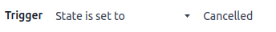

================
Automation rules
================

Automation rules are used to trigger automatic changes based on user actions (e.g., apply a
modification when a field is set to a specific value), email events, time conditions (e.g., archive
a record 7 days after its last update), or external events.

To create an automation rule with Studio, proceed as follows:

#. Open Studio and click :guilabel:`Automations`, then :guilabel:`New`.
#. Select the :ref:`studio/automated-actions/trigger` and, if necessary, fill in the fields that
   appear on the screen based on the chosen trigger.
#. Click :guilabel:`Add an action`, then select the :guilabel:`Type` of
   :ref:`action <studio/automated-actions/action>` and fill in the fields that appear on the screen
   based on your selected action.
#. Click :guilabel:`Save & Close` or :guilabel:`Save & New`.

.. example::

   .. image:: automated_actions/automation-rule-ex.png
      :alt: Example of an automated action on the Subscription model

.. tip::
   - To modify the :doc:`model <models_modules_apps>` of the automation rule, switch models before
     clicking :guilabel:`Automations` in Studio, or :ref:`activate the developer mode
     <developer-mode>`, create or edit an automation rule, and select the :guilabel:`Model` in the
     :guilabel:`Automation Rules` form.
   - You can also create automation rules from any kanban stage by clicking the gear icon
     (:guilabel:`⚙` ) next to the kanban stage name, then selecting :guilabel:`Automations`. In this
     case, the :guilabel:`Trigger` is set to :guilabel:`Stage is set to` by default, but you can
     change it if necessary.

     .. image:: automated_actions/automations-kanban.png
        :alt: Create automations from a kanban stage

.. _studio/automated-actions/trigger:

Trigger
=======

The :guilabel:`Trigger` is used to define when the automation rule should be applied. The available
triggers depend on the :doc:`model <models_modules_apps>`. Five trigger categories are available
overall:

- :ref:`studio/automated-actions/trigger/values-updated`
- :ref:`studio/automated-actions/trigger/email-events`
- :ref:`studio/automated-actions/trigger/values-timing-conditions`
- :ref:`studio/automated-actions/trigger/custom`
- :ref:`studio/automated-actions/trigger/external`

.. tip::
   You can also define a :guilabel:`Before Update Domain` to specify the conditions that must be met
   *before* the automation rule is triggered. In contrast, the conditions defined using the
   :ref:`Extra Conditions <studio/automated-actions/trigger/values-timing-conditions>` and
   :ref:`Apply on <studio/automated-actions/trigger/custom>` filters are checked *during* the
   execution of the automation rule.

   To define a :guilabel:`Before Update Domain`, :ref:`activate the developer mode
   <developer-mode>`, create or edit an automation rule, click :guilabel:`Edit Domain`, then click
   :guilabel:`New Rule`.

   For example, if you want the automated action to happen when an email address is set on a
   contact that did not have an address before (in contrast to modifying their existing address),
   define the :guilabel:`Before Update Domain` to :guilabel:`Email is not set`, and the
   :guilabel:`Apply on` domain to :guilabel:`Email is set`.

   .. image:: automated_actions/before-update-domain.png
      :alt: Example of a trigger with a Before Update Domain

.. _studio/automated-actions/trigger/values-updated:

Values Updated
--------------

The triggers available in this category depend on the model and are based on common field changes,
such as adding a specific tag (e.g., to a task) or setting the :guilabel:`User` field. Select the
trigger, then select a value if required.

.. _studio/automated-actions/trigger/email-events:

Email Events
------------

Trigger automated actions upon receiving or sending emails.

.. _studio/automated-actions/trigger/values-timing-conditions:

Timing Conditions
-----------------

Trigger automated actions based on a date field. The following triggers are available:

- :guilabel:`Based on date field`: Select the field to be used next to the :guilabel:`Delay` field.
- :guilabel:`After creation`: The action is triggered when a record is created and saved.
- :guilabel:`After last update`: The action is triggered when an existing record is edited and
  saved.

You can then define:

- a :guilabel:`Delay`: Specify the number of minutes, hours, days, or months. To trigger the action
  before the trigger date, specify a negative number. If you selected the :guilabel:`Based on date
  field` trigger, you must also select the date field to be used to determine the delay.
- :guilabel:`Extra Conditions`: Click :guilabel:`Add condition`, then specify the conditions to be
  met to trigger the automation rule. Click :guilabel:`New Rule` to add another condition.

The action is triggered when the delay is reached and the conditions are met.

.. example::
   If you want to send a reminder email 30 minutes before the start of a calendar event, select the
   :guilabel:`Start (Calendar Event)` under :guilabel:`Trigger Date` and set the :guilabel:`Delay`
   to **-30** :guilabel:`Minutes`.

   .. image:: automated_actions/timing-conditions-trigger.png
      :alt: Example of a Based on date field trigger

.. note::
   By default, the scheduler checks for trigger dates every 4 hours, meaning lower granularity in
   time-based automations may not always be honored.

.. _studio/automated-actions/trigger/custom:

Custom
------

Trigger automated actions:

- :guilabel:`On save`: When the record is saved;
- :guilabel:`On deletion`: When a record is deleted;
- :guilabel:`On UI change`: When a field's value is changed on the :ref:`Form view
  <studio/views/general/form>`, even before saving the record.

For the :guilabel:`On save` and :guilabel:`On UI change` triggers, you **must** then select the
field(s) to be used to trigger the automation rule in the :guilabel:`When updating` field.

.. warning::
   If no field is selected in the :guilabel:`When updating` field, the automated action may be
   executed multiple times per record.

Optionally, you can also define additional conditions to be met to trigger the automation rule in
the :guilabel:`Apply on` field.

.. note::
   The :guilabel:`On UI change` trigger can only be used with the
   :ref:`studio/automated-actions/action/python-code` action and only works when a modification is
   made manually. The action is not executed if the field is changed through another automation
   rule.

.. _studio/automated-actions/trigger/external:

External
--------

Trigger automated actions based on an external event using a webhook. A webhook is a method of
communication between two systems where the source system sends an HTTP(S) request to a destination
system based on a specific event. It usually includes a data payload containing information about
the event that occurred.

To configure the :guilabel:`On webhook` trigger, copy the :guilabel:`URL` generated by Odoo into the
destination system (i.e., the system receiving the request). Then, in the :guilabel:`Target Record`
field, enter the code to run to define the record(s) to be updated using the automation rule.

.. warning::
   The URL must be treated as **confidential**; sharing it online or without caution could
   potentially expose your system to malicious parties. Click the :guilabel:`Rotate Secret` button
   to change the URL's secret if necessary.

.. note::
    - The code defined by default in the :guilabel:`Target Record` field works for webhooks coming
      from another Odoo database. It is used to determine the record(s) to be updated using the
      information in the payload.
    - If you wish to use the webhook's content for a purpose other than to find the record(s) (e.g.,
      *create* a record), your only option is to use an :ref:`studio/automated-actions/action/python-code`
      action. In this case, the :guilabel:`Target record` field must contain any valid code, but its
      result doesn't have any effect on the automated action itself.
    - The webhook content is available in the server action context as a `payload` variable (i.e., a
      dictionary that contains the GET parameters or POST JSON body of the incoming request).

You can also choose to :guilabel:`Log Calls` to record the payloads received, e.g., to make sure the
data sent by the source system matches the expected format and content. This also helps identify
and diagnose any issues that may arise. To access the logs, click the :guilabel:`Logs` smart
button at the top of the :guilabel:`Automation rules` form.

.. _studio/automated-actions/action:

Actions
=======

Once you have defined the automation rule's :ref:`trigger <studio/automated-actions/trigger>`, click
:guilabel:`Add an action` to define the action to be executed.

.. tip::
   You can define multiple actions for the same trigger/automation rule. The actions are executed
   in the order they are defined. This means, for example, that if you define an
   :guilabel:`Update record` action and then a :guilabel:`Send email` action, the email uses the
   updated values. However, if the :guilabel:`Send email` action is defined before the
   :guilabel:`Update record` action, the email uses the values set *before* the update action is
   run.

.. _studio/automated-actions/action/update-record:

Update Record
-------------

This action allows to update one of the record's (related) fields. Click the :guilabel:`Update`
field and, in the list that opens, select or search for the field to be updated; click the right
arrow next to the field name to access the list of related fields if needed.

If you selected a :ref:`many2many field <studio/fields/relational-fields/many2many>`, choose whether
the field must be updated by :guilabel:`Adding`, :guilabel:`Removing`, or :guilabel:`Setting it to`
the selected value or by :guilabel:`Clearing it`.

.. example::
   If you want the automated action to remove a tag from the customer record, set the
   :guilabel:`Update` field to :guilabel:`Customer > Tags`, select :guilabel:`By Removing`, then
   select the tag.

   .. image:: automated_actions/update-record-action.png
      :alt: Example of an Update Record action

.. tip::
   Alternatively, you can also set a record's field dynamically using Python code. To do so, select
   :guilabel:`Compute` instead of :guilabel:`Update`, then enter the code to be used for computing
   the field's value. For example, if you want the automation rule to compute a custom
   :ref:`datetime field <studio/fields/simple-fields/date-time>` when a task's priority is set to
   `High` (by starring the task), you can define the trigger :guilabel:`Priority is set to` to
   `High` and define the :guilabel:`Update Record` action as follows:

   .. image:: automated_actions/update-record-compute.png
      :alt: Compute a custom datetime field using a Python expression

Create Activity
---------------

This action is used to schedule a new activity linked to the record. Select an :guilabel:`Activity
Type`, enter a :guilabel:`Title` and description, then specify when you want the activity to be
scheduled in the :guilabel:`Due Date In` field, and select a :guilabel:`User type`:

- To always assign the activity to the same user, select :guilabel:`Specific User` and add the user
  in the :guilabel:`Responsible` field;
- To target a user linked to the record dynamically, select :guilabel:`Dynamic User (based on
  record)` and change the :guilabel:`User Field` if necessary.

.. example::
   After a lead is turned into an opportunity, you want the automated action to set up a call for
   the user responsible for the lead. To do so, set the :guilabel:`Activity Type` to
   :guilabel:`Call` and the :guilabel:`User Type` to :guilabel:`Dynamic User (based on record)`.

   .. image:: automated_actions/create-activity-action.png
      :alt: Example of a Create Activity action

Send Email and Send SMS
-----------------------

These actions are used to send an email or a text message to a contact linked to a specific record.
To do so, select or create an :guilabel:`Email Template` or an :guilabel:`SMS Template`, then, in
the :guilabel:`Send Email As` or :guilabel:`Send SMS As` field, choose how you want to send the
email or text message:

- :guilabel:`Email`: to send the message as an email to the recipients of the :guilabel:`Email
  Template`.
- :guilabel:`Message`: to post the message on the record and notify the record's followers.
- :guilabel:`Note`: to send the message as an internal note visible to internal users in the
  chatter.
- :guilabel:`SMS (without note)`: to send the message as a text message to the recipients of the
  :guilabel:`SMS template`.
- :guilabel:`SMS (with note)`: to send the message as a text message to the recipients of the
  :guilabel:`SMS template` and post it as an internal note in the chatter.
- :guilabel:`Note only`: to only post the message as an internal note in the chatter.

.. _studio/automated-actions/action/add-followers:

Add Followers and Remove Followers
----------------------------------

Use these actions to (un)subscribe existing contacts to/from the record.

Create Record
-------------

This action is used to create a new record on any model.

Select the required model in the :guilabel:`Record to Create` field; it contains the current model
by default. Specify a :guilabel:`Name` for the record, and then, if you want to create the record on
another model, select a field in the :guilabel:`Link Field` field to link the record that
triggered the creation of the new record.

.. note::
   The dropdown list related to the :guilabel:`Link Field` field only contains :ref:`one2many fields
   <studio/fields/relational-fields/one2many>` existing on the current model that are linked to a
   :ref:`many2one field <studio/fields/relational-fields/many2one>` on the target model.

.. tip::
   You can create another automation rule with :ref:`studio/automated-actions/action/update-record`
   actions to update the fields of the new record if necessary. For example, you can use a
   :guilabel:`Create Record` action to create a new project task and then assign it to a specific
   user using an :guilabel:`Update Record` action.

.. _studio/automated-actions/action/python-code:

Execute Code
------------

This action is used to execute Python code. You can write your code into the :guilabel:`Code` tab
using the following variables:

- `env`: environment on which the action is triggered
- `model`: model of the record on which the action is triggered; is a void recordset
- `record`: record on which the action is triggered; may be void
- `records`: recordset of all records on which the action is triggered in multi-mode; this may be
  left empty
- `time`, `datetime`, `dateutil`, `timezone`: useful Python libraries
- `float_compare`: utility function to compare floats based on specific precision
- `log(message, level='info')`: logging function to record debug information in ir.logging
  table
- `_logger.info(message)`: logger to emit messages in server logs
- `UserError`: exception class for raising user-facing warning messages
- `Command`: x2many commands namespace
- `action = {...}`: to return an action

.. tip::
   The available variables are described both in the :guilabel:`Code` and :guilabel:`Help` tabs.

Send Webhook Notification
-------------------------

This action allows to send a POST request with the values of the :guilabel:`Fields` to the URL
specified in the :guilabel:`URL` field.

The :guilabel:`Sample Payload` provides a preview of the data included in the request using a random
record's data or dummy data if no record is available.

.. _studio/automated-actions/action/several-actions:

Execute Existing Actions
------------------------

The action is used to trigger multiple actions (linked to the current model) at the same time. To do
so, click on :guilabel:`Add a line`, then, in the :guilabel:`Add: Child Actions` pop-up, select an
existing action or click :guilabel:`New` to create a new one.
