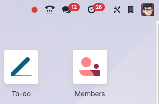

========
Webhooks
========

Automation rules that trigger based on events outside of Odoo are known as webhooks. This tool
(found within **Studio**) is helpful for receiving data about external events, then automating an
action within Odoo in response to those external events.

What is a webhook?
==================

Webhooks are user-defined HTTP callbacks (when an external system makes an API call to Odoo) that
enable real-time communication between Odoo and external systems. A webhook begins when a system
outside of the Odoo database sends data to the Odoo webhook's URL (a "trigger"). When Odoo is
notified of that trigger, something in the database happens (an "action").

Unlike scheduled actions, which run at set intervals (like a monthly subscription), or API calls,
which require external requests (like searching for concert tickets), webhooks are event-driven. For
example, when a sales order is confirmed by an external POS system, a webhook can notify the
database's inventory tracking to update stock levels immediately, keeping systems synchronized in
real time.

.. important::
  This article covers creating a webhook that *takes in* data from an external source. However,
  an automation action that sends an API call to an external webhook can also be created. Learn more
  about :doc:`webhook notification actions <../automated_actions>`.

Add Studio to the database
==========================

Setting up a webhook in Odoo requires no coding when connecting Odoo databases but testing requires
an external tool like `Postman <https://www.postman.com/>`_. Custom target records or actions may
require programming skills (like the :ref:`second webhook example
<studio/automated_actions/webhook-example>` below demonstrates).

.. important::
   **Studio** is not a standalone app but does require the `Custom pricing plan
   <https://www.odoo.com/pricing>`_ to get added to an Odoo database (unless it is selected for the
   *One App Free* plan).

To add **Studio**, go to the **Apps** app from the database home page, and then search for `Studio`.
From here, find the **Studio** card and then click :guilabel:`Install`.

When **Studio** is activated, a :icon:`oi-studio` (**Studio**) icon appears next to the user avatar
on the database's home page. This icon is where **Studio** is accessed, and is available in the
navigation menu of apps that **Studio** can edit.

Create a Studio webhook
=======================

**Studio** webhooks are configured within apps that can be edited by it, and their setup is split
between their *trigger* and their *actions*. The sections below walk through each step to make a
webhook.

Turn on developer mode
----------------------

Developer mode must be turned on to set what kinds of database records the webhook targets (like
sales orders or contact information). Learn how to :doc:`turn on and off developer mode
<../../general/developer_mode>`.

.. _studio/automations/webhook_trigger:

Set the webhook's trigger
-------------------------

To create a **Studio** webhook within another app, click the :icon:`oi-studio` (**Studio**) icon
next to the user avatar. Then, near the top of the screen, click :guilabel:`Webhooks`, and then
click :guilabel:`New`. From here, name the webhook, set the webhook's model (what kind of database
entry gets targeted), and toggle whether calls made to the webhook URL should be logged (which would
track the webhook's call history for troubleshooting). Finally, adjust the :guilabel:`Target Record`
actions to look for the JSON record that is included in the API call's payload when the call is made
to the webhook's URL.

.. danger::
   The webhook's URL is **confidential** and should be treated with care. Sharing it online or
   without caution can provide unintended access to the Odoo database. Click :guilabel:`Rotate
   Secret` to change the URL if needed.

.. _studio/automations/webhook_action:

Set the webhook's action
------------------------

Next, set the webhook's actions. This is what happens when the webhook's URL is called. Ensure the
correct Odoo fields are targeted, whether updating or computing, and that the action type is
configured correctly. To check that the webhook was properly set up, make sure to :ref:`test it
<studio/automations/test_webhook>`.

To set a webhook's action while configuring a webhook, click :guilabel:`Add an action` under the
:guilabel:`Actions To Do` tab, and then click the action's :guilabel:`Type` (what it does when it
receives a payload), select what :guilabel:`Allowed Groups` of users can send data to this webhook,
and then set the :guilabel:`Action Details`. To see an example of how a webhook action could be set
up, :ref:`review these example use cases <studio/automations/webhook_examples>`.

.. important::
   Although the :guilabel:`Model` is set in Odoo, its payload format differs and must be included in
   the payload. Click the model's internal link to find the correct format in the Model field. For
   example, a sales order webhook uses the `Sales Order` model but has a `sale.order` payload
   format.

   .. image:: webhooks/webhook-sales-order-model.png
      :alt: The sales order model for a webhook's payload.

.. _studio/automations/test_webhook:

Test the webhook
----------------

Testing the webhook requires the webhook to be set up, a test payload to send to the webhook, and an
external tool or system to send the payload through an API call. Consider using a tool like `Postman
<https://www.postman.com/>`_ so less technical skills are required.

To see an example of how to test a webhook, :ref:`review these example use cases
<studio/automations/webhook_examples>`.

If a message saying `200 OK` or `status: ok` gets returned during testing, then the webhook is
functioning properly on Odoo's side. From here, implementation can begin with the other tool to
automatically send those webhook calls into Odoo using the webhook's URL.

If any other responses are returned, the number associated with them helps to identify the problem.
For example, a `500 Internal Server Error` means that Odoo could not interpret the call properly. If
this gets returned, ensure the fields found in the JSON file are properly mapped in the webhook's
configuration and in Postman. Turning on call logging in the webhook's configuration provide error
logs if the webhook is not functioning as intended.

Implement the webhook
---------------------

Once the webhook is fully configured, begin connecting it to the system that sends data to the Odoo
database through this webhook. Make sure that the API calls are sent to the webhook's URL when
setting that system up.

.. _studio/automations/webhook_examples:

Webhook use cases
=================

Below are two examples of how to use webhooks in Odoo. These webhooks require external tools (which
are listed with the example).

.. warning::
   Consult with a developer, solution architect, or another technical role when deciding to
   implement webhooks. If not properly configured, webhooks may disrupt the Odoo database and takes
   time to revert.

Update a sales order's currency
-------------------------------

This webhook updates a sales order in the **Sales** app to USD, useful for subsidiaries outside the
United States with a mother company located inside the United States or during mergers when
consolidating data into one Odoo database.

Set the webhook's trigger
~~~~~~~~~~~~~~~~~~~~~~~~~

To set up this webhook, open the **Sales** app. Then, :ref:`set the trigger
<studio/automations/webhook_trigger>` so the :guilabel:`Model` is set to `Sales Order`. Also, set
the :guilabel:`Target Record` to `model.env[payload.get('model')].browse(int(payload.get('id')))`.
This is broken down below.

- **model**: What gets updated in Odoo (in this case, a sales order). This matches the
  :guilabel:`Model` set earlier.
- **env**: Where the action takes place. In this case, it is Odoo.
- **payload**: This is what is sent to the webhook's URL. It contains the information that updates
  the sales order.
- **get('model')**: Tells the webhook what database record to look at. In this case, the webhook
  retrieves (`get`) the data tied to a specific record `model`. In this example, this is the sales
  orders.
- **browse**: This tells the webhook to look in the `model` (the sales orders) set by the payload
  for what to update.
- **int**: This turns the target into an `integer` (a whole number). This is important in case some
  words (a `string`) or a decimal number is included in the payload's target record.
- **get('id')**: Identifies the sales order number that is getting updated in Odoo.

Set the webhook's action
~~~~~~~~~~~~~~~~~~~~~~~~

After setting the trigger, set the webhook's action by clicking :guilabel:`Add an action`. For the
:guilabel:`Type`, click :guilabel:`Update Record`. And then, set the :guilabel:`Action Details` to
`Update Customer to USD`. Finally, click :guilabel:`Save & Close`.

Webhook setup summary
~~~~~~~~~~~~~~~~~~~~~

To summarize what is set up, the webhook targets sales orders, identified by their sales order
number, and updates their currency to `USD` when an API call is sent to the webhook's URL that
includes that sales order number (which is identified by the payload's `id` record).

Test the webhook
~~~~~~~~~~~~~~~~

Test the webhook's setup to make sure everything is correct. This process uses a tool called
`Postman <https://www.postman.com/>`_ to send the simulated trigger.

This section walks through the steps to test this webhook in Postman, but does not offer help if
there's an issue within that tool. To get specific help with Postman, contact their support team.

Once Postman is open, create a new :guilabel:`HTTP` request, and set its method to :guilabel:`POST`.
Next, copy the webhook's URL that is being tested and paste it into the URL field in Postman. After
that, click the :guilabel:`Body` tab and select the :guilabel:`raw` option. Set the file type to
:guilabel:`JSON`, then copy this code and paste it into the file.

.. code-block:: json

   {
       "model": "sale.order",
       "id": "SALES ORDER NUMBER"
   }

From here, pick a sales order to test the sales order on. If it is not possible to test in a live
Odoo database, consider creating a demo database with a sample sales order and the webhook that was
configured. Replace `SALES ORDER NUMBER` with the sales order's number without the `S` or any zeros
before the number. For example, a sales order with the number `S00007` should be entered as `7` when
it is entered into Postman. Finally, click :guilabel:`Send` in Postman.

If a message saying `200 OK` or `status: ok` gets returned, then the webhook is functioning properly
on Odoo's side. From here, implementation can begin with the other tool to automatically send those
webhook calls into Odoo using the webhook's URL.

If any other responses are returned, the number associated with them helps to identify the problem.
For example, a `500 Internal Server Error` means that Odoo could not interpret the call properly. If
this gets returned, ensure the `model` and `id` fields are properly mapped in the webhook's
configuration and in Postman.

.. _studio/automated_actions/webhook-example:

Create a new contact
--------------------

This webhook creates a new contact in an Odoo database. This could be helpful for automatically
creating new vendors or customers. This webhook uses custom code, so consult with a developer to
ensure the code matches any unique setups a database might have.

Set the webhook's trigger
~~~~~~~~~~~~~~~~~~~~~~~~~

To set up this webhook, open the **Contacts** app. Then, :ref:`set the trigger
<studio/automations/webhook_trigger>` so the :guilabel:`Model` is set to `Contact`. Also, set the
:guilabel:`Target Record` to `model.browse([2])`. This is broken down below.

- **model**: What gets updated in Odoo (in this case, a contact). This matches the :guilabel:`Model`
  set earlier.
- **browse**: This tells the webhook to look in the `model` (the contacts) set by the payload for
  what to create.

Set the webhook's action
~~~~~~~~~~~~~~~~~~~~~~~~

After setting the trigger, set the webhook's action by clicking :guilabel:`Add an action`. For the
:guilabel:`Type`, click :guilabel:`Execute Code`. And then, set the :guilabel:`code` to the sample
code below. Finally, click :guilabel:`Save & Close`.

.. code-block:: python

   try:  # to retrieve data from the payload
       data = request.get_json_data()
   except:
       data = {}

   # variables to hold data from the payload contact_name = data.get('name') contact_email =
   data.get('email')
   contact_phone = data.get('phone')

   # a Python function to turn the payload into a contact in Odoo if contact_name and contact_email:
       new_partner = env['res.partner'].create({
           'name': contact_name,
           'email': contact_email,
           'phone': contact_phone,
           'company_type':
           'person', 'customer_rank': 1,
       })

       env['ir.logging'].create({  # for error logging
           'name': 'Webhook Contact Creation',
           'type': 'server',
           'level': 'info',
           'message': f"Created new contact: {new_partner.name} (ID: {new_partner.id})",
           'path': 'webhook',
           'func': 'execute',
           'line': 0,
       })
   else:  # an error message for missing required data in the payload
       raise ValueError("Missing required fields: 'name' and 'email'")

Webhook setup summary
~~~~~~~~~~~~~~~~~~~~~

To summarize what is set up, the webhook creates a contact when an API call is sent to the webhook's
URL that includes the contact's information.

Test the webhook
~~~~~~~~~~~~~~~~

Test the webhook's setup to make sure everything is correct. This process uses a tool called
`Postman <https://www.postman.com/>`_ to send the simulated trigger.

This section walks through the steps to test this webhook in Postman, but does not offer help if
there's an issue within that tool. To get specific help with Postman, contact their support team.

Once Postman is open, create a new request, and set its method to :guilabel:`POST`. Next, copy the
webhook's URL that is being tested and paste it into the URL field in Postman. After that, click the
:guilabel:`Body` tab and click :guilabel:`raw`. Set the file type to :guilabel:`JSON`, then copy
this code and paste it into the file.

.. code-block:: json

   {
       "name": "CONTACT NAME",
       "email": "contactemail@email.com",
       "phone": "contact phone number"
   }

Replace the fields above with a new contact's information in Postman, and then click
:guilabel:`Send`.

If a message saying `200 OK` or `status: ok` gets returned, then the webhook is functioning properly
on Odoo's side. From here, implementation can begin with the other tool to automatically send those
webhook calls into Odoo using the webhook's URL. The new contact appears in the **Contacts** app to
confirm it was created.

If any other responses are returned, the number associated with them helps to identify the problem.
For example, a `500 Internal Server Error` means that Odoo could not interpret the call properly. If
this gets returned, ensure the fields found in the JSON file are properly mapped in the webhook's
configuration and in Postman.
