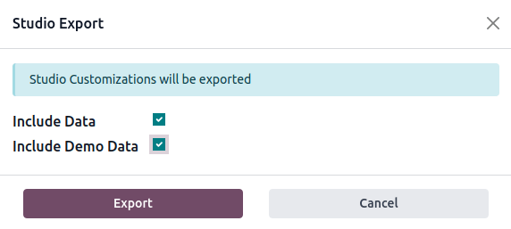

=========================
Models, modules, and apps
=========================

Models determine the logical structure of a database and how data is stored, organized, and
manipulated. In other words, a model is a table of information that can be linked with other tables.
A model usually represents a business concept, such as a *sales order*, *contact*, or *product*.

Modules and apps contain various elements, such as models, views, data files, web controllers, and
static web data.

.. note::
   All apps are modules. Larger, standalone modules are typically referred to as apps, whereas other
   modules usually serve as add-ons to said apps.

.. _studio/models-modules-apps/suggested-features:

Suggested features
==================

When you create a new model or app with Studio, you can choose to add up to 14 features to speed
up the creation process. These features bundle fields, default settings, and views that are usually
used together to provide some standard functionality. Most of these features can be added later on,
but adding them from the start makes the model creation process much easier. Furthermore, these
features interact together in some cases to increase their usefulness.

.. example::
   Creating a model with the :ref:`studio/models-modules-apps/suggested-features/picture` and
   :ref:`studio/models-modules-apps/suggested-features/pipeline-stages` features enabled adds the
   image in the card layout of the :ref:`Kanban view <studio/views/multiple-records/kanban>`.

   .. image:: models_modules_apps/picture-pipeline-kanban.png
      :align: center
      :alt: Combination of the Picture and Pipeline stages features on the Kanban view

.. _studio/models-modules-apps/suggested-features/contact-details:

Contact details
---------------

Selecting :guilabel:`Contact details` adds to the :ref:`Form view <studio/views/general/form>` a
:ref:`Many2One field <studio/fields/relational-fields-many2one>` linked to the *Contact* model and
two of its :ref:`Related Fields <studio/fields/relational-fields-related-field>`: :guilabel:`Phone`
and :guilabel:`Email`. The :guilabel:`Contact` field is also added to the :ref:`List view
<studio/views/multiple-records/list>`, and the :ref:`Map view <studio/views/multiple-records/map>`
is activated.

.. example::

   .. image:: models_modules_apps/contact.png
      :align: center
      :alt: Contact details feature on the Form view

.. _studio/models-modules-apps/suggested-features/user-assignment:

User assignment
---------------

Selecting :guilabel:`User assignment` adds to the :ref:`Form view <studio/views/general/form>` a
:ref:`Many2One field <studio/fields/relational-fields-many2one>` linked to the *Contact* model, with
the following :guilabel:`Domain`: `Share User is not set` to only allow the selection of *Internal
Users*. In addition, the :guilabel:`many2one_avatar_user` widget is used to display the user's
avatar. The :guilabel:`Responsible` field is also added to the :ref:`List view
<studio/views/multiple-records/list>`.

.. example::

   .. image:: models_modules_apps/user-assignment.png
      :align: center
      :alt: User assignment feature on the Form view

.. _studio/models-modules-apps/suggested-features/date-calendar:

Date & Calendar
---------------

Selecting :guilabel:`Date & Calendar` adds to the :ref:`Form view <studio/views/general/form>` a
:ref:`Date field <studio/fields/simple-fields-date>` and activates the :ref:`Calendar view
<studio/views/timeline/calendar>`.

.. _studio/models-modules-apps/suggested-features/date-range-gantt:

Date range & Gantt
------------------

Selecting :guilabel:`Date range & Gantt` adds to the :ref:`Form view <studio/views/general/form>`
two :ref:`Date fields <studio/fields/simple-fields-date>` next to each other: one to set a start
date, the other to set an end date, using the :guilabel:`daterange` widget, and activates the
:ref:`Gantt view <studio/views/timeline/gantt>`.

.. _studio/models-modules-apps/suggested-features/pipeline-stages:

Pipeline stages
---------------

Selecting :guilabel:`Pipeline stages` activates the :ref:`Kanban view
<studio/views/multiple-records/kanban>`, adds several fields such as :ref:`Priority
<studio/fields/simple-fields-priority>` and :guilabel:`Kanban State`, and three stages:
:guilabel:`New`, :guilabel:`In Progress`, and :guilabel:`Done`. The :guilabel:`Pipeline status bar`
and the :guilabel:`Kanban State` field are added to the :ref:`Form view
<studio/views/general/form>`. The :guilabel:`Color` field is added to the :ref:`List view
<studio/views/multiple-records/list>`.

.. note::
   The :guilabel:`Pipeline stages` feature can be added at a later stage.

.. _studio/models-modules-apps/suggested-features/tags:

Tags
----

Selecting :guilabel:`Tags` adds to the :ref:`studio/views/general/form` and
:ref:`studio/views/multiple-records/list` views a :ref:`Tags field
<studio/fields/relational-fields-tags>`, creating a *Tag* model with preconfigured access rights in
the process.

.. _studio/models-modules-apps/suggested-features/picture:

Picture
-------

Selecting :guilabel:`Picture` adds to the top-right of the :ref:`Form view
<studio/views/general/form>` an :ref:`Image field <studio/fields/simple-fields-image>`.

.. note::
   The :guilabel:`Picture` feature can be added at a later stage.

.. _studio/models-modules-apps/suggested-features/lines:

Lines
-----

Selecting :guilabel:`Lines`: adds to the :ref:`Form view <studio/views/general/form>` a :ref:`Lines
field <studio/fields/relational-fields-lines>` inside a :guilabel:`Tab` component.

.. _studio/models-modules-apps/suggested-features/notes:

Notes
-----

Selecting :guilabel:`Notes` adds to the :ref:`Form view <studio/views/general/form>` an :ref:`Html
field <studio/fields/simple-fields-html>` using the full width of the form.

.. _studio/models-modules-apps/suggested-features/monetary-value:

Monetary value
--------------

Selecting :guilabel:`Monetary value` adds to the :ref:`studio/views/general/form` and
:ref:`studio/views/multiple-records/list` views a :ref:`Monetary field
<studio/fields/simple-fields-monetary>`. The :ref:`studio/views/reporting/graph` and
:ref:`studio/views/reporting/pivot` views are also activated.

.. note::
   A *Currency* field is added and hidden from the view.

.. _studio/models-modules-apps/suggested-features/company:

Company
-------

Selecting :guilabel:`Company` adds to the :ref:`studio/views/general/form` and
:ref:`studio/views/multiple-records/list` views a :ref:`Many2One field
<studio/fields/relational-fields-many2one>` linked to the *Company* model.

.. note::
   This is only useful if you work in a multi-company environment.

.. _studio/models-modules-apps/suggested-features/custom-sorting:

Custom Sorting
--------------

Selecting :guilabel:`Custom Sorting` adds to the :ref:`List view
<studio/views/multiple-records/list>` a drag handle icon to manually reorder records.

.. example::

   .. image:: views/list-drag-handle.png
      :align: center
      :alt: Custom Sorting feature on the List view

.. _studio/models-modules-apps/suggested-features/chatter:

Chatter
-------

Selecting :guilabel:`Chatter` adds to the :ref:`Form view <studio/views/general/form>` Chatter
functionalities (sending messages, logging notes, and scheduling activities).

.. note::
   The :guilabel:`Chatter` feature can be added at a later stage.

.. example::

   .. image:: models_modules_apps/chatter.png
      :align: center
      :alt: Chatter feature on the Form view

.. _studio/models-modules-apps/suggested-features/archiving:

Archiving
---------

Selecting :guilabel:`Archiving` adds to the :ref:`studio/views/general/form` and
:ref:`studio/views/multiple-records/list` views the :guilabel:`Archive` action and hides archived
records from searches and views by default.

.. _studio/export-import:

Export and import customizations
================================

When you do any customization with Studio, a new module named `studio_customization` is
added to your database. You can export this module as a ZIP file using the :guilabel:`Studio Export`
function. The module can then be imported into another Odoo database. This may be useful, for
example, when setting up a new module or for training purposes.

.. note::
   Exporting and importing customizations in this way, rather than using the :doc:`standard Odoo
   export and import <../essentials/export_import_data>` functions, means data is imported in a
   logical way. For example, if the module contains customers and sales orders, the customers are
   created first, since these are required for the sales orders to be created.

.. _studio/export-import/export:

Export customizations
---------------------

To export customizations, click the :icon:`oi-studio` :guilabel:`(Toggle Studio)` button on the main
Odoo dashboard, then :guilabel:`Export`, then either:

- download all Studio customizations by clicking the :guilabel:`Export` button; or
- choose what data to export by clicking :ref:`Configure data and demo data to export
  <studio/export-import/export/configure>`.

.. _studio/export-import/export/configure:

Configure data to export
~~~~~~~~~~~~~~~~~~~~~~~~

To select specific models to export, click :guilabel:`New` on the :guilabel:`Studio Export` screen,
then start typing the name of the relevant model or select it from the list.

.. tip::
   Click :guilabel:`Preset` to see a list of all models in your database with records that have
   been modified using Studio and all custom models created using Studio. To configure one of these
   models for export, click on the model to open it and make the required changes.

Tick the following options as relevant:

- :guilabel:`Demo`: if the exported records should be considered as demo data when imported.
- :guilabel:`Attachments`: if attachments related to exported records should be included in the
  export.
- :guilabel:`Updatable`: if the exported records should be able to be updated during a module update.

If necessary, edit the :guilabel:`Domain` to determine which of the model's records should be
exported. To do so, click the :guilabel:`Edit Domain` button or :icon:`fa-caret-right`
:guilabel:`(Modify filter)` then :guilabel:`Edit Domain`, as appropriate. Proceed to make any
required changes.

After configuring a model for export, click :guilabel:`Studio Export` to return to the main screen.
To download a ZIP file with the customizations for all the listed models, click :guilabel:`Export`.

.. note::
   It is not necessary to select one or more models as all listed models will be included in the
   export. To remove a model from the export, select it and click the :icon:`fa-cog`
   :guilabel:`Actions` button then :icon:`fa-trash-o` :guilabel:`Delete`.

In the :guilabel:`Studio Export` window:

- leave the checkboxes unticked to export only the customizations done with Studio.
- tick :guilabel:`Include Data` to include data from the selected models in the export.
- tick :guilabel:`Include Demo Data` to include data from the selected models that is flagged
  as demo data. Ticking this option also ticks :guilabel:`Include Data`.

Click the :guilabel:`Export` button to download the ZIP file.

.. _studio/export-import/import:

Import customizations
---------------------

.. warning::
   Before importing, make sure the destination database is on the same Odoo version and contains the
   same apps and modules as the source database. Studio does not add the underlying modules as
   dependencies of the exported module.

To import and install Studio customizations in another Odoo database:

#. Connect to the destination database.
#. Click the :icon:`oi-studio` :guilabel:`(Toggle Studio)` button on the main Odoo dashboard, then
   :guilabel:`Import`.
#. Upload the exported ZIP file. If demo data should be imported, tick :guilabel:`Load demo data`.
#. Click :guilabel:`Install`.
