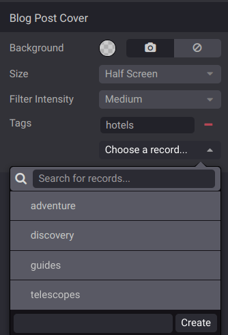

====
Blog
====

**Odoo Blog** allows you to create and manage blog posts on your website to engage your audience and
build a community.

.. tip::
   If the Blog module is not yet installed, click :guilabel:`+New` on the website builder, select
   :guilabel:`Blog Post`, and click :guilabel:`Install`.

Creating a blog
===============

To create or edit a blog, go to :menuselection:`Website --> Configuration --> Blogs: Blogs`. Click
:guilabel:`New`, and enter the :guilabel:`Blog Name` and the :guilabel:`Blog Subtitle`.

The :guilabel:`Blog` menu item is added to your website's menu the first time you create a blog and
gathers all your blogs.

Adding a blog post
==================

Go to your website, click :guilabel:`+New` in the top-right corner, and select
:guilabel:`Blog Post`. In the pop-up, **select the blog** where the post should appear, write the
post's :guilabel:`Title`, and :guilabel:`Save`. You can then write the post's content and customize
the page using the website builder.

.. tip::
   - Illustrate your articles with copyright-free images from :doc:`Unsplash
     <website/configuration/unsplash>`.
   - Type `/` in the text editor to format and add elements to your text.

.. important::
   Don't forget to toggle the :guilabel:`Unpublished` switch in the top-right corner to publish
   your post.

Using tags
==========

Tags let visitors filter all posts sharing the same tag. By default, they are displayed at the
bottom of posts, but can also be displayed on the blog's main page. To do so, click
:menuselection:`Edit --> Customize` and enable the :guilabel:`Sidebar`. By default, the sidebar's
:guilabel:`Tags List` is enabled.

To create a tag, go to :menuselection:`Website --> Configuration --> Blogs: Tags` and click
:guilabel:`New`. Fill in the:

- :guilabel:`Name`
- :guilabel:`Category`: tag categories let you group tags displayed on the sidebar by theme.
- :guilabel:`Used in`: to apply the tag to existing blog posts, click :guilabel:`Add a line`,
  select the posts, and click :guilabel:`Select`.

You can add and create tags directly from posts by clicking :menuselection:`Edit --> Customize` and
select the post's cover. Under :guilabel:`Tags`, click :guilabel:`Choose a record...`, and select
or create a tag.

.. note::
   To manage tag categories, go to :menuselection:`Website --> Configuration --> Blogs: Tag
   Categories`.

Customizing blog homepages
==========================

Customize the content of blog homepages by opening a blog homepage and clicking :menuselection:`Edit
--> Customize`.

.. note::
   Settings apply to **all** blogs homepages.

:guilabel:`Top Banner`: :guilabel:`Name/Latest Post` displays the title of the latest post on the
top banner, while :guilabel:`Drop Zone for Building Blocks` removes the top banner and lets you use
any building block instead.

:guilabel:`Layout`: organizes posts as a :guilabel:`Grid` or :guilabel:`List`.

- :guilabel:`Cards`: adds a *card* effect.
- :guilabel:`Increase Readability`: improves the text's readability.

:guilabel:`Sidebar`: displays a sidebar containing an :guilabel:`About us` section.

- :guilabel:`Archives`: allows visitors to select a month and filter all posts created during that
  month.
- :guilabel:`Follow Us`: displays links to your social media networks. They can be configured using
  the Social Media building block somewhere on your website.
- :guilabel:`Tags List`: displays all tags related to a blog. Visitors can select a tag to filter
  all related posts.

:guilabel:`Posts List`: :guilabel:`Cover` displays the posts' images, and :guilabel:`No Cover` hides
them.

- :guilabel:`Author`: displays the posts' authors.
- :guilabel:`Comments/Views Stats`: displays the posts' number of comments and views.
- :guilabel:`Teaser & Tags`: displays the posts' first sentences and tags.

Customizing blog posts
======================

Customize posts by opening a blog post and clicking :menuselection:`Edit --> Customize`.

.. note::
   Settings apply to **all** posts.

:guilabel:`Layout`: :guilabel:`Title Inside Cover` displays the title inside the cover image, and
:guilabel:`Title above Cover` displays it above.

- :guilabel:`Increase Readability`: increases the text's readability.

:guilabel:`Sidebar`: displays the :guilabel:`Sidebar` and additional options:

- :guilabel:`Archive`: allows visitors to select a month and filter all posts created during that
  month.
- :guilabel:`Author`: displays the post's author and creation date.
- :guilabel:`Blog List`: displays links to all your blogs.
- :guilabel:`Share Links`: displays share buttons to several social networks.
- :guilabel:`Tags`: displays the post's tags.

:guilabel:`Breadcrumb`: displays the path to the post.

:guilabel:`Bottom`: :guilabel:`Next Article` displays the next post at the bottom, and
:guilabel:`Comments` enable visitors to comment on the post.

:guilabel:`Select To Tweet`: visitors are offered to tweet the text they select.

.. tip::
   Use :ref:`Plausible <website/analytics/plausible>` to keep track of the traffic on your blog.
