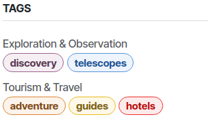

====
Blog
====

**Odoo Blog** lets you manage blog pages and posts, and customize them with the website builder.

Blog posts
==========

Create a blog post
------------------

To create a blog post, click :guilabel:`New` and click :guilabel:`Blog Post`. Select a blog, define
a :guilabel:`Blog Post Title` and click :guilabel:`Save`. Write the post's content and customize it
using the website builder.

Customize blog posts
--------------------

To customize the content of a blog post, open a blog post and click :menuselection:`Edit --> Style`.
Different options can be used to customize the posts:

- :guilabel:`Layout`: displays the title inside the cover or above the cover.
- :guilabel:`Increase Readability`: Enhances text appearance for better reading comfort without
  changing the content.
- :guilabel:`Sidebar`: displays archives, authors, blogs list, social networks, next article and
  comments.
- :guilabel:`Archive`: enables filtering posts by selected month.
- :guilabel:`Author`: displays the post author.
- :guilabel:`Blog List`: displays links to all the blogs.
- :guilabel:`Share Links`: displays share buttons to several social networks.
- :guilabel:`Breadcrumb`: displays the path to the post below the cover.
- :guilabel:`Bottom`: the :guilabel:`Next Article` button displays the next post at the bottom of
  the page, and the :guilabel:`Comments` button enables visitors to add comments.

To customize the cover of the post, click the cover and use the available options from the
:guilabel:`Blog Post Cover` section:

- :guilabel:`Tags`: displays the tags below blog posts.
- :guilabel:`Background`: adds a :ref:`theme color <website/themes/colors>` or a picture.
- :guilabel:`Size`: select the size of the cover.
- :guilabel:`Filter Intensity`: select the intensity of the cover's color.

After applying the desired changes, click :guilabel:`Save`. The settings apply to **all** posts.

To publish a post, toggle the :guilabel:`Unpublished` switch in the top-right corner of the page.

.. seealso::
   `Odoo Tutorials: Blogs [video] <https://www.odoo.com/slides/slide/blogs-6935>`_

To delete a blog post, go to :menuselection:`Website -> Site -> Blog post`. Select the blog
post to delete, click :guilabel:`Action` and :guilabel:`Delete`.

To change the author of the blog post, go to :menuselection:`Edit -> style` and click the author
under the blog post. Then, go to the website builder, under the :guilabel:`Block` section and select
the author in the :guilabel:`Contact` field.

.. tip::
   - The author can also be modified from the blog page using the same steps.
   - Use `/` to activate the :ref:`Powerbox <Powerbox>` which displays some functions such as
     :doc:`AI <../../../applications/productivity/ai/agents>` to generate and structure the content.
   - Use the :ref:`Text editor toolbar<essentials/html_editor/toolbar>` by hovering the mouse over
     the selected text to edit its format.
   - Illustrate your articles with copyright-free images from :doc:`Unsplash
     </applications/general/integrations/unsplash>`.
   - Use :ref:`Plausible <analytics/plausible>` to keep track of the traffic on your blog.

.. Note::
   - Increase blogs' visibility in search engines, attract more visitors and more clicks while
     improving the :doc:`SEO <../../../applications/websites/website/structure/seo>`:

      - Update the content of the website regularly.
      - Use meta tags and ensure both the website content and its metadata are translated.
      - Never have more than one :ref:`Heading 1 <website/elements/titles>` per page so the
        :doc:`SEO <../../../applications/websites/website/structure/seo>` can easily identify the
        main topic of the page.

   - Add 'Blog' :ref:`building blocks <website/building_blocks/add>` anywhere on your website by
     dragging and dropping them on the desired pages to increase the blogs visibility.
   - Customize blog building blocks through the website editor. For e.g., filter by the
     :guilabel:`Latest blog posts` or :guilabel:`Most viewed blog posts` and determine which blog
     to display in the building block.

.. seealso::
   :doc:`Building block documentation <../../../applications/websites/website/web_design/building_blocks>`

.. _blog/tags:

Tags
~~~~

Tags let visitors filter blog posts with the same tag. They are displayed at the
bottom of their posts.

Create tags
***********

To create a tag, go to :menuselection:`Website --> Configuration --> Tags` and click
:guilabel:`New`. Fill in the:

- :guilabel:`Name`.
- :ref:`Category <blog/tag category>`.
- :guilabel:`Color`.
- :guilabel:`Used in`: to apply tags to existing blog posts, click :guilabel:`Add a line`,
  select the posts, and click :guilabel:`Select`.

To manage the appearance of the tags, click :menuselection:`Edit --> Style` and enable the
:guilabel:`Sidebar`. On the :guilabel:`Posts List` section, enable or disable the
:guilabel:`Teaser & Tags` option.

Add and create tags directly from posts by clicking :menuselection:`Edit --> Style` and
select the post's cover. Under :guilabel:`Tags`, click :guilabel:`Choose a record...`, and select
or create a tag. Or create a tag by writing the name in the search bar and clicking
:guilabel:`Create "..."`.

.. _blog/tag category:

Create tag category
*******************

Tag categories let you organize tags into groups displayed on the sidebar.

To create tag categories, go to :menuselection:`Website --> Configuration --> Tag
Categories` and click :guilabel:`New`.

Blog pages
==========

Create a blog page
------------------

To create or edit a blog, go to :menuselection:`Website --> Configuration --> Blogs`. Click
:guilabel:`New`, select the :guilabel:`Blog` and define the :guilabel:`Blog Subtitle`.

The :guilabel:`Blog` menu is added to the website's menu the first time a blog is created and
gathers all the blogs and their posts.

Customize blog pages
--------------------

To customize a blog page, go to :menuselection:`Edit --> Style` and use the available options as
desired:

- :guilabel:`Top Banner`: displays the title of the page.
- :guilabel:`Full width`: displays the banner widely.
- :guilabel:`Layout`:  displays the blog posts as grid or as list.
- :guilabel:`Cards`: displays blog posts with a *card* effect.
- :guilabel:`Increase Readability`: Enhances text appearance for better reading comfort without
  changing the content.
- :guilabel:`Sidebar`: displays archives, social networks and :ref:`tags list <blog/tags>`.
- :guilabel:`Archives`: enables filtering posts by selected month.
- :guilabel:`Follow Us`: displays links to social networks. To add or customize a social network,
   click the :guilabel:`Follow us` block, click :guilabel:`Add New Social Network` and copy/paste
   your account URL next to the network field. Toggle the switch button on or off to enable or
   disable a social network.
- :guilabel:`Tags List`: displays the list of :ref:`tags <blog/tags>` for filtering purposes.
- :guilabel:`Posts List`: displays the posts' covers or hides them.
- :guilabel:`Author`: displays the posts' authors.
- :guilabel:`Comments/Views Stats`: displays the posts' number of comments and views.
- :guilabel:`Teaser & Tags`: displays the posts' first sentences and tags.

.. tip::

   To change the cover's background, click the blog post and edit the :guilabel:`Background`
   field in the :guilabel:`Cover` section.

After applying the desired changes, click :guilabel:`Save`

.. note::
   Settings apply to **all** blogs pages.
