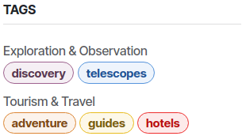

====
Blog
====

**Odoo Blog** lets you manage blog pages and posts, and customize them with the website builder.

.. tip::
   Install the :guilabel:`Blog` app by clicking :guilabel:`New` on the website builder, then
   selecting  :guilabel:`Blog Post`, and clicking :guilabel:`Install`.

.. seealso::
   `Odoo Tutorials: Blogs [video] <https://www.odoo.com/slides/slide/blogs-6935>`_

Blog posts
==========

To create a blog post, click :guilabel:`New` on the website builder and click :guilabel:`Blog Post`.
Select a :ref:`blog <blog/blog-pages>`, define a :guilabel:`Blog Post Title`, and click
:guilabel:`Save`. Write the post's content and customize it using the website builder.

To publish a post, toggle the :guilabel:`Unpublished` switch in the top-right corner of the page.

To delete a blog post, go to :menuselection:`Website --> Site --> Blog post`. Select the blog
post to delete, click :icon:`fa-cog` :guilabel:`Actions`, and :icon:`fa-trash-o` :guilabel:`Delete`.

Customize blog posts
--------------------

To customize the layout of all blog posts, open one and click :menuselection:`Edit --> Style`.
Under the :guilabel:`Blog Page` section, different categories of options can be used to customize
the posts:

:guilabel:`Layout`:

- :guilabel:`Breadcrumb`: display the breadcrumb trail.
- :guilabel:`Style`: choose how the post's title and cover are arranged:

  - :guilabel:`Title Above Cover`: display the title above the cover. Enable
    :guilabel:`Full Width Cover` to make the cover use the page's full width.
  - :guilabel:`Split Cover`: display the title on the left and the cover on the right.
  - :guilabel:`Title Inside Cover`: display the title over the cover.

  Then, select the elements to display in the post's header:

  - :guilabel:`Tags`: create or select existing :ref:`tags <blog/tags>` and display them on the
    post.
  - :guilabel:`Author`: display the post's author and publication date.
  - :guilabel:`Share Links`: add clickable icons that link to your social network profiles. This
    option is not available with the :guilabel:`Title Inside Cover` style.

- :guilabel:`Container Size`: choose the width of the post's content: :guilabel:`Small`,
  :guilabel:`Regular`, or :guilabel:`Full`.

  .. note::
     The :guilabel:`Small` size is not available with the :guilabel:`Split Cover` style.

:guilabel:`Content`:

- :guilabel:`Share Links`: add clickable icons that link to your social network profiles.
- :guilabel:`Tags`: create or select existing :ref:`tags <blog/tags>` and display them on the post.
- :guilabel:`Comments`: allow visitors to comment.
- :guilabel:`Bottom`: display another post at the end of the page; by default, the next post of
  the same blog. Use the :guilabel:`Recommended Post` field to select another post instead.

:guilabel:`Sidebar`:

- :guilabel:`Author`: display the post author.
- :guilabel:`Table of Contents`: display a table of contents for the post.
- :guilabel:`Share Links`: add clickable icons that link to your social network profiles and a
  subscription field for your newsletter.
- :guilabel:`Tags`: create or select existing :ref:`tags <blog/tags>` and display them on the post.
- :guilabel:`Blogs List`: display links to all :ref:`blog pages <blog/blog-pages>`.
- :guilabel:`Archive`: allow visitors to view all posts from a specific month by selecting it.

.. note::
   The sidebar is only displayed if at least one of its options is enabled.

To add tags or customize the cover of a specific post, click the cover and use the following
settings under the :guilabel:`Blog Post Cover` section:

- :guilabel:`Tags`
- :guilabel:`Background`: add an image by clicking the :icon:`os-camera` :guilabel:`(camera)` icon,
  or use a background color by clicking the :icon:`fa-ban` (:guilabel:`None`) icon and selecting a
  color.

- :guilabel:`Size`: select the size of the cover (:guilabel:`Full screen`, :guilabel:`Half screen`,
  or :guilabel:`Fit text`).
- :guilabel:`Filter Intensity`: choose the cover filter's intensity
  (:guilabel:`Low`, :guilabel:`Medium`, :guilabel:`High`) or disable it by selecting
  :guilabel:`No filter`.

After applying the desired changes, click :guilabel:`Save`.

.. tip::
   - Illustrate your posts with copyright-free images from :doc:`Unsplash
     </applications/general/integrations/unsplash>`.
   - Use :ref:`Plausible <analytics/plausible>` to track traffic on your blog.
   - Customize blog building blocks through the website editor. For example, filter by the
     :guilabel:`Latest blog posts` or :guilabel:`Most viewed blog posts` and determine which blog
     to display in the building block.

.. seealso::
   - :doc:`Building block documentation <website/web_design/building_blocks>`
   - :doc:`Odoo rich-text editor documentation <../essentials/html_editor>`

.. _blog/tags:

Tags
~~~~

Tags let visitors filter blog posts that share a specific tag. They are displayed at the bottom of
each post.

To create a tag, go to :menuselection:`Website --> Configuration --> Tags` and click
:guilabel:`New`. Fill in the:

- :guilabel:`Name`
- :ref:`Category <blog/tag-category>`
- :guilabel:`Color`
- :guilabel:`Used in`: to apply tags to existing blog posts, click :guilabel:`Add a line`.

Add and create tags directly from posts by clicking :menuselection:`Edit --> Style` and
selecting the post's cover. Under :guilabel:`Tags`, click :guilabel:`Choose a record...`, and select
or create a tag by writing a new name.

.. _blog/tag-category:

Tag category
************

Tag categories let you organize tags displayed on the sidebar into groups.

To create tag categories, go to :menuselection:`Website --> Configuration --> Tag Categories`
and click :guilabel:`New`.

.. _blog/blog-pages:

Blog landing pages
==================

To create multiple blogs, go to :menuselection:`Website --> Configuration --> Blogs` and click
:guilabel:`New`. Next, enter the :guilabel:`Blog Name` and the :guilabel:`Blog Subtitle`.

The :guilabel:`Blog` menu gathers all the blogs and their posts.

.. note::
   With two or more blogs, the blog landing page (/blog) aggregates posts from all blogs and lets
   visitors choose which blog to view.

Customize blog landing pages
----------------------------

To customize the blog landing pages, go to :menuselection:`Edit --> Style` and use the available
options as desired.

.. note::
   The settings are shared by the page listing the posts of all blogs (`/blog`) and the page of
   each individual blog. Only two options differ: :guilabel:`Top Banner` is available on the page
   of an individual blog, and :guilabel:`Show Title` on the page listing all blogs.

:guilabel:`Layout`:

- :guilabel:`Top Banner`: display the blog's cover image and subtitle at the top of the page:

  - :guilabel:`Full Width`: make the banner use the page's full width.

- :guilabel:`Show Title`: display the title at the top of the page.
- :guilabel:`Style`: choose how the posts are listed:

  - :guilabel:`Thumbnails`: display the posts in a grid. Two additional options are available:

    - :guilabel:`Promote Last`: emphasize the most recent post by displaying it in a larger size.
    - :guilabel:`Cards Design`: display the posts with the *card* effect.

  - :guilabel:`Grid`: display the posts in a grid with borders around each post.
  - :guilabel:`Split`: display the latest post in a fixed column on the left and the other posts
    in a scrollable grid on the right.
  - :guilabel:`Minimal`: display the posts in a list showing only their title and date.
  - :guilabel:`Compact`: display the posts in a list showing only their date, title, and tags.
  - :guilabel:`Regular`: display the posts in a list with all their information.
  - :guilabel:`Large`: display the posts in a larger list with all their information.

  With the :guilabel:`Grid` style, or the :guilabel:`Thumbnails` style when :guilabel:`Promote
  Last` is disabled, use the :guilabel:`Size` option to choose the number of columns.

- :guilabel:`Content Width`: choose whether the page's content should be :guilabel:`Regular` or
  :guilabel:`Full`.

:guilabel:`Text & Content`:

- :guilabel:`Cover Image`: display the posts' covers.
- :guilabel:`Teaser`: display the posts' first sentences.
- :guilabel:`Tags`: create or select existing :ref:`tags <blog/tags>` and display them on the post.
- :guilabel:`Stats`: display the number of comments and views for each post.
- :guilabel:`Author`: display the posts' authors.
- :guilabel:`Date`: display the posts' publication date.

:guilabel:`Sidebar`:

- :guilabel:`About Us`: display an *about us* section.
- :guilabel:`Follow Us`: add clickable icons that link to your social network profiles and a
  subscription field for your newsletter.
- :ref:`Tags List <blog/tags>`: allow visitors to view all blog posts that share a specific tag by
  selecting it.
- :guilabel:`Archives`: allow visitors to view all posts from a specific month by selecting it.

After applying the desired changes, click :guilabel:`Save`.

.. note::
   Increase your blog's visibility in search engines, attract more visitors while
   improving the :doc:`SEO <../../../applications/websites/website/structure/seo>` by:

   - Updating the content of the website regularly.
   - Using meta tags and ensuring that both the content and metadata are translated.
   - Never having more than one :ref:`Heading 1 <website/elements/titles>` per page, so
     search engines can easily identify the page's main topic.
   - Use the :guilabel:`Blog` :ref:`building blocks <website/building_blocks/add>` anywhere on the
     website.
