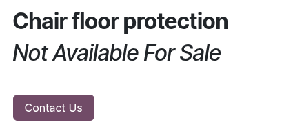
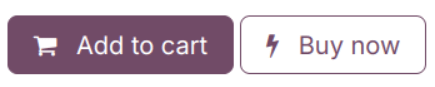
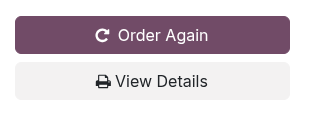

=============
Order buttons
=============

Odoo Ecommerce provides several order button options. To enable or add them on your product page,
go to :menuselection:`Website --> Configuration --> Settings`. Under
the :guilabel:`Shop - Checkout Process` section, tick an option for the :ref:`Add to Cart
<cart/add-to-cart>` button or enable the :ref:`Buy now <cart/buy-now>` or
:ref:`Re-order From Portal <cart/re-order>` buttons, and click :guilabel:`Save`.

.. _cart/add-to-cart:

Add to cart
===========

By default, the :guilabel:`Add to cart` button is displayed on your product's page. It provides
several options to configure when clicking on the button:

- :guilabel:`Stay on Product Page`: The product is added to the cart, and
  customers remain on the product's page.
- :guilabel:`Go to cart`: Customer are immediately **redirected** to their cart.
- :guilabel:`Let the user decide (dialog)`: Customers can choose if they want to go to the
  cart and :guilabel:`Proceed to Checkout` or if they prefer to :guilabel:`Continue Shopping`.

.. note::
   If a product has :doc:`optional products <products/cross_upselling>`, the **dialog
   box** will always appear.

.. _cart/prevent-sale:

Replace the button
------------------

You can replace the :guilabel:`Add to Cart` button with a :guilabel:`Contact Us` button
which redirects users to a given URL.

.. note::
   Hiding the :guilabel:`Add to Cart` button is often used by B2B ecommerce businesses
   that need to restrict purchases only to :ref:`customers with an account <ecommerce/checkout/policy>`,
   but still want to display an online product catalog for those without.

To do so, go to :menuselection:`Website --> Configuration --> Settings --> Shop - Products` and tick
:guilabel:`Prevent Sale of Zero Priced Product`. As a result, a new :guilabel:`Button url` field
appears to enter a **redirect URL**. Then, set the price of the product to `0.00`
either from the **product's template**, or from a
:doc:`pricelist </applications/sales/sales/products_prices/prices/pricing>`.

.. note::
   The :guilabel:`Contact Us` button and *Not Available For Sale* text beneath the product title
   and description can both be modified on the product's page while in :guilabel:`Edit` mode.

Add a customizable order button
-------------------------------

You can also create a customizable :guilabel:`Add to Cart` button and link it to a specific product.
The **customized button** can be added on any page of the website as an **inner content** building
block, and is an *additional* button to the regular :guilabel:`Add to Cart` button.

To add it, go to the :guilabel:`Shop` page of your choice, click :menuselection:`Edit --> Blocks`
and place the :guilabel:`Add to Cart Button` building block. Once placed, click the button, scroll
to the :guilabel:`Add to Cart Button` section and use the following options:

- :guilabel:`Product`: Select the product to link the button with. Selecting a product renders the
  :guilabel:`Action` field.
- :guilabel:`Action`: Choose if it should be a :guilabel:`Add to Cart` or :ref:`Buy Now
  <cart/buy-now>` button.

.. note::
   The default :guilabel:`Add to Cart` button does not offer those options, but the label can be
   changed.

.. tip::
   While in :guilabel:`Edit` mode, it is also possible to show or hide the
   :icon:`fa-shopping-cart` :guilabel:`cart` icon in the header of the page. Click the header,
   and enable the :guilabel:`Show empty` feature under the :guilabel:`Customize` tab.

.. _cart/buy-now:

Buy now
=======

Enable the :guilabel:`Buy Now` button to take customers to the :ref:`review order
<ecommerce/checkout/review_order>` step instead of adding the product to the cart.
This button is an *additional* option and does not replace the :guilabel:`Add to Cart` button.

.. tip::
   Alternatively, the :guilabel:`Buy Now` button can also be enabled from any product's page while
   in :guilabel:`Edit` mode. In the :guilabel:`Customize` tab, click the :guilabel:`Buy now` button
   next to :guilabel:`Cart`.

.. _cart/re-order:

Re-order From Portal
====================

Customers have the possibility to **re-order** items from **previous sales orders** on the customer
portal. Customers can find the :guilabel:`Order Again` button on their **sales order**
from the **customer portal**.

