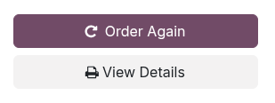

=====================
Ordering and checkout
=====================

Odoo eCommerce provides several options to organize the ordering and checkout process. It offers
different :ref:`order button <ecommerce/checkout/order-buttons>` options and sequential
:ref:`checkout steps <ecommerce/checkout/steps>`, some of which support additional features. The
related buttons and checkout pages can be customized using the website editor.

.. _ecommerce/checkout/order-buttons:

Order buttons
=============

To customize the ordering process in Odoo eCommerce, you can:

- change the :ref:`Add to Cart <ecommerce/checkout/add-to-cart>` button's behavior,
- replace it with a :ref:`customized <ecommerce/checkout/prevent-sale>` button,
- add a :ref:`Buy now <ecommerce/checkout/buy-now>` button, and
- add an :ref:`Order again <ecommerce/checkout/re-order>` button to the customer portal.

.. _ecommerce/checkout/add-to-cart:

Add to cart options
-------------------

Default add to cart behavior
~~~~~~~~~~~~~~~~~~~~~~~~~~~~

When clicking the :guilabel:`Add to cart` button, different actions can be triggered. To configure
them, go to :menuselection:`Website --> Configuration --> Settings`, scroll down to the
:guilabel:`Shop - Checkout Process` section, and select one of the following options:

- :guilabel:`Stay on Product Page`: The customer remains on the product's page.
- :guilabel:`Go to cart`: The customer is immediately redirected to the cart.
- :guilabel:`Let the user decide (dialog)`: The customer can choose if they want to go to the cart
  (:guilabel:`Proceed to Checkout`) or if they prefer to stay on the product page
  (:guilabel:`Continue Shopping`).

.. note::
   This dialog box always appears regardless of the configuration to suggest :doc:`optional products
   <products/cross_upselling>`, if any.

.. _ecommerce/checkout/prevent-sale:

Button customization
~~~~~~~~~~~~~~~~~~~~

You can replace the :guilabel:`Add to Cart` button with a :guilabel:`Contact Us` button, which
redirects users to the default contact form.

.. note::
   Removing the ability to add products to the cart is often used by businesses that want to display
   an online catalog but cannot share prices publicly (e.g., to offer custom or variable pricing).

To do so, go to :menuselection:`Website --> Configuration --> Settings`. Under the :guilabel:`Shop -
Products` section, tick :guilabel:`Prevent Sale of Zero Priced Product`. A new :guilabel:`Button
url` field appears to enter a redirect URL.

Then, for all products that should display the :guilabel:`Contact Us` button, set their price to
`0` using the product form or a :doc:`pricelist <../../sales/sales/products_prices/prices/pricing>`.

.. image:: checkout/cart-contact-us.png
   :alt: Contact us button on product page

.. note::
   The :guilabel:`Contact Us` button label, URL, and the *Not Available For Sale* text beneath the
   product title and description can be modified on the product's page while in :guilabel:`Edit`
   mode.

Additional add to cart buttons
~~~~~~~~~~~~~~~~~~~~~~~~~~~~~~

You can add additional :guilabel:`Add to Cart` buttons and link them to specific products on any
website page.

To add them, open the website editor and place the :guilabel:`Add to Cart Button` inner content
building block. Once placed, click the button, scroll to the :guilabel:`Add to Cart Button`
section, and configure the following:

- :guilabel:`Product`: Select the product to link the button with.
- :guilabel:`Action`: Choose if it should be an :guilabel:`Add to Cart` or :ref:`Buy Now
  <ecommerce/checkout/buy-now>` button.

.. note::
   - If the product has variants, either choose one or leave the option on :guilabel:`Visitor's
     Choice`, which prompts the customer to select a variant and then to :guilabel:`Proceed to
     Checkout` or :guilabel:`Continue Shopping`.
   - The default :guilabel:`Add to Cart` button does not offer those options, but its label can be
     changed.

.. tip::
   While in :guilabel:`Edit` mode, it is also possible to show or hide the :icon:`fa-shopping-cart`
   (:guilabel:`cart`) icon in the page's header. Click the header and then the
   :icon:`fa-shopping-cart` (:guilabel:`cart`) button next to the :guilabel:`Show Empty` option
   under the :guilabel:`Customize` tab.

.. _ecommerce/checkout/buy-now:

Buy now
-------

To let customers choose to go to the :ref:`review order <ecommerce/checkout/review_order>` step
directly, you can add an additional :guilabel:`Buy now` button. To do so, go to
:menuselection:`Website --> Configuration --> Settings`. Under the :guilabel:`Shop - Checkout
Process` section, tick the :guilabel:`Buy Now` feature.

.. tip::
   Alternatively, enable the feature by going to any product's page while in :guilabel:`Edit` mode
   and, in the :guilabel:`Customize` tab, clicking the :icon:`fa-bolt` :guilabel:`Buy Now` button
   next to the :guilabel:`Cart` options.

.. image:: checkout/cart-buy-now.png
   :alt: Buy now button

.. _ecommerce/checkout/re-order:

Re-order from portal
--------------------

You can let customers re-order items from previous sales orders from their customer portal using the
:guilabel:`Order Again` button. To add it, go to :menuselection:`Website --> Configuration -->
Settings`. Under the :guilabel:`Shop - Checkout Process` section, tick the :guilabel:`Re-order From
Portal` feature.

.. _ecommerce/checkout/policy:

Checkout policy
===============

To allow customers to checkout as guests or force them to sign in/create an account, go to
:menuselection:`Website --> Configuration --> Settings`, scroll down to the :guilabel:`Shop -
Checkout Process` section, and configure the :guilabel:`Sign in/up at checkout` setting. The
following options are available:

- :guilabel:`Optional`: Customers can check out as guests and register later via the order
  confirmation email to track their order.
- :guilabel:`Disabled (buy as guest)`: Customers can checkout as guests without creating an account.
- :guilabel:`Mandatory (no guest checkout)`: Customers must sign in or create an account at the
  :ref:`Review Order <ecommerce/checkout/review_order>` step to complete their purchase.

B2B access management
---------------------

To restrict checkout to selected B2B customers:

#. Go to :menuselection:`Website --> Configuration --> Settings`, and in the :guilabel:`Shop -
   Checkout Process` section, enable the :ref:`Mandatory (no guest checkout)
   <ecommerce/checkout/policy>` option.
#. Scroll down to the :guilabel:`Privacy` section, go to :guilabel:`Customer Account`, and select
   :guilabel:`On invitation`.
#. Go to :menuselection:`Website --> eCommerce --> Customers`, switch to the :guilabel:`List` view,
   and select the customers you wish to grant access to your :doc:`portal
   <../../general/users/portal>`.
#. Click the :icon:`fa-cog` :guilabel:`Actions` button, then :guilabel:`Grant portal access`.
#. Review the selected customers in the :guilabel:`Portal Access Management` pop-up and click
   :guilabel:`Grant Access`.

Once done, the relevant customers receive an email confirming their account creation, including
instructions on setting a password and activating their account.

.. note::
   - You can revoke access or re-invite a customer using the related buttons in the
     :guilabel:`Portal Access Management` pop-up.
   - Users can only have one :doc:`portal access <../../general/users/portal>` per email.
   - Settings are website-specific, so you could set up a B2C website that allows guest checkout and
     a B2B website with mandatory sign-in.

.. seealso::
   - :doc:`Customer accounts documentation <customer_accounts>`
   - :doc:`Portal access documentation <../../general/users/portal>`

.. _ecommerce/checkout/steps:

Checkout steps
==============

During the checkout process, customers are taken through the following steps:

- :ref:`Review order <ecommerce/checkout/review_order>`
- :ref:`Delivery <ecommerce/checkout/delivery>`
- :ref:`Extra info (if enabled) <ecommerce/checkout/extra_step>`
- :ref:`Payment <ecommerce/checkout/payment>`
- :ref:`Order confirmation <ecommerce/checkout/order_confirmation>`

.. _ecommerce/checkout/customize_steps:

Each step can be customized using the website editor by adding :doc:`building blocks
<../website/web_design/building_blocks>` or opening the :guilabel:`Customize` tab to enable various
checkout options.

.. note::
   Content added through building blocks is **specific** to each step.

.. _ecommerce/checkout/review_order:

Review order
------------

The :guilabel:`Review Order` step allows customers to see the items they added to their cart, adjust
quantities, or :guilabel:`Remove` products. Information related to the product prices and taxes
applied are also displayed. Customers can then click the :guilabel:`Checkout` button to continue to
the :ref:`Delivery <ecommerce/checkout/delivery>` step.

Open the website editor to :ref:`enable <ecommerce/checkout/customize_steps>` checkout options such
as:

- :guilabel:`Suggested Accessories`: to showcase :ref:`accessory products
  <ecommerce/cross_upselling/accessory>`;
- :guilabel:`Promo Code`: to allow customers to redeem :ref:`gift cards <ewallet_gift/gift-cards>`
  or apply :doc:`discount codes <../../sales/sales/products_prices/loyalty_discount>`;
- :guilabel:`Add to Wishlist`: To allow signed-in users to remove a product from their cart and add
  it to their wishlist, go to :menuselection:`Website --> Configuration --> Settings`, scroll to
  the :guilabel:`Shop - Products` section, and enable :guilabel:`Wishlists`. The :guilabel:`Add to
  Wishlist` option is then enabled by default in the website editor.

.. note::
   - If a :doc:`fiscal position <../../finance/fiscal_localizations>` is detected
     automatically, the product tax is determined based on the customer's IP address.
   - If the installed :doc:`payment provider <../../finance/payment_providers>` supports
     :ref:`express checkout <payment_providers/express_checkout>`, a dedicated button is displayed,
     allowing customers to go straight from the cart to the confirmation page without filling out
     the contact form.

.. _ecommerce/checkout/delivery:

Delivery
--------

Once they have reviewed their order:

- Unsigned-in customers are prompted to :guilabel:`Sign in` or enter their :guilabel:`Email
  address`, along with their delivery address and phone details;
- Signed-in customers can select the appropriate :guilabel:`Delivery address`.

They can then :doc:`choose a delivery method <shipping>`, select or enter their :guilabel:`Billing
Address` (or toggle the :guilabel:`Same as delivery address` switch if the billing and delivery
addresses are identical), and click :guilabel:`Confirm` to proceed to the next step.

.. tip::
   - For B2B customers, you can also :ref:`enable <ecommerce/checkout/customize_steps>` optional
     :guilabel:`VAT` and :guilabel:`Company name` fields by toggling the :guilabel:`Show B2B Fields`
     option in the website editor.
   - You can add a checkbox for users without an account to sign up for a newsletter. To do so, go
     to :menuselection:`Website --> Configuration --> Settings`. Under the :guilabel:`Shop -
     Checkout Process` section, enable the :guilabel:`Newsletter` feature and select a
     :guilabel:`Newsletter List`.

.. _ecommerce/checkout/extra_step:

Extra info
----------

You can add an :guilabel:`Extra Info` step in the checkout process to collect additional customer
information through an online form, which is then included in the :ref:`sales order
<handling/sales>`. To do so, :ref:`enable <ecommerce/checkout/customize_steps>` the :guilabel:`Extra
Step` option in the website editor. The form can be :ref:`customized <website/dynamic_content/form>`
as needed.

.. tip::
   Alternatively, go to :menuselection:`Website --> Configuration --> Settings`, scroll to the
   :guilabel:`Shop - Checkout Process` section, enable :guilabel:`Extra Step During Checkout`, and
   click :guilabel:`Save`. Click :icon:`fa-arrow-right` :guilabel:`Configure Form` to customize it.

.. _ecommerce/checkout/payment:

Payment
-------

At the :guilabel:`Payment` step, customers :guilabel:`Choose a payment method`, enter their payment
details, and click :guilabel:`Pay now`.

You can require customers to agree to your :doc:`terms and conditions
<../../finance/accounting/customer_invoices/terms_conditions>` before payment. To :ref:`enable
<ecommerce/checkout/customize_steps>` this option, go to the website editor and toggle the
:guilabel:`Accept Terms & Conditions` feature.

.. tip::
   Enable the :ref:`developer mode <developer-mode>` and click the :icon:`fa-bug` (:guilabel:`bug`)
   icon to display an :ref:`availability <payment_providers/availability>` report for payment
   providers and payment methods, which helps diagnose potential availability issues on the payment
   form.

.. _ecommerce/checkout/order_confirmation:

Order confirmation
------------------

The final step of the checkout process is the :guilabel:`Order confirmation`, which provides a
summary of the customer's purchase details.

.. seealso::
   :doc:`Order handling documentation <order_handling>`
