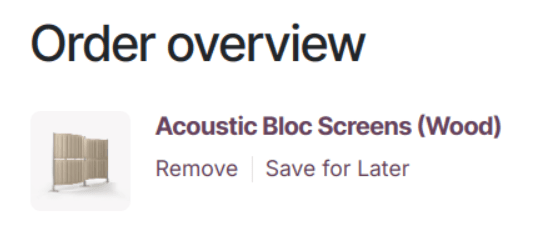

========
Checkout
========

You can customize each checkout process step using the website builder or by navigating to
:menuselection:`Website --> Configuration --> Settings`. Under the
:guilabel:`Shop - Checkout Process` section, you can enable features such as
:guilabel:`Buy Now` for :ref:`express checkout <ecommerce/checkout/express_checkout>` or
:ref:`Sign-in/up at checkout <ecommerce/checkout/policy>`.

.. tip::
   - Go to :menuselection:`Website --> Configuration --> Settings` and find the :guilabel:`Privacy`
     section to restrict :guilabel:`Ecommerce Access` to logged-in users or enable
     :guilabel:`Shared Customer Accounts` to allow or disallow access to all websites with a single
     account.
   - Enhance any checkout step with
     :doc:`building blocks <../../website/web_design/building_blocks>`. On a checkout page, click
     :guilabel:`Edit`, select :guilabel:`Blocks`, and drag and drop the blocks you want. Content
     added through building blocks is **specific** to each step.

Checkout steps
==============

When customers click the :icon:`fa-shopping-cart` :guilabel:`Add to cart` button on a product page,
they can adjust the :guilabel:`Quantity` they want, choose to :guilabel:`Continue Shopping` or
:guilabel:`Proceed to Checkout` to complete their purchase through the steps of the checkout
process.

.. image:: checkout/checkout-steps.png
   :alt: Checkout steps

.. _ecommerce/checkout/review_order:

Review order
------------

After adding products to their cart, customers are taken to the :guilabel:`Review order` step to see
the items they selected, adjust quantities, remove products, or apply
:ref:`discounts <ecommerce/checkout/promo-code>`. Information related to the product prices and
taxes applied are also displayed. Customers can then click the :guilabel:`Checkout` button to
continue to the :ref:`Delivery <ecommerce/checkout/delivery>` step.

.. note::
   - If a :doc:`fiscal position <../../../finance/fiscal_localizations>` is detected automatically,
     the tax on the product is applied based on the person's IP.
   - If the payment provider :doc:`Demo <../../../finance/payment_providers/demo>` is installed,
     then the :guilabel:`Pay with Demo` button is visible.

.. _ecommerce/checkout/delivery:

Delivery
--------

Customers are prompted to :guilabel:`Sign in` or enter their :guilabel:`Email` address at the
:guilabel:`Delivery` step. Next, they select or confirm their :guilabel:`Delivery Address`,
:doc:`Choose a delivery method <../../ecommerce/checkout_payment_shipping/shipping>`, and select
their :guilabel:`Billing Address`. Once done, they can click :guilabel:`Confirm` to proceed to the
next step.

.. _ecommerce/checkout/extra_info:

Extra info
----------

When this feature is :ref:`enabled <ecommerce/checkout/extra_step>`, customers not logged in are
prompted to either sign in or proceed as guests. Logged-in customers benefit from auto-filled
details, streamlining the process. Once ready, they can click :guilabel:`Continue Checkout to proceed`.

.. _ecommerce/checkout/payment:

Payment
-------

At the :guilabel:`Payment` step, customers :guilabel:`choose a payment method`, enter their
payment details, and click :guilabel:`Pay Now`.

.. tip::
   Click the :icon:`fa-bug` :guilabel:`bug` icon to verify the
   :ref:`availability <payment_providers/availability>` of the payment provider.

.. _ecommerce/checkout/order_confirmation:

Order confirmation
------------------

The final step of the checkout process is the :guilabel:`Order confirmation`, which provides a
summary of the customer's purchase details.

.. seealso::
   :doc:`order handling <../../ecommerce/ecommerce_management/order_handling>`

Checkout options
================

From any checkout page, click :guilabel:`Edit` and go to the :guilabel:`Customize` tab to enable
checkout options according to your preferences:

.. _ecommerce/checkout/extra_step:

Extra step
----------

Enable the :guilabel:`Extra Step` option to collect additional customer information via an online
:ref:`form <website/dynamic_content/form>`, adding an
:ref:`Extra Info <ecommerce/checkout/extra_info>` step to the checkout process.

You can also enable this feature by going to
:menuselection:`Website --> Configuration --> Settings`, scrolling to the
:guilabel:`Shop - Checkout Process` section, enabling :guilabel:`Extra Step During Checkout` and
clicking :guilabel:`Save`. Click :icon:`fa-arrow-right` :guilabel:`Configure Form` to customize the
form.

Suggested accessories
---------------------

Toggle the :guilabel:`Suggested Accessories` feature to showcase
:ref:`accessory products <ecommerce/cross_upselling/accessory>` at the
:ref:`Review Order <ecommerce/checkout/review_order>` step.

.. _ecommerce/checkout/promo-code:

Promo code
----------

Enable the :guilabel:`Promo Code` option so that customers can redeem
:ref:`gift cards <ewallet_gift/gift-cards>` or
:doc:`discount <../../../sales/sales/products_prices/loyalty_discount>` codes.

Accept Terms & Conditions
-------------------------

Toggle :guilabel:`Accept Terms & Conditions` to ask customers to agree to the
:doc:`terms and conditions <../../../finance/accounting/customer_invoices/terms_conditions>` before
confirming their order.

.. image:: checkout/checkout-terms.png
    :alt: Accept terms and conditions feature

Show B2B Fields
---------------

Enable the :guilabel:`Show B2B Fields` option to add optional :guilabel:`VAT` and
:guilabel:`Company name` fields to the :guilabel:`Billing address` form for B2B customers during the
:ref:`Delivery <ecommerce/checkout/delivery>` step.

Add to Wishlist
---------------

Activate :guilabel:`Add to Wishlist` to display the :guilabel:`Save for Later` option at the
:guilabel:`Review Order` step to allow customers to remove a product from their order and save it in
their Wishlist.

.. _ecommerce/checkout/express_checkout:

Express checkout
================

Enable a :guilabel:`Buy Now` button on product pages to take customers to the
:ref:`review order <ecommerce/checkout/review_order>` step instead of adding the product to the
cart. To do so, go to :menuselection:`Website --> Configuration --> Settings`, scroll to the
:guilabel:`Shop—Checkout Process` section, enable :guilabel:`Buy Now` and :guilabel:`Save`.
Alternatively, the :guilabel:`Buy Now` button can also be enabled from any product's page by
clicking :guilabel:`Edit` and going to the :guilabel:`Customize` tab.

.. image:: checkout/checkout-buy-now.png
   :alt: Buy Now button

.. _ecommerce/checkout/policy:

Checkout policy
===============

Allow customers to checkout as **guests** or force them to **sign in/create an account** by going to
:menuselection:`Website --> Configuration --> Settings` and scrolling down to the
:guilabel:`Shop - Checkout Process` section. There, you can select:

- :guilabel:`Optional`: Customers can check out and register later from the order confirmation email
  to track their order;

- :guilabel:`Disabled (buy as guest)`: Customers can checkout as guests without creating an account;

- :guilabel:`Mandatory (no guest checkout)`: Customers must sign in or create an account to complete
  their purchase.

.. seealso::
   - :doc:`Customer accounts <../ecommerce_management/customer_accounts>`
   - :doc:`Portal access <../../../general/users/portal>`

B2B access restriction
======================

To restrict checkout to selected B2B customers, enable the
:ref:`Mandatory (no guest checkout) <ecommerce/checkout/policy>` option, go
to :menuselection:`Website --> eCommerce --> Customers`, go to the :guilabel:`List` view, select
the customers you wish to grant access to, click the :icon:`fa-cog` :guilabel:`Actions` button, and
:guilabel:`Grant portal access`. In the :guilabel:`Portal Access Management` pop-up you can view all
the customers that have access, :guilabel:`Revoke Access`, or :guilabel:`Re-Invite` them.

.. note::
   - Users can only have one portal access per email.
   - Settings are website-specific, so you can set up a B2C website that allows guest checkout and
     another for B2B customers with mandatory sign-in.
