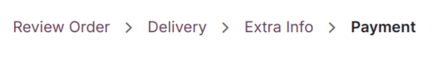
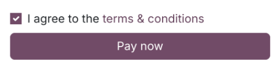

========
Checkout
========

You can customize the **checkout steps**, add more content using the **website builder**, and enable
additional features such as **express checkout** and **sign in/up at checkout**.

You can use **building blocks** to add content at any step of the checkout process. To do so, from
any **checkout page**, go to :menuselection:`Edit --> Blocks`, and drag and drop **building blocks**
to the page.

.. note::
   Note that content added through building blocks is **specific** to each step.

Checkout steps
==============

Review order: promo code (and subtotal)
---------------------------------------

If you have enabled :guilabel:`Discounts, Loyalty, & Gift Card` in the settings
(:menuselection:`Website --> Configuration --> Settings --> Shop - Products`), you can enable the
:guilabel:`Promo Code` field (:menuselection:`Edit --> Customize`) from any checkout page. Customers
can then redeem gift cards and promotional codes at the :guilabel:`Review Order` step.

Furthermore, you can display the subtotal with discounts applied by enabling :guilabel:`Show
Discount in Subtotal`.

.. image:: checkout/checkout-subtotal.png
   :align: center
   :alt: Subtotal discount

Address: B2B fields
-------------------

Optional :guilabel:`TIN/VAT` and :guilabel:`Company Name` fields can be added to the
:guilabel:`Billing Address` form for B2B customers, at the :guilabel:`Address` step. To add the
fields, go to :menuselection:`Edit --> Customize` from any checkout page, and enable
:guilabel:`Show B2B fields`.

Request extra info (additional step)
------------------------------------

You can request :guilabel:`Extra Info` from the customer by adding an :guilabel:`Extra Info` step
between the :guilabel:`Address` and :guilabel:`Confirm Order` steps. To do so, go to
:menuselection:`Edit --> Customize` from any checkout page, and enable :guilabel:`Extra Step
Option`.

The :guilabel:`Extra Info` step is an online form linked to the quotation or sales order of the
customer. The information added during that step can be found on the quotation or sales order of the
customer from the back end, in the **Sales** app.

When enabled, you can remove, add, and modify fields of the form by clicking on :guilabel:`Edit` in
the top-right corner, and then clicking on any of the form's fields. All customization options, as
well as the :guilabel:`+ Field` button to add new fields, are available at the bottom of the
:guilabel:`Customize` menu under the :guilabel:`Field` section.

.. image:: checkout/checkout-form.png
   :align: center
   :alt: Online form customization

Confirm order: terms and conditions
-----------------------------------

You can ask customers to agree to the :guilabel:`Terms & Conditions` in order to confirm their order
by enabling :guilabel:`Accept Terms & Conditions` under :menuselection:`Edit --> Customize` on any
checkout page.

Express checkout
================

You can enable a :guilabel:`Buy Now` button on products' pages which instantly takes the customer to
the :guilabel:`Confirm Order` checkout page, instead of adding the product to the cart. To do so, go
to :menuselection:`Website --> Configuration --> Settings --> Shop - Checkout Process section` and
tick :guilabel:`Buy Now`. Alternatively, the :guilabel:`Buy Now` button can also be enabled from any
product's page by going :menuselection:`Edit --> Customize`, in the :guilabel:`Cart` section.

The button can be found next to the :guilabel:`Add to Cart` button on the product's page.

.. image:: checkout/checkout-express.png
   :align: center
   :alt: Buy now (express checkout) button

.. seealso::
   :ref:`Product page design: additional functions <ecommerce-functions>`

.. _checkout-sign:

Guest and signed-in checkout
============================

It is possible to introduce a **checkout policy** under which customers can either checkout as
**guests** or **signed-in users only**. Customers can also checkout as guest, and **optionally sign
up later** in order to track their order, if enabled.

To select a policy, go to :menuselection:`Website --> Configuration --> Settings --> Shop - Checkout
Process`. You can choose between:

- :guilabel:`Optional`: allows guests to checkout and later register from the **order confirmation**
  email to track their order;
- :guilabel:`Disabled (buy as guest)`: customers can only checkout as guests;
- :guilabel:`Mandatory (no guest checkout)`: customers can only checkout if they have signed-in.

.. seealso::
   - :doc:`../ecommerce_management/customer_accounts`
   - :doc:`/applications/general/users/portal`

B2B access restriction
----------------------

If you wish to restrict checkout only to **selected B2B customers**, enable :guilabel:`Mandatory (no
guest checkout)` and go to :menuselection:`Website --> eCommerce --> Customers`. Select the customer
you wish to **grant access to**, click :menuselection:`Action --> Grant portal access`, and click
:guilabel:`Grant Access`.

.. tip::
   Settings are **website-specific**, which means you can set up a B2C website allowing **guest**
   checkout, and another for B2B customers with **mandatory sign-in**.

.. note::
   Users can only have one portal access per **email**. They *cannot* be granted access to two
   different portals with the same **email address**.

Shared customer accounts
------------------------

If you enable :guilabel:`Shared Customer Accounts` under :menuselection:`Website --> Configuration
--> Settings --> Privacy section`, you can allow or disallow access to *all* websites for one same
account.
