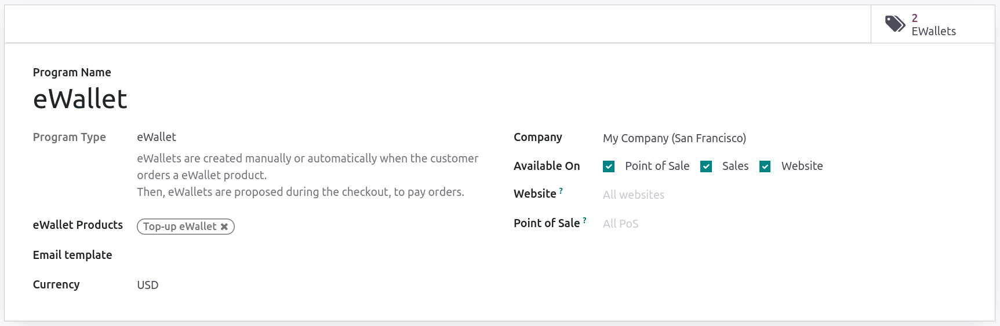
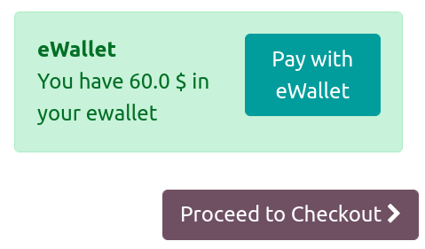

======================
eWallet and gift cards
======================

You can enable **eWallets** and **gift cards** for your customers on your eCommerce, which they can
use for their online and in-store shopping. To allow eWallets and gift cards for your eCommerce,
head to :menuselection:`Website app --> eCommerce` and in the :guilabel:`Shop - Products` category,
enable :guilabel:`Discounts, Loyalty & Gift Card`.

eWallet
=======

eWallet allows customers to save their credits on their online account and use these credits as a
payment method when buying items on your online store. As multiple gift card redeems for the same
order are not possible in Odoo, eWallets can also be used by customers to centralize multiple
:ref:`gift cards <ewallet_gift/gift-cards>` and accumulate credits.

Before creating an eWallet program, it is necessary to create an eWallet **top-up** product. Top-ups
are digital credits added to an eWallet in exchange for live currency. These credits can then be
used in the eCommerce shop as payment method. Top-up values can be of different amounts.

.. example::
   A $50 top-up can be bought for $50, and adds that same amount of credits in the eWallet.

To create a top-up **product**, go to :menuselection:`Website app --> eCommerce --> Products` and
:guilabel:`Create` a new product. On the product template, configure the product as such:

- :guilabel:`Can be sold`: enabled;
- :guilabel:`Product Type`: set as :guilabel:`Service`;
- :guilabel:`Invoicing Policy`: set as :guilabel:`Prepaid/Fixed Price`;
- :guilabel:`Create on Order`: select :guilabel:`Nothing`;
- :guilabel:`Sales Price`: type in the **amount** of the top-up.

.. note::
   If you wish to have eWallet **top-ups** of different amounts, repeat the process and modify the
   :guilabel:`Sales Price` accordingly.

Once the **top-up** is created, go to :menuselection:`Website app --> eCommerce --> Gift Cards &
eWallet` to :guilabel:`Create` an eWallet **program**. The following configuration options are
available:

- :guilabel:`Program Name`: enter the name you want;
- :guilabel:`Program Type`: select :guilabel:`eWallet`;
- :guilabel:`eWallet Products`: select the eWallet **top-up(s)** created earlier;
- :guilabel:`Email template`: the email template used for the email sent to the customer, you can
  create a template by clicking the field and selecting :guilabel:`Search more`;
- :guilabel:`Currency`: select the currency you wish to use for that eWallet program;
- :guilabel:`Company`: the company in which the program is valid and available;
- :guilabel:`Available On`: the different stores where the program is valid and available;
- :guilabel:`Website`: the website on which the program is valid and available, leave empty for all;
- :guilabel:`Point of Sale`: :abbr:`PoS (Point of Sale)` in which the program is valid and
  available, leave empty for all.

The :guilabel:`eWallets` smart tab in the upper-right corner shows you the number of existing
eWallets. Click on it to access more details about each existing eWallet.

Checkout
--------

On the checkout page, customers have the option to pay with their **eWallet** in the
:guilabel:`Order Total` column, and the amount will be deducted from their **eWallet**.

Gift cards
==========

.. _ewallet_gift/gift-cards:

You can generate **gift cards** which can be bought by your customers, and in turn used as **payment
methods** upon checkout. Before creating a new gift card program, it is necessary first to create
gift cards as a **product**. To do so, go to :menuselection:`Website app --> eCommerce --> Products`
and :guilabel:`Create` a gift card **product**. The following configuration options are available:

- :guilabel:`Can be Sold`: enabled;
- :guilabel:`Product Type`: set as :guilabel:`Service`;
- :guilabel:`Invoicing Policy`: set as :guilabel:`Prepaid/Fixed Price`;
- :guilabel:`Create on Order`: select :guilabel:`Nothing`;
- :guilabel:`Sales Price`: type in the **value** of the gift card.

.. note::
   If you wish to have **gift cards** of different values, repeat the process and modify the
   :guilabel:`Sales Price` accordingly.

Once the gift card **product** is created, go to :menuselection:`Website app --> eCommerce --> Gift
cards & eWallet` to :guilabel:`Create` a gift cards **program**. The following configuration options
are available:

- :guilabel:`Program Name`: enter the name you want;
- :guilabel:`Program Type`: select :guilabel:`Gift Card`;
- :guilabel:`Gift Cards Products`: select the gift card **product(s)** created earlier;
- :guilabel:`Email template`: select the default :guilabel:`Gift Card: Gift Card Information`
  template, or create your own by clicking the field and :guilabel:`Search More`;
- :guilabel:`Print Report`: select :guilabel:`Gift Card`;
- :guilabel:`Currency`: select the currency you wish to use for that gift card program;
- :guilabel:`Company`: the company in which the program is valid and available;
- :guilabel:`Available On`: the different stores where the program is valid and available;
- :guilabel:`Website`: the website on which the program is valid and available, leave empty for all;
- :guilabel:`Point of Sale`: :abbr:`PoS (Point of Sale)` in which the program is valid and
  available, leave empty for all.

.. image:: ewallet_gift/giftcard-config.png
   :align: center
   :alt: Gift card configuration

The :guilabel:`Gift Cards` smart tab in the upper-right corner shows you the number of existing
gift cards. Click on it to access more details about each existing gift card.

Checkout
--------

When finalizing their purchases, on the checkout page, customers have the option to pay with their
**gift card** in the :guilabel:`Order Total` column by clicking :guilabel:`Discount code or gift
card`. In the pop-up field, the customer can enter their gift card **code** and click
:guilabel:`Apply` to pay.

.. note::
   Multiple gift card redeems for the same order are not possible in Odoo; however, customers can
   use eWallets to centralize multiple gift cards and accumulate the credits.
