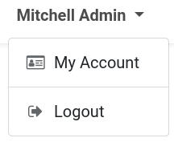
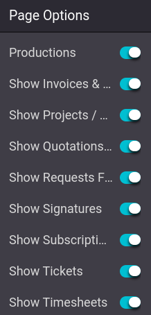

=================
Customer accounts
=================

Having customer accounts on an eCommerce allows customers to access all their documents from a
single place. To access their account, customers must be **logged-in** on the eCommerce website,
click on their **username** in the top-right corner of the screen, and click :guilabel:`My Account`.
From there, customers can access their :guilabel:`quotations`, :guilabel:`orders`,
:guilabel:`invoices`, etc.

.. note::
   Customers can only have an account if the :ref:`sign in/up at checkout <checkout-sign>` option
   allows for accounts creation.

.. tip::
   Similarly to the rest of the website, the customer account page can be customized with **content
   blocks** and other features through the **website builder**.

.. seealso::
   :doc:`/applications/general/users/portal`

Access restriction
==================

It is possible to allow or restrict the documents to which customers have access through the website
builder. Log in your **own** account with your Odoo database credentials, and go to
:menuselection:`Edit --> Customize`. From the website builder menu, enable or disable the documents
customers can have access to.

Multi-website account
=====================

If you own multiple websites, you can make customer accounts available across **all** websites.
Then, the customer only needs one account. To do so, go to :menuselection:`Website --> Configuration
--> Settings --> Privacy section`, and enable :guilabel:`Shared Customer Accounts`.
