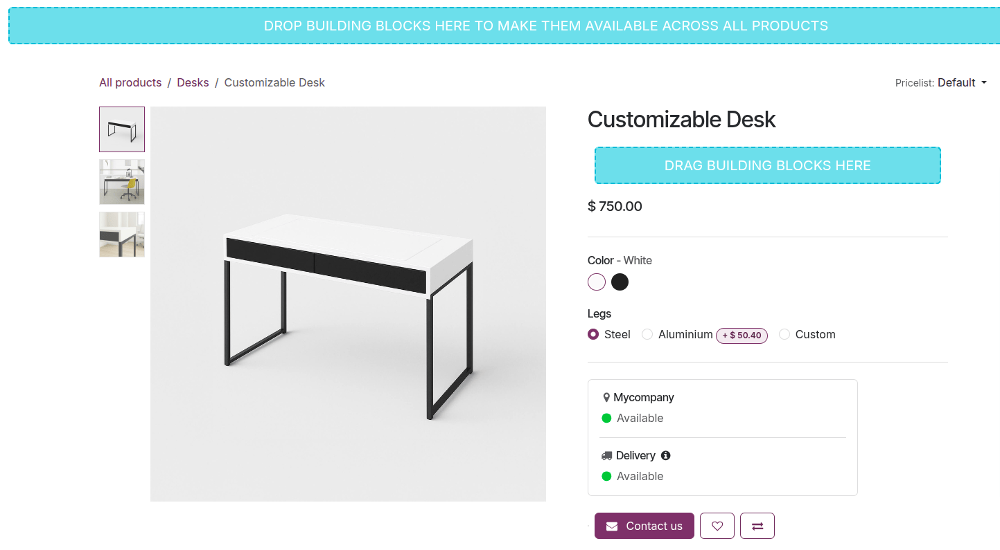

============
Product page
============

The e-commerce product pages showcase all product details and media items related to the relevant
products. It is possible to customize the :ref:`images and videos section
<ecommerce/product_page/image-customization>`, choose :ref:`which product information to display
<ecommerce_design/product_page/customization>`, show specific :ref:`buttons
<ecommerce_design/product_page/buttons>`, customize the :ref:`attribute details section
<ecommerce_design/product_page/attributes>`, enable :ref:`additional organizational features
<ecommerce_design/product_page/page-features>`, and add content using :ref:`building blocks
<ecommerce_design/product_page/building_blocks>`.

.. _ecommerce/product_page/image-customization:

Product images and videos
=========================

After :ref:`adding media items on the product form <ecommerce/products/images>` or upon
:ref:`product creation in the frontend <ecommerce/products/create-products>`, customize them on the
frontend product pages. To do so, navigate to the relevant product page in the online shop, click
:guilabel:`Edit` in the upper-right corner, and navigate to the :guilabel:`Style` tab.

.. tip::
   To access the relevant product page from the :ref:`product form
   <ecommerce/products/product-form>` in the backend, click the :icon:`fa-globe` :guilabel:`Go to
   Website` smart button at the top of the form.

To manage individual media items, click the item on the product page and scroll down to
the :guilabel:`Image` section of the website editor. You can then :guilabel:`Replace` or
:guilabel:`Remove` the image or video and :guilabel:`Re-order` the items. Use the
:icon:`fa-angle-double-left` (:guilabel:`left double arrow`) or :icon:`fa-angle-double-right`
(:guilabel:`right double arrow`) to move the media to the first or last position, and the
:icon:`fa-angle-left` (:guilabel:`left arrow`) or :icon:`fa-angle-right` (:guilabel:`right arrow`)
to move them by one position.

To adjust the layout of the images and videos section, go to :guilabel:`Images Area` and define the
images' size and :guilabel:`Position`. Then, navigate to the :guilabel:`Images` section, and use
the following options to customize this section:

- :guilabel:`Main image`: Click :guilabel:`Replace` to change the main product image.

  .. note::
     It is not possible to use a video as the main media item.

- :guilabel:`Extra Media`: :guilabel:`Add More` images or videos (including via URL) or
  :guilabel:`Remove all` media items.
- :guilabel:`Display`: Choose between the following layouts when you use more than one media item:

  - :guilabel:`Carousel`: This option allows visitors to navigate from one image to the next using
    the :icon:`fa-angle-left` (:guilabel:`left arrow`) or :icon:`fa-angle-right` (:guilabel:`right
    arrow`). Show :guilabel:`Thumbnails` on the :icon:`fa-long-arrow-left` (:guilabel:`Left`) or
    at the :icon:`fa-long-arrow-down` (:guilabel:`Bottom`) and adapt the corner
    :guilabel:`Roundness` of the images.

  - :guilabel:`Grid`: This layout displays media items in a square layout. Adjust the number of
    :guilabel:`Columns` and define the :guilabel:`Spacing` between the images in the grid, if
    necessary.

- :guilabel:`Auto-crop`: Choose a size to cut/trim images to match the page layout. This is useful
  when designing the :guilabel:`Mobile` :ref:`layout <website/visibility/mobile-and-computer>`.
- :guilabel:`Zoom on click`: Enable image zoom when visitors click an image.

.. _ecommerce_design/product_page/customization:

Page layout and product information display
===========================================

To customize the layout of the product pages, access any product page, click :guilabel:`Edit` in the
upper-right corner, and navigate to the :guilabel:`Style` tab. Then, go to the :guilabel:`Page
Width` setting and choose either the :guilabel:`Regular` or :guilabel:`Full-width` option.

.. tip::
   You can choose a different width for the :ref:`shop page <ecommerce/catalog/customize-layout>`.

Select which product information appears on product pages using the options available in the
:guilabel:`Product Details` section. You can configure :ref:`buttons
<ecommerce_design/product_page/buttons>`, define :ref:`how attributes are displayed
<ecommerce_design/product_page/attributes>`, organize the page using :ref:`page customization
features <ecommerce_design/product_page/page-features>`, and add content using :ref:`building blocks
<ecommerce_design/product_page/building_blocks>`.

.. _ecommerce_design/product_page/buttons:

Buttons
-------

Customize the buttons displayed on product pages using the following options:

- :guilabel:`Purchase Style`: Define the layout of the buttons.
- :guilabel:`Purchase Options`: (De)activate the :ref:`Buy Now <ecommerce/checkout/buy-now>` button
  and/or the :guilabel:`Quantity` selector.
- :guilabel:`Actions`: Enable the :ref:`wishlist <ecommerce/products/additional_features/wishlists>`
  and the :ref:`product comparison <ecommerce/products/additional_features/product-comparison>`
  features.

.. _ecommerce_design/product_page/attributes:

Attributes
----------

Choose how product :ref:`attributes <ecommerce/categories_variants/attributes>` are displayed in
the :guilabel:`Specification` section of the product page:

- :guilabel:`None`: Do not show the details.
- :guilabel:`Bottom of Page`: Show the details at the bottom of the page.
- :guilabel:`In accordion`: Show a foldable table directly under the ordering options.

.. note::
   The specification section is only displayed when :ref:`product variants
   <ecommerce/categories_variants/product-variants>` are enabled, and at least one attribute has
   been defined for the product.

.. tip::
   - Create :ref:`attribute categories <ecommerce/categories_variants/attribute-categories>` to
     better structure this section.
   - Use the :guilabel:`Image` :ref:`attribute display type <products/variants/attributes>` to show
     images of product variants on the product page.

.. _ecommerce_design/product_page/page-features:

Page organization options and additional features
-------------------------------------------------

Toggle the following options on/off to enable or disable features across all product pages:

- :guilabel:`Separators`: Organize the page and improve visual clarity.
- :guilabel:`Tax Indication`: Indicate whether the price is :ref:`VAT included or
  excluded <ecommerce/prices/taxes>`.
- :guilabel:`Tags`: Display the tags created in the :ref:`backend <ecommerce/catalog/filters>` on
  product pages and enable customers to filter products by those tags.
- :guilabel:`Terms and Conditions`: Display a link to your :doc:`terms and conditions
  </applications/finance/accounting/customer_invoices/terms_conditions>`.
- :guilabel:`Reviews`: Allow :doc:`logged-in portal users </applications/general/users/user_portals>`
  to submit product reviews. To add a review, users must navigate to the :guilabel:`Customer
  Reviews` section at the bottom of the page and click the :icon:`fa-plus` (:guilabel:`plus`) icon.
  They can then select a rating using the :icon:`fa-star-o` (:guilabel:`star`) icons and leave a
  comment. The :icon:`fa-star` (:guilabel:`star`) rating is displayed directly under the product
  name.
- :guilabel:`Search Bar`: Display a search bar that can be shown or hidden independently from
  the :ref:`shop page <ecommerce/catalog/toolbar>`.
- :ref:`Ribbon <ecommerce/products/additional_features/product-highlight>` (or badge): Highlight a
  specific product.

.. tip::
   It is possible to enable additional features and display information previously configured in the
   backend:

   - :ref:`Click & Collect <ecommerce/shipping/instore-pickup>`: Show the order pick-up location
     and delivery availability on the product page.
   - :ref:`Description <ecommerce/products/description>`: Display an e-commerce-specific product
     description right under the product name.
   - :ref:`Packagings <ecommerce/products/stock-management/packagings>`: Offer different types of
     packagings.
   - :ref:`Documents <ecommerce/products/digital-files>`: Add relevant documents, such as
     user manuals or other supporting materials.
   - :ref:`Alternative products <ecommerce/cross_upselling/alternative>`: Suggest similar
     products and customize the section.
   - :ref:`Show Available Quantity <ecommerce/products/stock-management/inventory>`: Display the
     available product quantity when the quantity falls below a specified threshold.
   - :ref:`Out-of-Stock Message <ecommerce/products/stock-management/inventory>`: Display a
     customized message for products that are out of stock.
   - :ref:`Get notified when back in stock <ecommerce/products/stock-management/inventory>`:
     Customers can insert their email address to receive a notification when the item is back in
     stock.
   - :guilabel:`Product Page Extra Fields`: To enable specific extra fields for the product page,
     enable the :doc:`developer mode </applications/general/developer_mode>`. Then, go to
     :menuselection:`Website --> Configuration --> Websites`, select the relevant website,
     navigate to the :guilabel:`Product Page Extra Fields` tab, and under :guilabel:`Field`,
     click :guilabel:`Add a line` to add as many additional fields as needed, e.g., the barcode
     number of the product.

.. _ecommerce_design/product_page/building_blocks:

Building blocks
---------------

Use building blocks to add content and design elements to all product pages or to a specific one.
To do so, navigate to any or the relevant product page and click :guilabel:`Edit` in the upper-right
corner. Then, in the :icon:`fa-plus` (:guilabel:`plus`) :guilabel:`Blocks` tab, select a building
block, and drag and drop it:

- into the blue area at the top or bottom of the product page to make it available on *all* product
  pages, or
- into the blue building block area below the product title or below the ordering options to display
  it only for the current product.

.. note::
   These building blocks do not appear on the :ref:`shop page <ecommerce/catalog/customize-layout>`.

.. seealso::
   :doc:`../../../websites/website/web_design`
