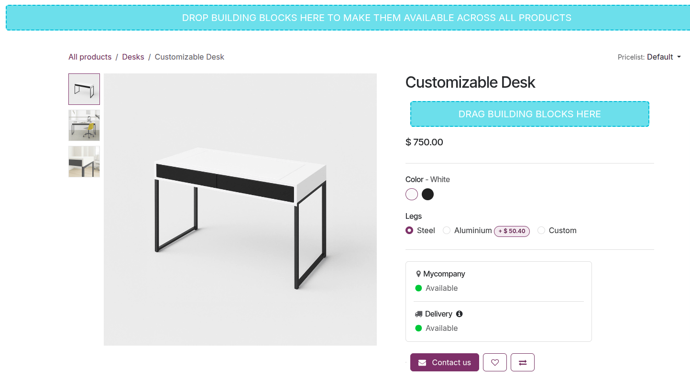

============
Product page
============

The e-commerce product pages showcase all product details and media items related to the relevant
products. It is possible to customize the :ref:`images and videos section
<ecommerce/product_page/image-customization>`, and choose :ref:`which product information to display
<ecommerce_design/product_page/customization>`.

To customize the product pages, click :guilabel:`Edit` in the upper-right corner and navigate to
the :guilabel:`Style` tab.

.. _ecommerce/product_page/image-customization:

Product images and videos
=========================

After :ref:`adding media items <ecommerce/products/images>`, go to :guilabel:`Images Area` to
define the images' size and :guilabel:`Position`.

To customize the image and video section, navigate to the :guilabel:`Images` section, and use the
following options:

- :guilabel:`Main image`: Click :guilabel:`Replace` to change the main product image.

  .. note::
     It is not possible to use a video as the main media item.

- :guilabel:`Extra Media`: :guilabel:`Add More` images or videos (including via URL) or
  :guilabel:`Remove all` media items.
- :guilabel:`Display`: Choose between the following layouts when you use more than one media item:

  - :guilabel:`Carousel`: Customers can navigate from one image to the next using the
    :icon:`fa-angle-left` (:guilabel:`left arrow`) or :icon:`fa-angle-right` (:guilabel:`right
    arrow`). To customize this display type, use:

    - :guilabel:`Thumbnails`: Show additional product images or videos on the
      :icon:`fa-long-arrow-left` (:guilabel:`Left`) or at the :icon:`fa-long-arrow-down`
      (:guilabel:`Bottom`).
    - :guilabel:`Roundness`: Adjust the corner rounding of the images.

  - :guilabel:`Grid`: This layout displays media items in a square layout. To customize this
    display type, use:

    - :guilabel:`Columns`: Select a number of columns.
    - :guilabel:`Spacing`: Define the space between the images in the grid.

- :guilabel:`Auto-crop`: Choose a size to cut/trim images to match the page layout. This is useful
  when designing the :guilabel:`Mobile` :ref:`layout <website/visibility/mobile-and-computer>`.
- :guilabel:`Zoom on click`: Enable image zoom when an image is clicked.

.. tip::
   To manage individual media items, click the item and scroll down to the :guilabel:`Image`
   section. Next to :guilabel:`Media`, click :guilabel:`Replace` or :guilabel:`Remove`.

   :guilabel:`Re-order` the items using the :icon:`fa-angle-double-left` (:guilabel:`left double
   arrow`) or :icon:`fa-angle-double-right` (:guilabel:`right double arrow`) to move the media to
   the first or last position, and the :icon:`fa-angle-left` (:guilabel:`left arrow`) or
   :icon:`fa-angle-right` (:guilabel:`right arrow`) to move them by one position.

.. _ecommerce_design/product_page/customization:

Page layout and product information display
===========================================

To change the layout of the product page, navigate to the :guilabel:`Page Width` setting and choose
either the :guilabel:`Regular` or :guilabel:`Full-width` option.

.. tip::
   You can choose a different width for the :ref:`shop page <ecommerce/catalog/customize-layout>`.

Select which product information appears on the product page using the options available in the
:guilabel:`Product Details` section. You can configure :ref:`buttons
<ecommerce_design/product_page/buttons>`, define :ref:`how attributes are displayed
<ecommerce_design/product_page/attributes>`, organize the page using :ref:`page customization
features <ecommerce_design/product_page/page-features>`, and add :ref:`building blocks
<ecommerce_design/product_page/building_blocks>`.

.. _ecommerce_design/product_page/buttons:

Buttons
-------

Configure purchase and action buttons:

- Select a :guilabel:`Purchase Style` to define a layout.
- Enable additional :guilabel:`Purchase Options` by:

  - activating the :ref:`Buy Now <ecommerce/checkout/buy-now>` button,
  - and/or selecting the :guilabel:`Quantity` button to display a quantity selector on each product
    page.

- Add :doc:`additional buttons <additional_features>` next to :guilabel:`Actions`, if needed.

.. _ecommerce_design/product_page/attributes:

Attributes
----------

Choose how product :ref:`attributes <ecommerce/categories_variants/attributes>` are displayed in
the :guilabel:`Specification` section of the product page:

- :guilabel:`None`: Do not show the details.
- :guilabel:`Bottom of Page`: Show the details at the bottom of the page.
- :guilabel:`In accordion`: Show a foldable table directly under the ordering options.

.. note::
   - To use the specification section, :ref:`product variants
     <ecommerce/categories_variants/product-variants>` must be enabled.
   - Products with single values for their attributes do not generate variants but are still
     displayed in the :guilabel:`Specifications` section.

.. tip::
   - Create :ref:`attribute categories <ecommerce/categories_variants/attribute-categories>` to
     better structure this section.
   - Use the :guilabel:`Image` :ref:`display type <products/variants/attributes>` to show images
     of product variants on the product page.

.. _ecommerce_design/product_page/page-features:

Organization options and additional features
--------------------------------------------

Toggle the following options on/off to adapt the page according to your needs:

- :guilabel:`Separators`: Organize the page and improve visual clarity.
- :guilabel:`Tax Indication`: Indicate whether the price is :ref:`VAT included or
  excluded <ecommerce/prices/taxes>`.
- :guilabel:`Tags`: Display the tags created in the :ref:`backend <ecommerce/catalog/filters>` on
  the product page and enable customers to filter products by those tags.
- :guilabel:`Terms and Conditions`: Display a link to your :doc:`terms and conditions
  </applications/finance/accounting/customer_invoices/terms_conditions>`.
- :guilabel:`Reviews`: Allow :ref:`logged-in portal users <portal/access>` to submit product
  reviews. To add a review, users must navigate to the :guilabel:`Customer Reviews` section at
  the bottom of the page and click the :icon:`fa-plus` (:guilabel:`plus`) icon. They can then select
  a rating using the :icon:`fa-star-o` (:guilabel:`star`) icons and leave a comment. The
  :icon:`fa-star` (:guilabel:`star`) rating is displayed directly under the product name.
- :guilabel:`Search Bar`: Display a search bar that can be shown or hidden independently from
  the :ref:`shop page <ecommerce/catalog/toolbar>`.
- :ref:`Ribbon <ecommerce/products/additional_features/product-highlight>` (or badge) to
  highlight a specific product.

.. note::
   Enabled functions apply to *all* product pages.

.. tip::
   It is possible to display additional features and information previously configured in the
   backend:

   - :ref:`Click & Collect <ecommerce/shipping/instore-pickup>`: Show the order pick-up location
     and delivery availability on the product page.
   - :ref:`Description <ecommerce/products/description>`: Display an e-commerce-specific product
     description right under the product name.
   - :ref:`Packagings <ecommerce/products/stock-management/packagings>`: Offer different types of
     packagings.
   - :ref:`Documents <ecommerce/products/digital-files>`: Add relevant documents, such as
     user manuals or other supporting materials.
   - :ref:`Alternative products <ecommerce/cross_upselling/alternative>`: Suggest similar
     products. This block's title can be customized.
   - :ref:`Show Available Quantity <ecommerce/products/stock-management/inventory>`: Display the
     available product quantity when the quantity falls below a specified threshold.
   - :ref:`Out-of-Stock Message <ecommerce/products/stock-management/inventory>`: Display a
     customized message for products that are out of stock.
   - :ref:`Get notified when back in stock <ecommerce/products/stock-management/inventory>`:
     Customers can insert their email address to receive a notification when the item is back in
     stock.
   - :guilabel:`Product Page Extra Fields`: To enable specific extra fields for the product page,
     enable the :doc:`developer mode </applications/general/developer_mode>`. Then, go to
     :menuselection:`Website --> Configuration --> Websites`, select the relevant website,
     navigate to the :guilabel:`Product Page Extra Fields` tab, and under :guilabel:`Field`,
     click :guilabel:`Add a line` to add as many additional fields as needed, e.g., the barcode
     number of the product.

.. _ecommerce_design/product_page/building_blocks:

Building blocks
---------------

Add building blocks either to a specific product page or apply them to all product pages. These
building blocks do not appear on the :ref:`shop page <ecommerce/catalog/customize-layout>`.
To make a building block available on *all* product pages, navigate to the :icon:`fa-plus`
(:guilabel:`plus`) :guilabel:`Blocks`, select a building block, and drag it to the top of the page.
To display it only for the selected product, drop it into a blue building block area within the
page.

.. note::
   - You can also add building blocks for the :ref:`entire shop or a category
     <ecommerce/catalog/customize-layout>`.
   - You can edit any text on your website by clicking it while in :guilabel:`Edit` mode.
