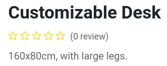
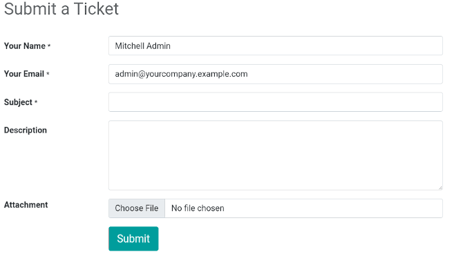
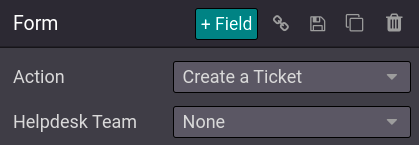
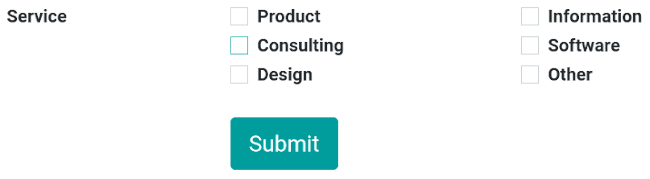
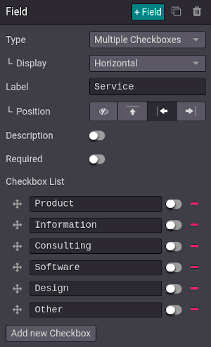
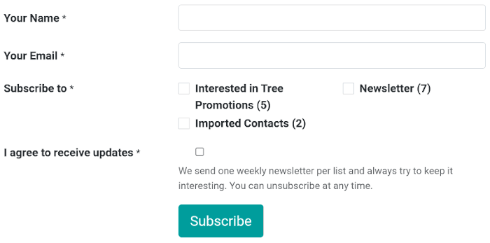

====================
Customer interaction
====================

Odoo offers many ways to interact with customers and for customers to interact with your website.

.. _product-reviews:

Product reviews
===============

Customers can give a rating to your products. This is a great way to promote your products or
services since reviews can influence purchase processes. To activate the **rating** feature, from
your **shop page**, select a product, go to :menuselection:`Edit --> Customize` and enable
:guilabel:`Rating`.

.. note::
   Only portal users which purchased the product or service can leave ratings.

.. tip::
   Customer reviews can be hidden by clicking the :guilabel:`Visible` button next to a published
   review.

Live chat
=========

A chatbot is available and can simulate a human-like conversation with website visitors via text
messages in a chat box.

.. seealso::
   - :doc:`../../livechat`
   - :doc:`../../livechat/ratings`
   - :doc:`../../livechat/responses`

.. _contact-form:

Contact forms
=============

Helpdesk
--------

Customers may need support after purchasing a product or subscribing to a service. It is possible to
create a **contact form**, which, when fulfilled, automatically creates a new ticket for your
**support team**.

To add a contact form, **create** a new page (:menuselection:`+ New --> Page`) if necessary, and
drag and drop a :guilabel:`Form` block from the :guilabel:`Dynamic Content` section onto the page.
Once placed, click on the form (while in :guilabel:`Edit` mode), and in the :guilabel:`Action`
field, select :guilabel:`Create a Ticket`. You can then select to which :guilabel:`Helpdesk team`
the ticket should be assigned.

Contact us
----------

A 'Contact Us' page makes it easier for customers and prospects to contact your company and get in
touch.

To have a 'Contact Us' page, create a new page (:menuselection:`+ New --> Page`) if necessary, and
click on :menuselection:`Edit --> Customize`. Then, drag and drop a :guilabel:`Form` block onto the
page. Select the form and define the action to be performed when submitted in the :guilabel:`Action`
field.

When clicking on a field, or when adding a new field (:guilabel:`+ Field`), you can select its
:guilabel:`Type`. This enables different options, such as :guilabel:`Multiple Checkboxes`, which
customers can use to indicate the services they are interested in, for example.

Newsletter
==========

Customers can get updates on your eCommerce activities by subscribing to a newsletter. Visitors
subscribing to the newsletter are automatically added to the mailing list of the **Email Marketing**
application. You can either choose a newsletter **block**, a newsletter **popup**, or both.

- **Popup**: prompts up a newsletter box when visitors scroll down the page;
- **Block**: displays a field on the page where customers can sign up by entering their email.

The newsletter **block** can be configured according to different :guilabel:`Templates`. To do so,
click the **block** while in :menuselection:`Edit --> Customize`, and select a :guilabel:`Template`
in the :guilabel:`Newsletter Block` section. There are **three** templates available:

- :guilabel:`Email Subscription`: visitors can sign up by email to the newsletter, without any
  choice to the content. The content is defined in :menuselection:`Edit --> Customize` in the
  :guilabel:`Newsletter` field;
- :guilabel:`SMS Subscription`: is the same as :guilabel:`Email Subscription`, but by SMS;
- :guilabel:`Form Subscription`: allows adding several fields, as well as a checkbox for the visitor
  to agree to the **GDPR policy** of your website.

.. tip::
   Alternatively, you can select :guilabel:`Subscribe to Newsletter` as :guilabel:`Action` when
   creating a :ref:`contact form <contact-form>`, allowing for the same level of customization. Make
   sure to add a checkbox stating visitors agree to be added to the mailing list.
