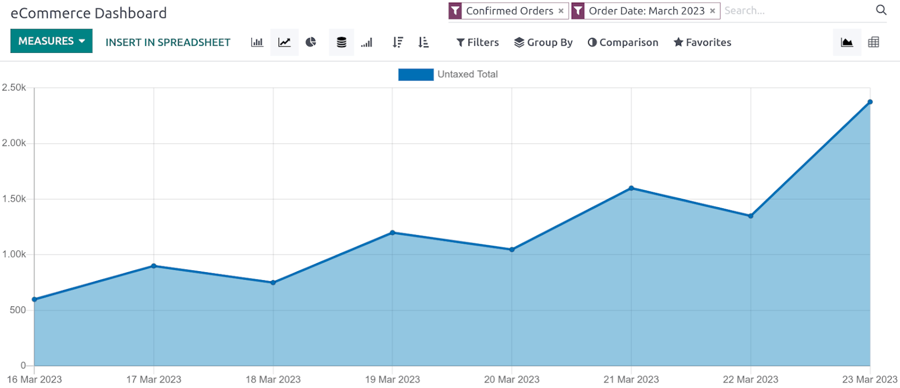

======================
Performance management
======================

Odoo integrates a variety of tools to analyze and improve the performance of your eCommerce
website.

Data monitoring
===============

**Website** allows monitoring and analysis of the sales performance of your eCommerce. To access the
**reporting view**, go to :menuselection:`Website --> Reporting --> eCommerce`. This dashboard helps
you monitor everything related to sales, such as sales performance per product, category, day, etc.

By clicking :guilabel:`Measures`, you can select the type of measurement used, such as:

- :guilabel:`Margin`;
- :guilabel:`Qty Invoiced`;
- :guilabel:`Untaxed Total`;
- :guilabel:`Volume`;
- ...

Other options include **multiple views (Pivot, etc.), comparison** by periods or years, and directly
:guilabel:`insert in spreadsheet`, etc.

Analytics
=========

It is possible to link your Odoo website with :ref:`analytics/plausible` and
:ref:`analytics/google-analytics`.

.. _ecommerce/performance/email_queue:

Email queue optimization
========================

For websites handling flash sales (e.g., event ticket sales) or experiencing high traffic spikes,
order confirmation emails can become a performance bottleneck, potentially slowing down the checkout
process for other customers.

To improve performance, these emails can be queued and processed separately from the order
confirmation flow. This is managed by the :guilabel:`Sales: Send pending emails` scheduled action,
which sends queued emails as soon as possible.

To enable asynchronous email sending:

#. Enable the :doc:`developer mode </applications/general/developer_mode>`.
#. Go to :menuselection:`Settings --> Technical --> System Parameters` and set the
   :guilabel:`sale.async_emails` system parameter to `True`.
#. Go to :menuselection:`Settings --> Technical --> Scheduled Actions` and ensure that the
   :guilabel:`Sales: Send pending emails` scheduled action is enabled.

.. caution::
   Enabling this feature may delay order confirmation and invoice emails by a few minutes. It is
   recommended only for high-traffic websites, as it can introduce unnecessary delays for e-commerce
   websites with moderate traffic.
