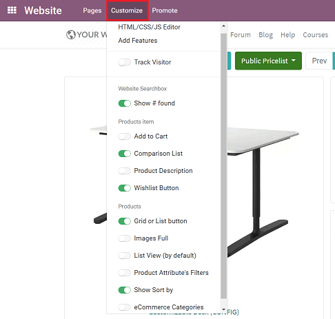
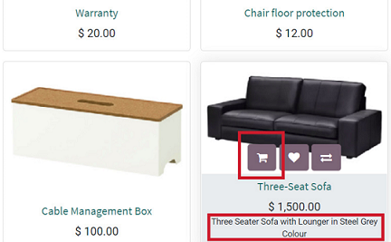
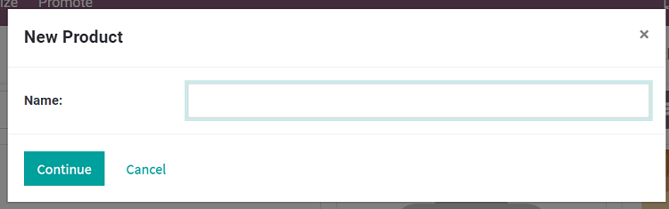

=======
Catalog
=======

All your published items show up in your catalog (or *Shop*) page.

.. image:: ./catalog/product-catalog.png
   :align: center
   :alt: ecommerce product catalog page

Most modification options and features are available in the *Customize* menu.

Highlight a product
===================

Boost the visibility of your star (or promoted) products in a number of different ways. Push them
to top, make them bigger, add an editable ribbon to attract attention (*Sale*, *New*, etc.).

Simply open the *Shop* page, switch to *Edit* mode, and click any item to start customizing.

.. tip::
   See how to do it `here <https://drive.google.com/file/d/1ztxrwaX8Y7UgtmCJrqNIqVn4RGUxmBA9/view?usp=sharing>`_.

Quick 'Add to Cart'
===================

If customers tend to buy a lot of items at once, you can make their shopping experience even
*faster* by enabling an "Add to Cart" button directly on products found on your catalog page.

This way, they can instantly add an item to their virtual cart directly from the catalog page,
without having to access the product page itself. Therefore, it would require less time for them
to purchase products that they desire from your online store.

To do this, you'll want to activate the *Add to Cart* feature, located under the *Customize*
drop-down menu on the header.

You may want to add a product description, as well. That way, customers can quickly see a brief
description of the product and add it to their virtual cart in just one click. To do that, make
sure to activate the *Product Description* feature in the *Customize* menu.

Both features appear in Grid and List view.

-  **Grid** view (appears when cursor hovers over product):

-  **List** view:

.. image:: catalog/ecommerce-list-view-cart.png
   :align: center
   :alt: ecommerce list view add to cart

=============
Product pages
=============

An eCommerce store simply isn't complete without products. That's why it's important to make sure
all your product pages look great, and properly present items to potential customers.

Thankfully, with Odoo, building product pages for your online store has never been easier.

Building product pages
======================

On the website, click *+New* in the top-right corner. Then click *Product*.

.. image:: catalog/create-product.png
   :align: center
   :alt: create new product ecommerce

Then, a pop-up appears where you'll enter in a name for the new product before clicking *Continue*.

Odoo will then take you the Product page that you can modify in a number of different ways,
including the various building blocks from Odoo's Website Builder.

Even after you hit *Save* after you complete your product page, remember to hit the switch on the
header to mark it from *Unpublished* (Default) to *Published*.

Here are the main elements of the Product page:

.. image:: catalog/product_page_tips.png
   :align: center
   :alt: ecommerce product page tips

Many elements can be made visible from the *Customize* menu.

.. image:: catalog/customize-dropdown.png
   :align: center
   :alt: ecommerce customize drop down menu

See how to configure your products from links here below.

.. seealso::

  * :doc:`../managing_products/variants`
  * :doc:`../managing_products/multi_images`
  * :doc:`../maximizing_revenue/cross_selling`
  * :doc:`../maximizing_revenue/reviews`
  * :doc:`../maximizing_revenue/pricing`
  * :doc:`../../website/optimize/seo`
