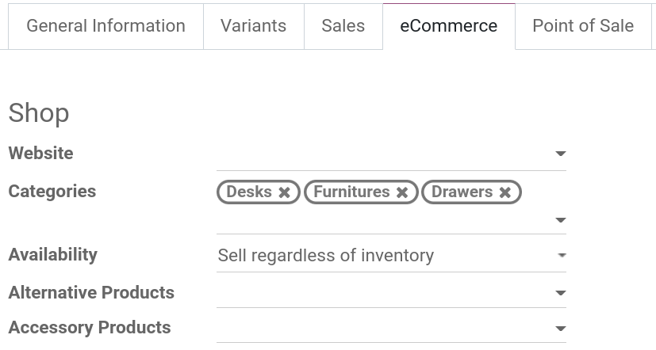
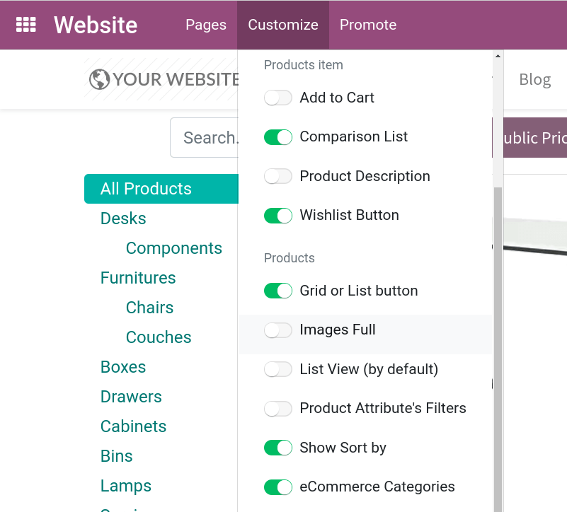
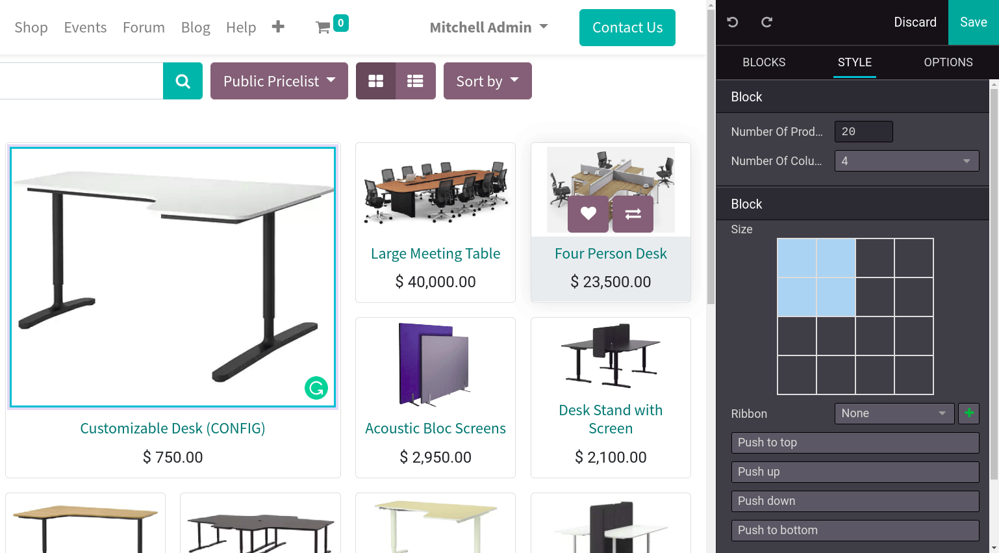
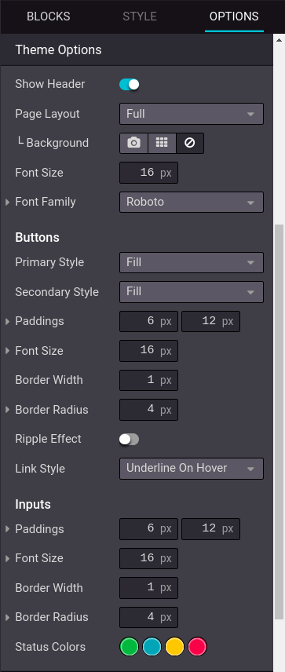

============================
Organize the product catalog
============================

The eCommerce catalog is the equivalent of your physical store shelves: it allows customers to see
what you have to offer. Clear categories, available options, sorting, and navigation threads help
you structure it efficiently. The smoother the navigation in the catalog, the better the shopping
experience, and the higher the user satisfaction.

Categorize the product catalog
==============================

In Odoo, there is a **specific category model** for your eCommerce. This category, which can be
found on the product form in the :guilabel:`eCommerce` tab, is a many-to-many field. This allows a
single product to be added to multiple eCommerce categories and simultaneously appear in multiple
categories.

.. note::
   The **eCommerce category** must *not* be mistaken with the :guilabel:`Product Category` found in
   the :guilabel:`General Information` tab, which serves another purpose.

When your product is configured, go to your **Website** page, click on :guilabel:`Customize` and
enable the :guilabel:`eCommerce Categories`. This option creates a categories search menu for your
customers to use. Additionally, you can enable :guilabel:`Show Sort By` to allow sorting on the
products page by :guilabel:`Catalog price` or :guilabel:`Name`.

Add filters
-----------

The eCommerce category is the first tool to organize and split your products. However, if you need
an extra level of categorization in your catalog, you can activate the attribute filter (such as the
color of a product, the material, etc.).

To do so, click on the :guilabel:`Customize` button in the top-left corner of your **website** page.

.. tip::
   You can use **attribute filters** even if you do not work with product variants. When adding
   attributes to your products, make sure only to specify *one* value per attribute. Odoo will not
   create variants if no combination is possible.

Highlights
==========

.. _getting_started/catalog/highlights:

You can highlight products to make them more visible on the **main** product page. Make the product
image bigger, push it to the top of the page, add a ribbon, etc. To do so, from the **main page** of
the shop, click :guilabel:`Edit`, and select the product you wish to modify. Click :guilabel:`Style`
in the right panel to modify the product's form view to your desire.

Ribbons
-------

It is possible to add a ribbon to the product's form view to indicate the product is on sale, new,
etc. Simply follow the steps of the :ref:`Highlights paragraph <getting_started/catalog/highlights>`
and select the **ribbon** type you wish to use.

.. image:: catalog/ecommerce-ribbons.png
   :align: center
   :alt: The different product ribbons.

Design the category page
========================

You can customize the layout of the category page using the website builder. Note that editing the
layout of the category page is global; editing one category layout will affect all category pages.

.. tip::
   You can choose the size of the grid, but beware that displaying too many products may affect
   performances and page loading speed.

Additional features
-------------------

You can access and enable additional features through the :guilabel:`Customize` menu:

- :guilabel:`Add to cart`: adds a button to **add to cart** the product when hoovering the mouse
  over the product's form view;
- :guilabel:`Comparison List`: adds a button to **compare** products based on their price, variant,
  etc;
- :guilabel:`Product Description`: shows the **product's description** when hoovering over the
  product's form view;
- :guilabel:`Wishlist Button`: adds a button to **wishlist** the product.
