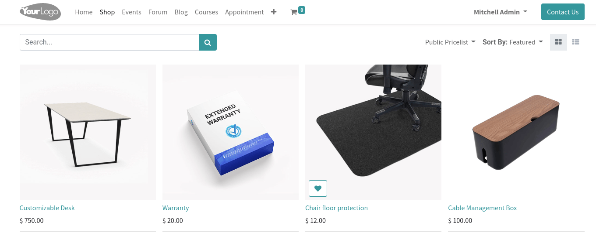

===========================
Customize your catalog page
===========================

When selling online, your product catalog is a crucial part of your efforts. It helps
showcase all products currently available while making it easier for everyone to find the product
they need.

The more information you give about your products, the better. Photos, descriptions, prices, so many
aspects that can help increase sales. With Odoo, all of that is managed from one single view.

.. _ecommerce/started/catalog/catalog:

Product Catalog
===============

When opening your **shop** for the first time, all items are published one after the other. You need
to customize the page to showcase the information you assess as crucial for your business.

You can display more information or change the page layout from the :guilabel:`Customize`
menu. To access it, go to :menuselection:`Edit --> Customize`.

Once there, multiples customization options appears:

- :guilabel:`Layout`: Allows to choose how products are displayed. It includes the number of
  products on the   page and per line, the style, and the size of your product pictures.
- :guilabel:`Prod. Desc.`: Allows to display the products' description if there's one.
- :guilabel:`Left Panel`: Allows to add more navigation options, such as accessing specific product
  categories or attributes (colors, sizes, etc.).
- :guilabel:`Top Bar`: Allows to add more display options for customers, such as how product are
  sorted by, or the layout of the page (grid, list, etc.).
- :guilabel:`Default Sort`: Allows to choose how products are sorted when opening the shop.
- :guilabel:`Buttons`: Allows to add quick actions, such as add to cart, add to favorite, etc.

Let's see some of those in action.

.. _ecommerce/started/catalog/layout:

Page layout
===========

Under the :guilabel:`Layout` section, you can change several display options. For this example,
let's change the number of products per page from 20 to 21, and the number of products per line
from 4 to 3 with the :guilabel:`Size` option.

For the :guilabel:`Style` and :guilabel:`Images Size`, let's choose :guilabel:`Cards` and
:guilabel:`Landscape (4/3)` to add borders to our pictures and reduce the size of each block.

.. _ecommerce/started/catalog/panel:

Left Panel
==========

To give your customers more navigation options, you can use the :guilabel:`Left Panel` options.
Let's display :guilabel:`Categories` and enable :guilabel:`Collapse Categories` to add a navigation
menu for customers.

Since giving more information about your products is important, let's also enable the
:guilabel:`Prod. Desc.` option to display the description of each product. The option can be found
just above :guilabel:`Left Panel`.

.. _ecommerce/started/catalog/cart:

Quick add to cart
=================

With the :guilabel:`Buttons` options, let's add several possibilities. Click on
:guilabel:`Add to Cart` and :guilabel:`Wishlist` to optimize the customer journey.

.. _ecommerce/started/catalog/highlight:

Highlight a product
===================

While opening the website builder, click on a specific product to customize its block.
Doing so displays more options, giving the possibility to change the size of a particular block,
or add a :guilabel:`badge` on the product.

Here, let's change the :guilabel:`Size` of the first product to 2*2 and add the :guilabel:`Badge`
:guilabel:`New`.

Final Result
============

With all these changes, you obtain a page optimized for navigation. Here is what it looks like:

.. seealso::
   - `Design Your First Page <https://www.odoo.com/slides/slide/design-your-first-web-page-1667>`_