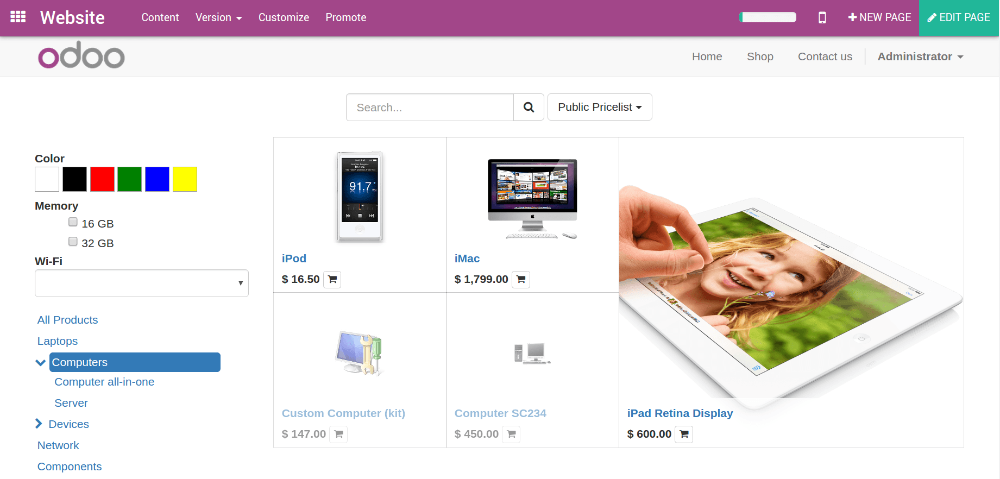
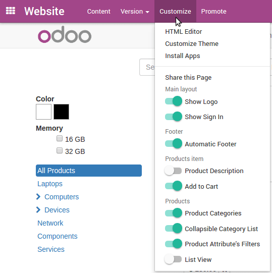
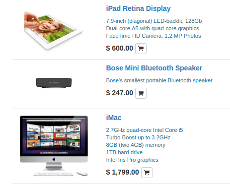

==================================
How to customize my catalog page 
==================================

Product Catalog
===============

All your published items show up in your catalog page (or *Shop* page).

Most options are available in the *Customize* menu: display attributes,
website categories, etc.

Highlight a product
===================

Boost the visibility of your star/promoted products: push them to top, make them
bigger, add a ribbon that you can edit (Sale, New, etc.). Open the Shop page, switch
to Edit mode and click any item to start customizing the grid.

See how to do it: https://www.odoo.com/openerp_website/static/src/video/e-commerce/editing.mp4

Quick add to cart
=================

If your customers buy a lot of items at once, make their process shorter by enabling purchases from
the catalog page. To do so, add product description and add to cart button. Turn on the following
options in *Customize* menu:  Product Description, Add to Cart, List View (to display product
description better).

