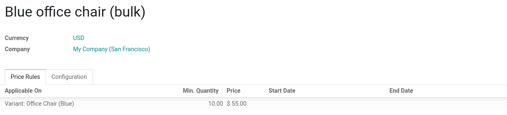
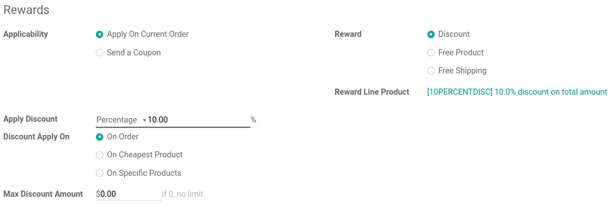
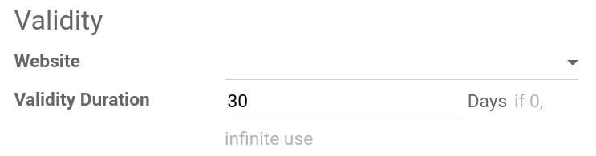

==================
Pricing management
==================

Odoo offers multiple options to select the price displayed on your website, as well as
condition-specific prices based on selected criteria.

Tax display strategy
====================

The choice of tax display usually depends on a country's regulations or the type of customers **(B2B
vs B2C)**. To select the type of price displayed, go to :menuselection:`Website --> Configuration
--> Settings`, scroll-down to the :guilabel:`Pricing` category, and select :guilabel:`Tax-Excluded`
or :guilabel:`Tax-Included`.

Note that this setting is **global**, and the tax display type is the same across all website(s) and
back-end. It is therefore not possible to select different tax displays for different websites. This
may be a significant point of consideration when implementing a database with multiple ecommerce
websites pertaining to different types of customers (for instance, B2B and B2C).

- :guilabel:`Tax-excluded`: the price displayed on the website is **tax-excluded** and the tax is
  computed at the cart review step;
- :guilabel:`Tax-included`: the price displayed on the website is **tax-included**.

Price management
================

There are multiple ways to manage the pricing of your products.

Pricelists
----------

Pricelists are the main tool to manage prices on your ecommerce. They allow you to define specific
prices based according to: **country groups**, **currency**, **minimum quantity**, or **variants**.
Pricelists can be selected by your customer on the product's page in the upper-right corner. You can
create as many pricelist as needed, but it is mandatory to have at least one pricelist available on
a website. If no custom pricelists are added, Odoo defaults to the **Public Pricelist** for all
websites.

To create or configure a pricelist, go to :menuselection:`Website backend --> Products -->
Pricelists`. You can change the :guilabel:`Name` of the pricelist, the :guilabel:`Currency`, the
:guilabel:`Company` in which it is available, and the :guilabel:`Price Rules`. When modifying or
creating a line under :guilabel:`Price Rules`, you can:

.. note::
   To offer **multiple currencies** to your customer, make sure to activate the
   :guilabel:`Multi-Currencies` option in :menuselection:`Website backend --> Configuration -->
   Settings` under the category :guilabel:`Pricing`.

- :guilabel:`Apply On`: choose to what type the pricelist applies (all products, product category,
  single product, or product variant(s));
- :guilabel:`Compute Price`: how the price should be computed (fixed price, percentage as discount,
  or a formula of your choice);
- :guilabel:`Min. Quantity`: the minimum quantity at which the :guilabel:`price` is applicable;
- :guilabel:`Fixed` or :guilabel:`Percentage Price`: the fixed price of the product (or variant) or
  the percentage price;
- :guilabel:`Start` and :guilabel:`End Date`: the dates during which the pricelist is available.

Under the :guilabel:`Configuration` tab, you can:

.. _pricing_management/pricelists-availability:

- :guilabel:`Country Groups`: select the country groups in which the pricelist is available;
- :guilabel:`Website`: the websites on which the pricelist is available;
- :guilabel:`Selectable`: whether or not the customer can select that pricelist;
- :guilabel:`E-commerce Promotional Code`: whether the pricelist should be applied using a promo
  code upon checkout.

.. image:: pricing_management/pricing-configuration.png
   :align: center
   :alt: Pricelist configuration

Add multiple currencies
~~~~~~~~~~~~~~~~~~~~~~~

You can assign a specific currency to a pricelist and therefore offer **multiple currencies** to
your customers on the ecommerce. In order for your customers to be able to switch currencies, make
sure that your currencies pricelists are enabled as :guilabel:`Selectable` by the customer.

Pricelist availability
~~~~~~~~~~~~~~~~~~~~~~

Once the pricelists for a website have been made, the active pricelist is applied based on (in order
of importance):

#. **Website**: by limiting the availability of a pricelist on a
   :ref:`per-website basis <pricing_management/pricelists-availability>`;
#. **User**: by assigning a specific pricelist to a customer on its contact form. To do so, go to
   :menuselection:`Website backend --> Orders --> Customers`, select your customer, the
   :guilabel:`Sales & Purchase` tab, and then :guilabel:`Pricelist`.
#. **Country**: Odoo automatically applies the right pricelist based on the geolocation of the
   customer's IP address. A
   :ref:`country group availability <pricing_management/pricelists-availability>` must be set in
   order to use that feature.
#. **Pricelist sequence order**: if multiple pricelists are available for a website, the first
   pricelist is applied. The pricelist order can be changed in the backend.

Promotion and coupon programs
-----------------------------

It is also possible to create promotion and coupon programs, which offer different options from
pricelists. To do so, go to :menuselection:`Website backend --> Products --> Promotion or Coupon
Programs`.

Promotion programs
~~~~~~~~~~~~~~~~~~

.. _getting_started/pricing_management/promotion-programs:

Conditions
**********

- :guilabel:`Based on Customers`: you can specify the criteria based on which customers are eligible
  to the program;
- :guilabel:`Based on Products`: you can specify the criteria based on which products are comprised
  in the program;
- :guilabel:`Quantity`: the minimum quantity at which the program is applicable;
- :guilabel:`Minimum Purchase Of`: the minimum amount :guilabel:`Tax Excluded` or
  :guilabel:`Included` at which the program is applicable;
- :guilabel:`Promo Code Usage`: if the code is :guilabel:`Automatically Applied` or if customers
  must :guilabel:`Use a code` upon checkout;
- :guilabel:`Promotion Code:` the code (of your choice) that should be entered upon checkout to
  benefit from the promotion;
- :guilabel:`Company`: the company to which the promotion is applicable.

Validity
********

- :guilabel:`Website`: the website(s) where the promotion is applicable;
- :guilabel:`Apply on First`: the first customers to order up to the number defined can benefit from
  the promotion program. Leave on `0` for infinite use;
- :guilabel:`Start` and :guilabel:`End Date`: the period during which the promotion program is
  valid.

.. image:: pricing_management/promotion-conditions-validity.png
   :align: center
   :alt: Conditions and validity of the promotion program

Rewards
*******

- :guilabel:`Applicability`: whether the promotion program should be applied on the order, or if the
  customer should receive a coupon to use at a later date.
- :guilabel:`Apply Discount`: either a :guilabel:`Fixed Price` or :guilabel:`Percentage` should be
  applied, and its amount.
- :guilabel:`Discount Apply On`: if the discount should be applied on the total amount of the order,
  on the **cheapest** product, or on **specific** products;
- :guilabel:`Max Discount Amount`: the maximum amount of the discount, leave on `0` for unlimited.
- :guilabel:`Reward`: if the reward should be :guilabel:`Discount`, a :guilabel:`Free Product`, or
  :guilabel:`Free Shipping`;
- :guilabel:`Reward Line Product`: the **product** used as placeholder for the discount.

To create a **discount product placeholder**, create a product in :menuselection:`Website backend
--> Products --> Products --> Create`, uncheck everything and *only* populate these fields:

- :guilabel:`Name`: your choice;
- :guilabel:`Product Type`: Service;
- :guilabel:`Internal Reference`: your choice;
- :guilabel:`Product Category`: All/Saleable/Services
- :guilabel:`Version`: 1
- :guilabel:`Public Price`: 1 (of your currency);
- :guilabel:`Cost`: 0 (of your currency);
- :guilabel:`Company`: the company, if applicable;
- :guilabel:`Unit of Measure`: Units;
- :guilabel:`Purchase Unit of Measure`: Units.

Coupons
-------

Options for **coupons** are the same as for the :ref:`promotion programs
<getting_started/pricing_management/promotion-programs>`, with fewer options. One exception is the
:guilabel:`Validity Duration`, which specifies the validity duration of the coupon. Leave it on `0`
for infinite use.

