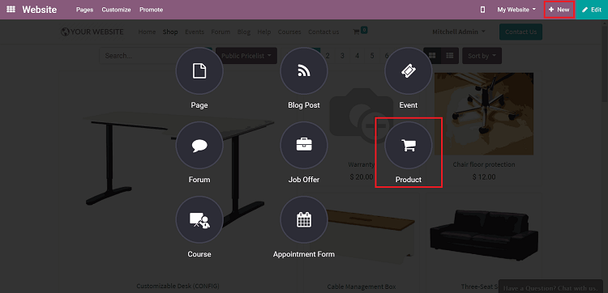
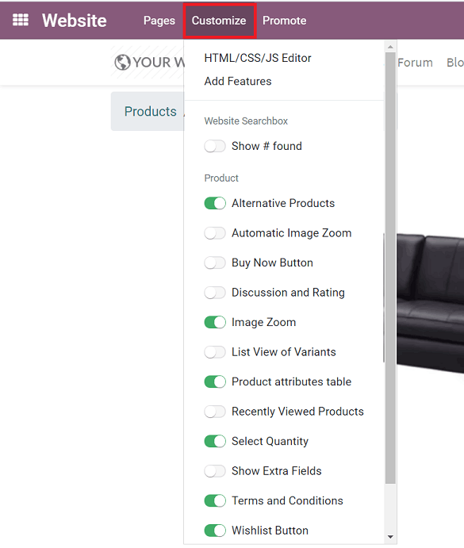

=============
Product pages
=============

An eCommerce store simply isn't complete without products. That's why it's important to make sure
all your product pages look great, and properly present items to potential customers.

Thankfully, with Odoo, building product pages for your online store has never been easier.

Building product pages
======================

On the website, click *+New* in the top-right corner. Then click *Product*.

Then, a pop-up appears where you'll enter in a name for the new product before clicking *Continue*.

.. image:: product_page/ecommerce-new-product-pop-up.png
   :align: center
   :alt: ecommerce new product pop-up window

Odoo will then take you the Product page that you can modify in a number of different ways,
including the various building blocks from Odoo's Website Builder.

Even after you hit *Save* after you complete your product page, remember to hit the switch on the
header to mark it from *Unpublished* (Default) to *Published*.

Here are the main elements of the Product page:

.. image:: product_page/product_page_tips.png
   :align: center
   :alt: ecommerce product page tips

Many elements can be made visible from the *Customize* menu.

See how to configure your products from links here below.

.. seealso::

  * :doc:`../managing_products/variants`
  * :doc:`../managing_products/multi_images`
  * :doc:`../maximizing_revenue/cross_selling`
  * :doc:`../maximizing_revenue/reviews`
  * :doc:`../maximizing_revenue/pricing`
  * :doc:`../../website/optimize/seo`
