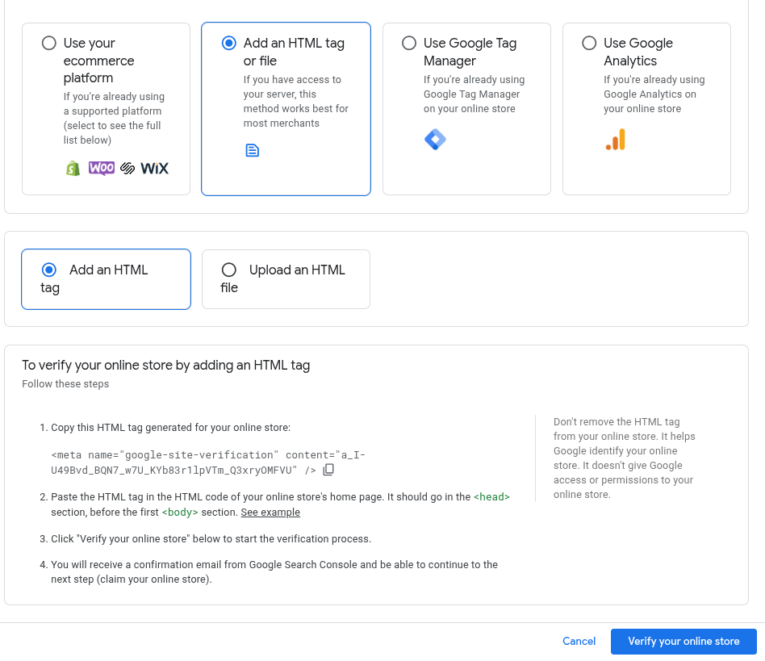

======================
Google Merchant Center
======================

Google Merchant Center is a specialized tool for ecommerce retailers that helps to manage product
data and make products visible to online shoppers across Google's platforms, including
Google Search, Google Maps, Google Shopping, and YouTube. It serves as a centralized hub where
retailers can upload and maintain details about their products such as images, prices, and
descriptions. By leveraging this tool, businesses can enhance their products' visibility as well as
enhance their advertising and sales performance.

Getting started
===============

To connect your ecommerce with the :abbr:`GMC (Google Merchant Center)` platform, proceed as
follows:

#. First, go the `Google Merchant Center page <https://business.google.com/us/merchant-center/>`_.

#. Click to :guilabel:`Get started` button to register your ecommerce shop.

#. Indicate that you sell products online, and enter :guilabel:`Your store's website`.

   .. image:: google_merchant_center/gmc-first-steps.png
      :alt: Your store's website screen

#. Click :guilabel:`Continue`, then click :guilabel:`Continue to Merchant Center`.

#. Enter your business details by adding the :guilabel:`Business name` and the
   :guilabel:`Registered country`, then click the :guilabel:`Continue to Merchant Center` button,
   and :guilabel:`Continue to Merchant Center`.

#. Go through the tasks to provide additional business information or click :guilabel:`Do it later`
   to access the dashboard directly.

Site ownership verification
---------------------------

In order to use Google Merchant Center, you have to verify your website's ownership first. To do so,
go to the :guilabel:`Business info` tab on the left menu, and click :guilabel:`Confirm online store`.

There are several options to verify the ownership:

- Via an ecommerce platform
- Via HTML tag or file
- Via :ref:`Google Tag Manager <analytics/google-tag-manager>`
- Via :ref:`Google Analytics <analytics/google-analytics>`

If you are not using Google Tag Manager or Google Analytics, the simplest method is adding
the HTML tag.

To verify using an HTML tag, follow the instructions:

#. Copy the HTML tag to clipboard.

#. On the website of your Odoo database, click :guilabel:`Edit` in the upper-right corner, go to
   the :guilabel:`Theme` tab, scroll down to the :guilabel:`Advanced` section, then
   click :guilabel:`<head> and </body>` next to :guilabel:`Code Injection`.
   Paste the copied tag in the first field (:guilabel:`<head>`), and click :guilabel:`Save`.

   .. image:: google_merchant_center/gmc-copy-tag.png
      :alt: Paste tag in head field.

#. Return to :abbr:`GMC (Google Merchant Center)`, click :guilabel:`Verify your online store`,
   and :guilabel:`Continue`.

Linking Odoo to GMC
===================

To activate the Google Merchant Center integration in your Odoo database, at least one
pricelist has to be enabled for your website.

To do so:

#. Go to :menuselection:`eCommerce --> Pricelists`, choose an existing pricelist
   or create a :guilabel:`New` one. On the pricelist form, navigate to the :guilabel:`Ecommerce`
   tab, and select a website in the :guilabel:`Website` field.

   .. image:: google_merchant_center/ecommerce-add-pricelist.png
      :alt: Add pricelist to shop.

#. Next, navigate to :menuselection:`Configuration --> Settings`, scroll to the
   :guilabel:`SEO - Search Engine Optimization` section. Then tick the
   :guilabel:`Google Merchant Center Data Source` option, click the :guilabel:`Copy file link`
   button, and :guilabel:`Save`.

#. Go to the Google Merchant Center platform, navigate to the :guilabel:`Products` tab on
   the side menu, and click the :guilabel:`Add products` button.

   .. image:: google_merchant_center/gmc-add-products.png
      :alt: Add products on Google Merchant Center.

#. Choose :guilabel:`Add products from a file` and paste the URL of the copied file.

   .. image:: google_merchant_center/gmc-add-products-from-file.png
      :alt: Add products from file.

   .. important::
      Make sure to select all the countries where you intend to sell your products. You are not
      able to proceed without selecting at least one target country.

      .. image:: google_merchant_center/gmc-select-countries.png
         :alt: Select countries in GMC.

#. Click :guilabel:`Continue`.

.. tip::
   We recommend using the tool alongside other Google services, such as :doc:`Google Search Console
   <../website/configuration/google_search_console>`,
   :ref:`Google Analytics <analytics/google-analytics>` or :ref:`Google Tag Manager
   <analytics/google-tag-manager>` to obtain detailed reports on product listing issues,
   improve marketing strategies, increase your products' online visibility and enhance
   the overall sales performance.

.. seealso::
   `Google Merchant Center Help <https://support.google.com/merchants/answer/12564959?hl=en>`_
