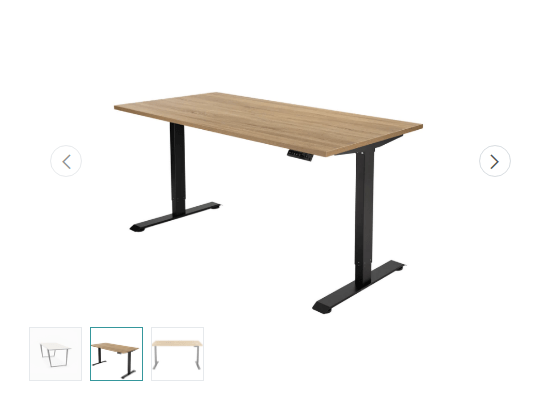
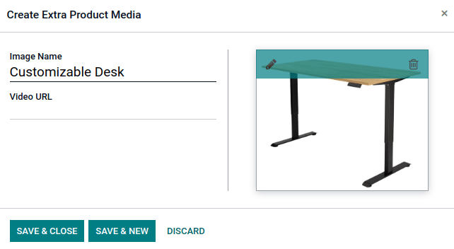

===========================
Multiple images per product
===========================

When you register several images for a product, only the first image is shown on the main products
page. By clicking on the product, visitors can see additional images with the carousel view.

Adding multiple images to a product
-----------------------------------

#. Go to :menuselection:`Website --> Products`, and select a product.
#. Go to the :guilabel:`Sales` tab, click :guilabel:`Edit`, and :guilabel:`Add a media`.
#. Click the pencil icon to add an image, then click :guilabel:`Save & New` to add additional ones.
#. Click :guilabel:`Save & Close` when you are done.

.. note::
    Such extra images are common to all the product variants (if any).
