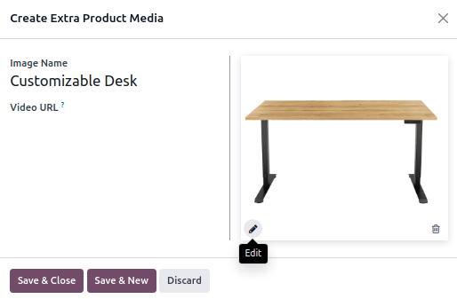

===========================
Multiple images per product
===========================

When several images are added for a product, only the first image is shown on the main products
page. By clicking on the product, visitors can see your products from several angles with the
carousel view.

.. image:: multi_images/carousel-view.pngq
  :alt: showing the multiple products with the carousel view.

Adding multiple images to a product
===================================

#. Go to :menuselection:`Website --> eCommerce --> Products: Products`, and select a product.

#. Go to the :guilabel:`Sales` tab, and in the :guilabel:`Extra Product Media` section, click
   :guilabel:`Add a media`.

#. Click the pencil icon to add an image, then click :guilabel:`Save & New` to add additional ones.

4. Click :guilabel:`Save & Close` when you are done.

.. note::
   Such extra images are common to all the product variants (if any).