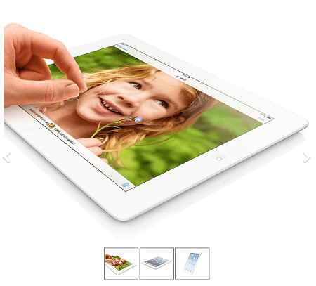
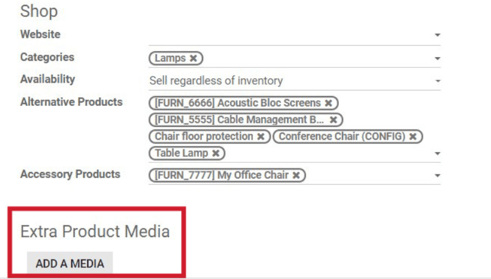
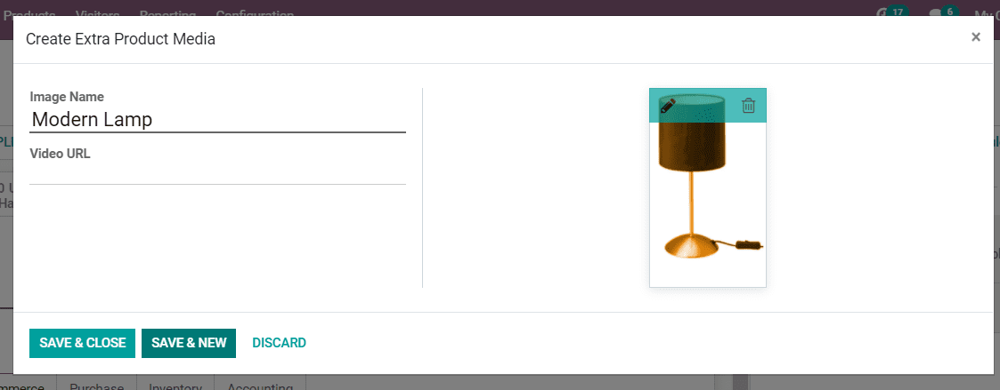
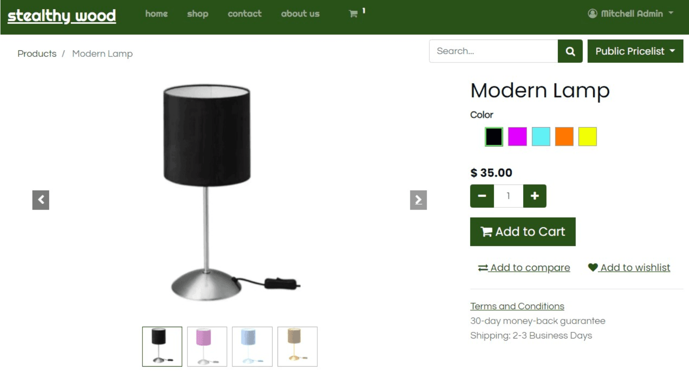

==================================
Display several images per product
==================================

By default, your product page only displays the main image of your product.
If you'd like to show multiple images of your product, you can turn the images into a carousel.

* Open a product template form and click the *eCommerce* tab.
* Then click *Add A Media* in the *Extra Product Media* section.

   
* A pop-up will appear, in which you can add a title and upload additional media.

* Any additional media will be displayed as the default product photo on the product page.

.. note:: 
    Additional images are commonly used on products with a number of variants.
